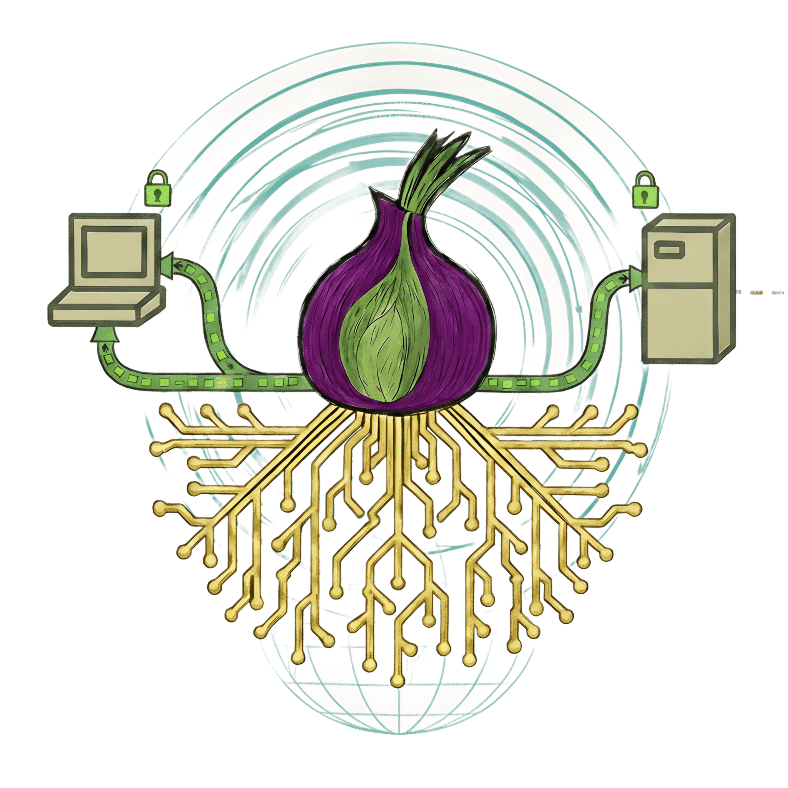
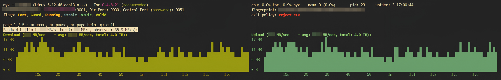
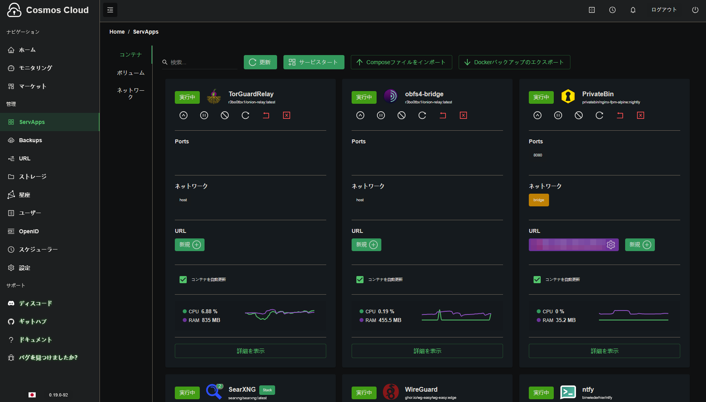
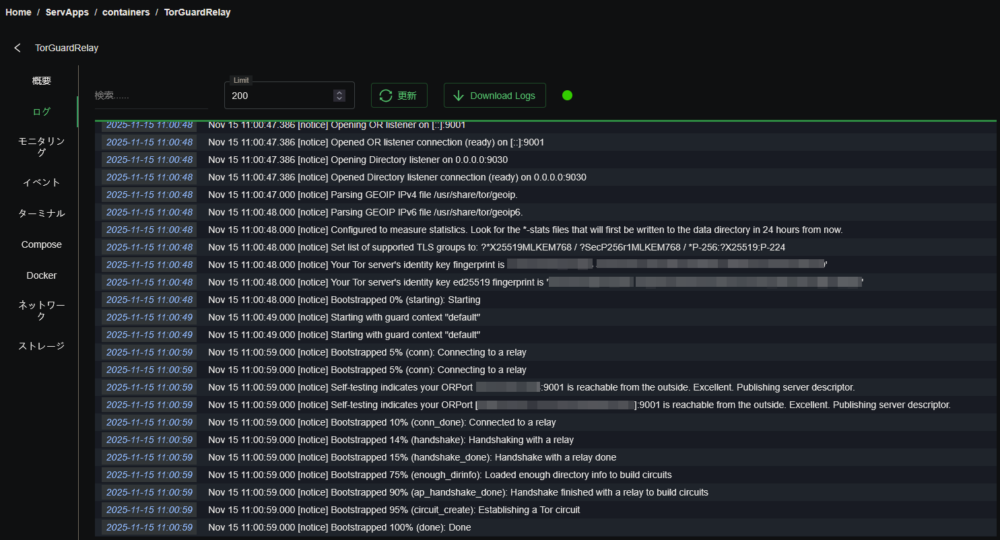
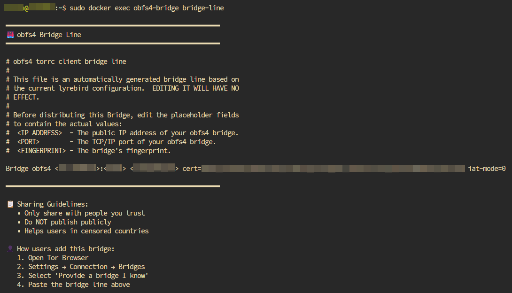
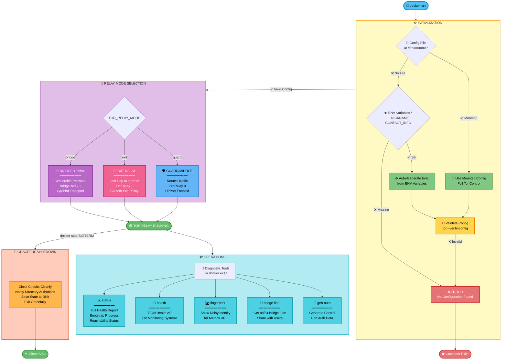

<a id="readme-top"></a>
<div align="center">

# 🧅 Tor Guard Relay

[](https://github.com/r3bo0tbx1/tor-guard-relay/actions/workflows/release.yml)
[](https://github.com/r3bo0tbx1/tor-guard-relay/releases/latest)

[](https://hub.docker.com/r/r3bo0tbx1/onion-relay)
[](LICENSE.txt)



**A hardened, production-ready Tor relay with built-in diagnostics and monitoring**

[Quick Start](#-quick-start) • [Features](#-key-features) • [Documentation](#-documentation) • [FAQ](docs/FAQ.md) • [Architecture](docs/ARCHITECTURE.md) • [Tools](#-diagnostic-tools) • [Contributing](#-contributing)

</div>

<br>

<div style="color:#7ce5ff;font-family:monospace;font-size:17px;margin-bottom:14px;">▍ 🚀 What is This?</div>

**Tor Guard Relay** is a production-ready, self-healing Tor relay container designed for privacy advocates who want to contribute to the Tor network securely and efficiently.

> 🌉 **Multi-Mode:** guard, exit, and bridge with obfs4 transport. Configure via `TOR_RELAY_MODE`.

### Why Choose This Project?

- 🛡️ **Security-First** - Hardened Alpine Linux, non-root operation
- 🪶 **Very light** - Ultra-minimal 16.8 MB image
- 🎯 **Simple** - One command to deploy, minimal configuration needed
- 📊 **Observable** - 5 busybox-only diagnostic tools with JSON health API
- 🌉 **Multi-Mode** - Supports guard, exit, and bridge (obfs4) relays
- 🔄 **Automated** - Weekly security rebuilds, CI/CD ready
- 📚 **Documented** - Comprehensive guides for deployment, monitoring, backup, and more
- 🏗️ **Multi-Arch** - Native support for AMD64 and ARM64 (Raspberry Pi, AWS Graviton, etc.)

<br>

<div style="color:#7ce5ff;font-family:monospace;font-size:17px;margin-bottom:14px;">▍ 🔒 Security Model</div>

**Port Exposure Policy**

- **9001** ORPort, public  
- **9030** DirPort, public for guard and exit  
- **9002** obfs4 for bridge mode  

**Environment Variables**

- `TOR_ORPORT` default 9001  
- `TOR_DIRPORT` default 9030  
- `TOR_OBFS4_PORT` default 9002  

Diagnostics are run only through `docker exec`, with no exposed monitoring ports.

Minimal surface area, roughly 16.8 MB.

<br>

<div style="color:#7ce5ff;font-family:monospace;font-size:17px;margin-bottom:14px;">▍ ⚡ Quick Start</div>

### System Requirements

| Component | Minimum | Recommended |
|----------|----------|-------------|
| CPU | 1 core | 2+ cores |
| RAM | 512 MB | 1 GB+ |
| Disk | 10 GB | 20 GB+ SSD |
| Bandwidth | 10 Mbps | 100+ Mbps |
| Uptime | 95 percent | 99 percent |
| Docker | 20.10+ | Latest |

**Supported Architectures:** AMD64, ARM64

### Network Security Notes

⚠️ **Port Exposure:**
- **Guard/Middle/Exit:** Ports 9001 (ORPort) and 9030 (DirPort) should be publicly accessible
- **Bridge:** Ports 9001 (ORPort) and 9002 (obfs4) should be publicly accessible
- **No monitoring ports** - all diagnostics via `docker exec` commands only
- Use `--network host` for best IPv6 support (Tor recommended practice)

### Interactive Quick Start (Recommended for Beginners)

**🚀 Try our interactive setup script:**

```bash
# Download and run the quick-start script
curl -fsSL https://raw.githubusercontent.com/r3bo0tbx1/tor-guard-relay/main/scripts/quick-start.sh -o quick-start.sh
chmod +x quick-start.sh
sh ./quick-start.sh
```

The script will:
- ✅ Guide you through relay type selection (guard, exit, bridge)
- ✅ Collect required information with validation
- ✅ Generate deployment commands or docker-compose.yml
- ✅ Provide next steps and monitoring guidance

### Manual Deployment

**Step 1:** Create your relay configuration (or use our [example](examples/relay-guard.conf)):

```bash
mkdir -p ~/tor-relay && cd ~/tor-relay
curl -o relay.conf https://raw.githubusercontent.com/r3bo0tbx1/tor-guard-relay/refs/heads/main/examples/relay-guard.conf
nano relay.conf
```

### **Step 2:** Run (Docker Hub)

```bash
docker run -d \
  --name tor-relay \
  --restart unless-stopped \
  --network host \
  --security-opt no-new-privileges:true \
  -v $(pwd)/relay.conf:/etc/tor/torrc:ro \
  -v tor-guard-data:/var/lib/tor \
  -v tor-guard-logs:/var/log/tor \
  r3bo0tbx1/onion-relay:latest
```

### **Step 3:** Verify it's running:
```bash
# Check status
docker exec tor-relay status

# View fingerprint
docker exec tor-relay fingerprint

# Stream logs
docker logs -f tor-relay
```

**That's it!** Your relay will bootstrap in 10-30 minutes and appear on [Tor Metrics](https://metrics.torproject.org/rs.html) within 1-2 hours.

> 📖 **Need more?** See our comprehensive [Deployment Guide](docs/DEPLOYMENT.md) for Docker Compose, Cosmos Cloud, Portainer, and advanced setups.

<br>

<div style="color:#7ce5ff;font-family:monospace;font-size:17px;margin-bottom:14px;">▍ 🎯 Choosing a Variant</div>

We offer **two build variants** to match your risk tolerance and requirements:

### Stable Variant (Recommended)

**Base:** Alpine 3.23.0 | **Recommended for:** Production relays

- ✅ Battle-tested Alpine stable release
- ✅ Weekly automated rebuilds with latest security patches
- ✅ Proven stability for long-running relays
- ✅ Available on both **Docker Hub** and **GHCR**

```bash
# Pull from Docker Hub (easiest)
docker pull r3bo0tbx1/onion-relay:latest
docker pull r3bo0tbx1/onion-relay:1.1.3

# Pull from GHCR
docker pull ghcr.io/r3bo0tbx1/onion-relay:latest
docker pull ghcr.io/r3bo0tbx1/onion-relay:1.1.3
```

### Edge Variant (Testing Only)

**Base:** Alpine edge | **Recommended for:** Testing, security research

- ⚡ Bleeding-edge Alpine packages (faster security updates)
- ⚡ Latest Tor and obfs4 versions as soon as available
- ⚡ **More frequent rebuilds** - Every 3 days + weekly (~2-3x faster updates than stable)
- ⚠️ **NOT recommended for production** - less stable, potential breaking changes
- 📦 Available on both Docker Hub and GHCR

```bash
# Pull from Docker Hub
docker pull r3bo0tbx1/onion-relay:edge

# Pull from GHCR
docker pull ghcr.io/r3bo0tbx1/onion-relay:edge
docker pull ghcr.io/r3bo0tbx1/onion-relay:1.1.3-edge
```

**When to use edge:**
- 🔬 Testing new Tor features before stable release
- 🛡️ Security research requiring latest packages
- 🧪 Non-production test environments
- 🚀 Early adopters willing to accept potential breakage

**Stability comparison:**

| Feature | Stable | Edge |
|---------|--------|------|
| Production ready | ✅ Yes | ❌ No |
| Breaking changes | ❌ Rare | ⚠️ Possible |
| Security updates | Weekly | Weekly (newer packages) |
| Package versions | Proven | Bleeding edge |
| Docker Hub | ✅ Yes | ✅ Yes |
| GHCR | ✅ Yes | ✅ Yes |

> 💡 **Our recommendation:** Use **stable** for production relays, **edge** only for testing or when you specifically need the latest package versions.

<br>

<div style="color:#7ce5ff;font-family:monospace;font-size:17px;margin-bottom:14px;">▍ 🏗️ Deployment Methods</div>

Choose the method that fits your workflow.

| Method | Best For | Guide |
|--------|----------|--------|
| 🐳 Docker CLI | Quick testing | [Guide](docs/DEPLOYMENT.md#method-1-docker-cli) |
| 📦 Docker Compose | Production | [Guide](docs/DEPLOYMENT.md#method-2-docker-compose) |
| ☁️ Cosmos Cloud | UI based deployment | [Guide](docs/DEPLOYMENT.md#method-3-cosmos-cloud) |
| 🎛️ Portainer | Web UI | [Guide](docs/DEPLOYMENT.md#method-4-portainer) |

**New to Docker?** Try [Cosmos Cloud](https://cosmos-cloud.io/) by [azukaar](https://github.com/azukaar) - a gorgeous, self-hosted Docker management platform.

### Multi-Relay Setup

Running multiple relays? We have templates for that:

- **Docker Compose:** [docker-compose-multi-relay.yml](templates/docker-compose-multi-relay.yml) - 3 relays setup
- **Cosmos Cloud:** [cosmos-compose-multi-relay.json](templates/cosmos-compose-multi-relay.json) - Multi-relay stack

See [Deployment Guide](docs/DEPLOYMENT.md) for complete instructions.

<br>

<div style="color:#7ce5ff;font-family:monospace;font-size:17px;margin-bottom:14px;">▍ 🔧 Diagnostic Tools</div>

Version >=v1.1.1 includes five busybox-only tools.

| Tool | Purpose | Usage |
|------|---------|--------|
| status | Full health report | `docker exec tor-relay status` |
| health | JSON health | `docker exec tor-relay health` |
| fingerprint | Show fingerprint | `docker exec tor-relay fingerprint` |
| bridge-line | obfs4 line | `docker exec tor-relay bridge-line` |
| gen-auth | Credentials for Nyx | `docker exec tor-relay gen-auth` |

```bash
# Full health report with emojis
docker exec tor-relay status

# JSON output for automation/monitoring
docker exec tor-relay health
```

Example JSON:

```json
{
  "status": "healthy",
  "bootstrap": 100,
  "reachable": true,
  "fingerprint": "1234567890ABCDEF",
  "nickname": "MyRelay",
  "uptime_seconds": 3600
}
```

> 📖 **Complete reference:** See [Tools Documentation](docs/TOOLS.md) for all 5 tools with examples, JSON schema, and integration guides.

<br>

<div style="color:#7ce5ff;font-family:monospace;font-size:17px;margin-bottom:14px;">▍ 📊 Monitoring and Observability</div>

<br>
<div align="center">
  
</div>
<br>

**>=v1.1.2 supports both real-time CLI monitoring and external observability** for minimal image size and maximum security.

### Real-Time Monitoring (Nyx)

You can connect Nyx (formerly arm) to your relay securely using the Control Port.

1. Generate credentials: docker exec tor-relay gen-auth
2. Add the hash to your config.
3. Connect via local socket or TCP.

> 📖 Full Setup: See the [Control Port Guide](docs/CONTROL-PORT.md) for step-by-step Nyx configuration.

### JSON Health API

The `health` tool provides JSON output for monitoring integration:

```bash
# Get health status (raw JSON)
docker exec tor-relay health

# Parse with jq (requires jq installed on HOST machine)
docker exec tor-relay health | jq .

# Example cron-based monitoring
*/5 * * * * docker exec tor-relay health | jq '.status' | grep -q 'healthy' || alert
```

> **Note:** `jq` must be installed on your HOST machine (`apt install jq` / `brew install jq`), NOT in the container.

### Integration Examples

**Prometheus Node Exporter:**
```bash
# Use textfile collector (requires jq on host)
docker exec tor-relay health | jq -r '
  "tor_bootstrap_percent \(.bootstrap)",
  "tor_reachable \(if .reachable then 1 else 0 end)"
' > /var/lib/node_exporter/tor.prom
```

**Nagios/Icinga:**
```bash
#!/bin/bash
# Requires jq on host machine
HEALTH=$(docker exec tor-relay health)
STATUS=$(echo "$HEALTH" | jq -r '.status')
[ "$STATUS" = "healthy" ] && exit 0 || exit 2
```

> 📖 **Complete guide:** See [Monitoring Documentation](docs/MONITORING.md) for Prometheus, Grafana, alert integration, and observability setup.

<br>

<div style="color:#7ce5ff;font-family:monospace;font-size:17px;margin-bottom:14px;">▍ 🎯 Key Features</div>

### Security & Reliability
- ✅ Non-root execution (runs as `tor` user)
- ✅ Ultra-minimal Alpine Linux base (**~16.8 MB**)
- ✅ Busybox-only tools (no bash/python dependencies)
- ✅ Automatic permission healing on startup
- ✅ Configuration validation before start
- ✅ Tini init for proper signal handling
- ✅ Graceful shutdown with cleanup

### Operations & Automation
- ✅ **5 busybox-only diagnostic tools** (status, health, fingerprint, bridge-line, gen-auth)
- ✅ **JSON health API** for monitoring integration
- ✅ **Multi-mode support** (guard, exit, bridge with obfs4)
- ✅ **ENV-based config** (TOR_RELAY_MODE, TOR_NICKNAME, etc.)
- ✅ **Multi-architecture** builds (AMD64, ARM64)
- ✅ **Weekly security rebuilds** via GitHub Actions
- ✅ **Docker Compose templates** for single/multi-relay
- ✅ **Cosmos Cloud support** with one-click deploy

### Developer Experience
- ✅ Comprehensive documentation (8 guides)
- ✅ Example configurations included
- ✅ GitHub issue templates
- ✅ Automated dependency updates (Dependabot)
- ✅ CI/CD validation and testing
- ✅ Multi-arch support (same command, any platform)

<br>

<div style="color:#7ce5ff;font-family:monospace;font-size:17px;margin-bottom:14px;">▍ 🖼️ Gallery</div>

| Cosmos Cloud Dashboard | Docker Logs (Bootstrapping) |
|:-----------------------:|:---------------------------:|
|  |  |
| Relay Status Tool | Obfs4 Bridge Line |
|  |  |


<br>

<div style="color:#7ce5ff;font-family:monospace;font-size:17px;margin-bottom:14px;">▍ 📚 Documentation</div>

**>=v1.1.1 includes comprehensive documentation** organized by topic:

### Getting Started
- **[FAQ](docs/FAQ.md)** - ⭐ **NEW!** Frequently asked questions with factual answers
- **[Quick Start Script](scripts/utilities/quick-start.sh)** - ⭐ **NEW!** Interactive relay deployment wizard
- **[Migration Assistant](scripts/migration/migrate-from-official.sh)** - ⭐ **NEW!** Automated migration from thetorproject/obfs4-bridge
- **[Deployment Guide](docs/DEPLOYMENT.md)** - Complete installation for Docker CLI, Compose, Cosmos Cloud, and Portainer
- **[Migration Guide](docs/MIGRATION-V1.1.X.md)** - Upgrade to >=v1.1.1 or migrate from other Tor setups

### Technical Reference
- **[Architecture](docs/ARCHITECTURE.md)** - ⭐ **NEW!** Technical architecture with Mermaid diagrams
- **[Tools Reference](docs/TOOLS.md)** - Complete guide to all 4 diagnostic tools
- **[Monitoring Guide](docs/MONITORING.md)** - External monitoring integration, JSON health API, alerts, and observability
- **[Control Port Guide](docs/CONTROL-PORT.md)** - ⭐ **NEW!** Authentication setup and Nyx integration
- **[Backup Guide](docs/BACKUP.md)** - Data persistence, recovery, and disaster planning
- **[Performance Guide](docs/PERFORMANCE.md)** - Optimization, tuning, and resource management

### Legal & Community
- **[Legal Considerations](docs/LEGAL.md)** - Legal aspects of running a Tor relay
- **[Documentation Index](docs/README.md)** - Complete documentation navigation

### Project Info
- **[Security Policy](SECURITY.md)** - Security practices and vulnerability reporting
- **[Contributing Guide](CONTRIBUTING.md)** - How to contribute to the project
- **[Code of Conduct](CODE_OF_CONDUCT.md)** - Community guidelines
- **[Changelog](CHANGELOG.md)** - Version history and changes

> 💡 **Tip:** Start with the [FAQ](docs/FAQ.md) for quick answers or [Documentation Index](docs/README.md) for complete navigation.

<br>

<div style="color:#7ce5ff;font-family:monospace;font-size:17px;margin-bottom:14px;">▍ 🛠️ Configuration</div>

### Minimal Configuration

```ini
Nickname MyTorRelay
ContactInfo your-email@example.com
ORPort 9001
ORPort [::]:9001
DirPort 9030
ExitRelay 0
SocksPort 0
DataDirectory /var/lib/tor
Log notice file /var/log/tor/notices.log
```

### Production Configuration

```ini
RelayBandwidthRate 50 MBytes
RelayBandwidthBurst 100 MBytes
NumCPUs 2
MaxMemInQueues 512 MB
ORPort [::]:9001
```

### Example Configurations

Examples are found in the [`examples/`](examples/) directory for complete, annotated configuration files:

- **[relay-guard.conf](examples/relay-guard.conf)** - Recommended production config
- Additional examples for specific use cases

> 📖 **Configuration help:** See [Deployment Guide](docs/DEPLOYMENT.md#configuration) for complete reference.

<br>

<div style="color:#7ce5ff;font-family:monospace;font-size:17px;margin-bottom:14px;">▍ 🔍 Monitoring Your Relay</div>

### Check Bootstrap Status

```bash
# Quick status
docker exec tor-relay status

# JSON output for automation (raw)
docker exec tor-relay health

# Parse specific field with jq (requires jq on host)
docker exec tor-relay health | jq .bootstrap
```r exec tor-relay health | jq .bootstrap
```

### View on Tor Metrics

After 1-2 hours, find your relay:

🔗 **[Tor Metrics Relay Search](https://metrics.torproject.org/rs.html)**

Search by:
- Nickname (e.g., "MyTorRelay")
- Fingerprint (get with `docker exec tor-relay fingerprint`)
- IP address

### Expected Timeline

| Milestone | Time | What to Expect |
|-----------|------|----------------|
| Bootstrap Complete | 10-30 min | Logs show "Bootstrapped 100%" |
| Appears on Metrics | 1-2 hours | Relay visible in search |
| First Statistics | 24-48 hours | Bandwidth graphs appear |
| Guard Flag | 8+ days | Trusted for entry connections |

> 📖 **Detailed monitoring:** See [Monitoring Guide](docs/MONITORING.md) for complete observability setup with Prometheus and Grafana.

<br>

<div style="color:#7ce5ff;font-family:monospace;font-size:17px;margin-bottom:14px;">▍ 🐛 Troubleshooting</div>

### Quick Diagnostics

```bash
# Check overall status
docker exec tor-relay status

# Check JSON health (raw)
docker exec tor-relay health

# View fingerprint
docker exec tor-relay fingerprint

# For bridge mode: Get bridge line
docker exec tor-relay bridge-line

# Generate Control Port hash
docker exec tor-relay gen-auth
```

### Common Issues

| Problem | Quick Fix |
|---------|-----------|
| Container won't start | Check logs: `docker logs tor-relay` |
| ORPort not reachable | Verify firewall: `sudo ufw allow 9001/tcp` |
| Not on Tor Metrics | Wait 24h, verify bootstrap complete |
| Low/no traffic | Normal for new relays (2-8 weeks to build reputation) |

> 📖 **Full troubleshooting:** See [Tools Documentation](docs/TOOLS.md#troubleshooting) for detailed diagnostic procedures.

<br>

<div style="color:#7ce5ff;font-family:monospace;font-size:17px;margin-bottom:14px;">▍ 🏢 Architecture and Design</div>

> 📐 **NEW:** See the complete [Architecture Documentation](docs/ARCHITECTURE.md) for detailed technical design with Mermaid diagrams covering:
> - Container lifecycle and initialization flow (6 phases)
> - ENV compatibility layer and configuration priority
> - Config generation for guard/exit/bridge modes
> - OBFS4V security validation (v1.1.1 fix)
> - Diagnostic tools architecture
> - Signal handling and graceful shutdown

<div style="color:#7ce5ff;font-family:monospace;font-size:17px;margin-bottom:14px;">▍ 📊 Flowchart</div>



### Why Host Network Mode?

This project uses `--network host` for important reasons:

- ✅ **IPv6 Support** - Direct access to host's IPv6 stack
- ✅ **No NAT** - Tor binds directly to ports without translation
- ✅ **Better Performance** - Eliminates network overhead
- ✅ **Tor Recommended** - Follows Tor Project best practices

**Security:** The container still runs as non-root with restricted permissions. Host networking is standard for Tor relays.

### Multi-Architecture Support

Docker automatically pulls the correct architecture:

```bash
# Same command works on:
# - x86_64 servers (pulls amd64)
# - Raspberry Pi (pulls arm64)
# - AWS Graviton (pulls arm64)
docker pull r3bo0tbx1/onion-relay:latest
```

Verify what you got:
```bash
docker exec tor-relay cat /build-info.txt | grep Architecture
```

<br>

<div style="color:#7ce5ff;font-family:monospace;font-size:17px;margin-bottom:14px;">▍ 🤝 Contributing</div>

Contributions are welcome.

- 🐛 **Report bugs** via [GitHub Issues](https://github.com/r3bo0tbx1/tor-guard-relay/issues)
- 💡 **Suggest features** or improvements
- 📖 **Improve documentation** (typos, clarity, examples)
- 🔧 **Submit pull requests** (code, configs, workflows)
- ⭐ **Star the repository** to show support
- 🧅 **Run a relay** and strengthen the network!

### Development Setup

```bash
# Clone repository
git clone https://github.com/r3bo0tbx1/tor-guard-relay.git
cd tor-guard-relay

# Build locally
docker build -t tor-relay:dev .

# Test
docker run --rm tor-relay:dev status
```

See [Contributing Guide](CONTRIBUTING.md) for detailed instructions.

<br>

<div style="color:#7ce5ff;font-family:monospace;font-size:17px;margin-bottom:14px;">▍ 📦 Templates and Examples</div>

All templates are in the [`templates/`](templates/) directory:

### Docker Compose
- [docker-compose.yml](templates/docker-compose.yml) - Single relay
- [docker-compose-multi-relay.yml](templates/docker-compose-multi-relay.yml) - 3 relays + monitoring

### Cosmos Cloud
- [cosmos-compose.json](templates/cosmos-compose.json) - Single relay
- [cosmos-compose-multi-relay.json](templates/cosmos-compose-multi-relay.json) - Multi-relay stack

### Monitoring
See [Monitoring Guide](docs/MONITORING.md) for external monitoring integration examples with Prometheus, Nagios, and other tools

### Configuration Examples
See [`examples/`](examples/) directory for relay configurations.

<br>

<div style="color:#7ce5ff;font-family:monospace;font-size:17px;margin-bottom:14px;">▍ 🔐 Security</div>

### Best Practices

✅ Store `relay.conf` with restricted permissions (`chmod 600`)  
✅ Never commit configs with sensitive info to Git  
✅ Use PGP key in ContactInfo for verification  
✅ Regularly update Docker image for security patches  
✅ Monitor logs for suspicious activity  
✅ Configure firewall properly  

### Security Policy

Found a vulnerability? See our [Security Policy](SECURITY.md) for responsible disclosure.

### Updates

Images are automatically rebuilt on separate schedules to include security patches:

**Stable Variant** (`:latest`)
- **Schedule:** Every Sunday at 18:30 UTC
- **Includes:** Latest Tor + Alpine 3.23.0 updates
- **Strategy:** Overwrites last release version (e.g., `:1.1.3`) with updated packages
- **Tags Updated:** `:latest` and version tags (e.g., `:1.1.3`)

**Edge Variant** (`:edge`)
- **Schedule:** Every 3 days at 12:00 UTC (independent schedule)
- **Includes:** Latest Tor + Alpine edge (bleeding-edge) updates
- **Strategy:** Overwrites last release version (e.g., `:1.1.3-edge`) with updated packages
- **Tags Updated:** `:edge` and version tags (e.g., `:1.1.3-edge`)
- **Frequency:** ~2-3x more frequent updates than stable

All images auto-published to Docker Hub and GitHub Container Registry

<br>

<div style="color:#7ce5ff;font-family:monospace;font-size:17px;margin-bottom:14px;">▍ 🌐 Resources</div>

### Container Registries
- 🐳 [Docker Hub Repository](https://hub.docker.com/r/r3bo0tbx1/onion-relay)
- 📦 [GitHub Container Registry](https://github.com/r3bo0tbx1/tor-guard-relay/pkgs/container/onion-relay)

### Official Tor Project
- 📚 [Relay Setup Guide](https://community.torproject.org/relay/setup/)
- 💬 [Relay Operators Forum](https://forum.torproject.org/c/relay-operators)
- 📧 [Mailing List](https://lists.torproject.org/cgi-bin/mailman/listinfo/tor-relays)
- 📊 [Tor Metrics](https://metrics.torproject.org/)

### This Project
- 📖 [Documentation](docs/README.md)
- 🐛 [Issue Tracker](https://github.com/r3bo0tbx1/tor-guard-relay/issues)
- 💬 [Discussions](https://github.com/r3bo0tbx1/tor-guard-relay/discussions)
- 📦 [Container Registry](https://github.com/r3bo0tbx1/tor-guard-relay/pkgs/container/onion-relay) 

<br>

<div style="color:#7ce5ff;font-family:monospace;font-size:17px;margin-bottom:14px;">▍ 📊 Project Status</div>

<div align="center">


**Current Version:** v1.1.3 • **Status:** Production Ready  
**Image Size:** 16.8 MB • **Rebuild:** Weekly  
**Registries:** Docker Hub • GHCR  

</div>

<br>

<div style="color:#7ce5ff;font-family:monospace;font-size:17px;margin-bottom:14px;">▍ 📄 License</div>

Project is licensed under the MIT License.  
See [License](LICENSE.txt) for full details.

<br>

<div style="color:#7ce5ff;font-family:monospace;font-size:17px;margin-bottom:14px;">▍ 🙏 Acknowledgments</div>

- **The Tor Project** for maintaining the global privacy network  
- **Alpine Linux** for a minimal and secure base image  
- **azukaar** for Cosmos Cloud  
- **All relay operators** supporting privacy and anti-censorship worldwide

<br>

<div style="color:#7ce5ff;font-family:monospace;font-size:17px;margin-bottom:14px;">▍ 💖 Support the Project</div>

This project is open source. Your support helps sustainability and improvements.

### Bitcoin (BTC)
```
bc1qltkajaswmzx9jwets8hfz43nkvred5w92syyq4
```

Or via **[AnonPay](https://trocador.app/anonpay?ticker_to=btc&network_to=Mainnet&address=bc1qltkajaswmzx9jwets8hfz43nkvred5w92syyq4&ref=sqKNYGZbRl&direct=True&name=rE-Bo0tbx1+%28r3bo0tbx1%29&description=Support+FOSS+Development&email=r3bo0tbx1%40brokenbotnet.com)** (convert any crypto)

### Monero (XMR)
```
45mNg5cG1S2B2C5dndJP65SSEXseHFVqFdv1N6paAraD1Jk9kQxQQArVcjfQmgCcmthrUF3jbNs74c5AbWqMwAAgAjDYzrZ
```
Or via **[AnonPay](https://trocador.app/anonpay?ticker_to=xmr&network_to=Mainnet&address=85ft7ehMfcKSSp8Ve92Y9oARmqvDjYvEiKQkzdp3qiyzP9dpLeJXFahgHcoXUPeE9TacqDCUXWppNffE3YDC1Wu1NnQ71rT&ref=sqKNYGZbRl&direct=True&name=rE-Bo0tbx1+%28r3bo0tbx1%29&description=Support+FOSS+Development&email=r3bo0tbx1%40brokenbotnet.com)** (convert any crypto)

### Other Ways to Support

- ⭐ Star the repo  
- 🐛 Report bugs  
- 💡 Suggest features  
- 📖 Improve documentation  
- 🤝 Submit patches  
- 🧅 Run a relay  

<br>

<div style="color:#7ce5ff;font-family:monospace;font-size:17px;margin-bottom:14px;">▍ ⭐ Star History</div>

<div align="center">

<a href="https://www.star-history.com/#r3bo0tbx1/tor-guard-relay&type=date&legend=top-left">
 <picture>
   <source media="(prefers-color-scheme: dark)" srcset="https://api.star-history.com/svg?repos=r3bo0tbx1/tor-guard-relay&type=date&theme=dark&legend=top-left" />
   <source media="(prefers-color-scheme: light)" srcset="https://api.star-history.com/svg?repos=r3bo0tbx1/tor-guard-relay&type=date&legend=top-left" />
   
 </picture>
</a>

</div>

<br>

<div align="center">

<div style="color:#7ce5ff;font-family:monospace;font-size:18px;margin-bottom:10px;">Made with 💜 for a freer, uncensored internet</div>

*Protecting privacy, one relay at a time* 🔁🧅✨

⭐ Star this repo if you find it useful!

🌍 [Support Internet Freedom](https://donate.torproject.org/)  
📚 [Documentation](docs/README.md)  
⬆ [Back to top](#readme-top)

</div>

