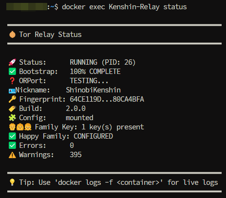
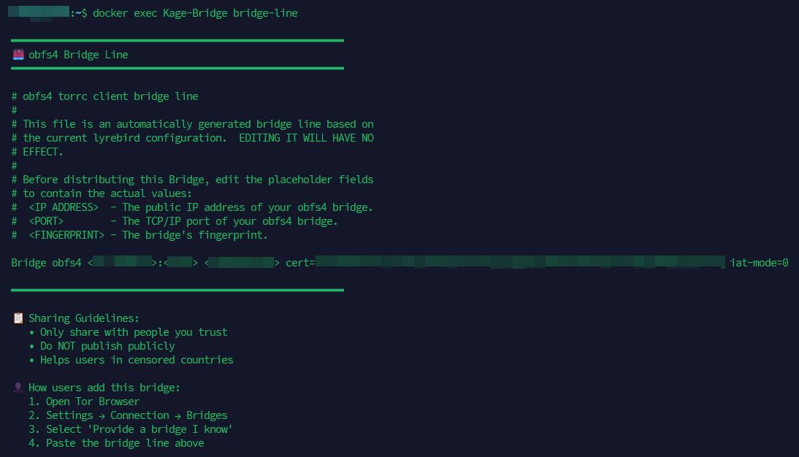
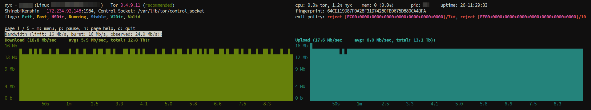

<a id="readme-top"></a>
<div align="center">

# 🧅 Tor Guard Relay

[](https://github.com/r3bo0tbx1/tor-guard-relay/actions/workflows/release.yml)
[](https://github.com/r3bo0tbx1/tor-guard-relay/releases/latest)
[](#multi-architecture-support)
[](https://hub.docker.com/r/r3bo0tbx1/onion-relay)
[](LICENSE.txt)
[](https://brokenbotnet.com/donate/)


**A hardened, production-ready Tor relay with built-in diagnostics and monitoring**

[Quick Start](#-quick-start) • [Features](#-key-features) • [🌐 Live Dashboard](https://relays.brokenbotnet.com/) • [Documentation](#-documentation) • [Gallery](#️-gallery) • [FAQ](docs/FAQ.md) • [Architecture](docs/ARCHITECTURE.md) • [Tools](#-diagnostic-tools) • [Contributing](#-contributing)

</div>

---

## 🚀 What is This?

**Tor Guard Relay** is a production-ready, self-healing Tor relay container designed for privacy advocates who want to contribute to the Tor network securely and efficiently.

> 🌉 **Multi-Mode:** guard, exit, and bridge with obfs4 transport. Configure via `TOR_RELAY_MODE`.

### Why Choose This Project?

- 🛡️ **Security-First** - Hardened Alpine Linux, non-root operation, and minimized port exposure
- 🪶 **Very light** - Ultra-minimal 16.8 MB image
- 🎯 **Simple** - One command to deploy, minimal configuration needed
- 📊 **Observable** - 6 busybox-only diagnostic tools with JSON health API
- 🌉 **Multi-Mode** - Supports guard, exit, and bridge (obfs4) relays
- 🔄 **Automated** - Weekly security rebuilds, CI/CD ready
- 📚 **Documented** - Comprehensive guides for deployment, monitoring, backup, and more
- 🏗️ **Multi-Arch** - Native support for AMD64 and ARM64 (Raspberry Pi, AWS Graviton, etc.)

### 🌐 Live Production Network

**Battle-tested in production.** See it live: **[relays.brokenbotnet.com](https://relays.brokenbotnet.com/)**

🌉 **Bridges** (Obfs4) • 🛡️ **Middle/Guard** • 🚪 **Exit** across **15 countries**

> 🇯🇵 • 🇰🇷 • 🇸🇬 • 🇲🇾 • 🇮🇩 • 🇻🇳 • 🇭🇰 • 🇦🇺 • 🇷🇺 • 🇹🇷 • 🇿🇦 • 🇨🇦 • 🇺🇸 • 🇲🇽 • 🇧🇷

---

## 🔒 Security Model

### Port Exposure Policy

- **9001** ORPort, public
- **9002** obfs4 for bridge mode
- DirPort, **Disabled (0)** by default

### Environment Variables

- `TOR_ORPORT` default 9001
- `TOR_OBFS4_PORT` default 9002
- `TOR_DIRPORT` default 0 (Disabled)

Diagnostics are run only through `docker exec`, with no exposed monitoring ports.

Minimal surface area, roughly 16.8 MB.

---

## ⚡ Quick Start

### System Requirements

| Component | Minimum | Recommended |
|----------|----------|-------------|
| CPU | 1 core | 2+ cores |
| RAM | 512 MB | 1 GB+ |
| Disk | 10 GB | 20 GB+ SSD |
| Bandwidth | 10 Mbps | 100+ Mbps |
| Uptime | 95 percent | 99 percent |
| Docker | 20.10+ | Latest |

**Supported Architectures:** AMD64, ARM64

### Network Security Notes

⚠️ **Port Exposure:**
- **Guard/Middle/Exit:** Port 9001 (ORPort) should be publicly accessible
- **Bridge:** Ports 9001 (ORPort) and 9002 (obfs4) should be publicly accessible
- **No monitoring ports** - all diagnostics via `docker exec` commands only
- Use `--network host` for best IPv6 support (Tor recommended practice)

### Interactive Quick Start (Recommended for Beginners)

**🚀 Try our interactive setup script:**

```bash
# Download and run the quick-start script
curl -fsSL https://raw.githubusercontent.com/r3bo0tbx1/tor-guard-relay/main/scripts/quick-start.sh -o quick-start.sh
chmod +x quick-start.sh && sh ./quick-start.sh
```

The script will:
- ✅ Guide you through relay type selection (guard, exit, bridge)
- ✅ Collect required information with validation
- ✅ Generate deployment commands or docker-compose.yml
- ✅ Provide next steps and monitoring guidance

### Manual Deployment

**Step 1:** Create your relay configuration (or use our [example](examples/relay-guard.conf)):

```bash
mkdir -p ~/tor-relay && cd ~/tor-relay && curl -o relay.conf https://raw.githubusercontent.com/r3bo0tbx1/tor-guard-relay/refs/heads/main/examples/relay-guard.conf && nano relay.conf
```

**Step 2:** Run (Docker Hub)

```bash
docker run -d \
  --name tor-relay \
  --restart unless-stopped \
  --network host \
  --security-opt no-new-privileges:true \
  -v $(pwd)/relay.conf:/etc/tor/torrc:ro \
  -v tor-guard-data:/var/lib/tor \
  -v tor-guard-logs:/var/log/tor \
  r3bo0tbx1/onion-relay:latest
```

**Step 3:** Verify it's running:

```bash
# Check status
docker exec tor-relay status

# View fingerprint
docker exec tor-relay fingerprint

# Stream logs
docker logs -f tor-relay
```

**That's it!** Your relay will bootstrap in 10-30 minutes and appear on [Tor Metrics](https://metrics.torproject.org/rs.html) within 1-2 hours.

> 📖 **Need more?** See our comprehensive [Deployment Guide](docs/DEPLOYMENT.md) for Docker Compose, Cosmos Cloud, Portainer, and advanced setups.

---

## 🎯 Choosing a Variant

We offer **two build variants** to match your risk tolerance and requirements:

### Stable Variant (Recommended)

**Base:** Alpine 3.24.1 | **Recommended for:** Production relays

- ✅ Battle-tested Alpine stable release
- ✅ Weekly automated rebuilds with latest security patches
- ✅ Proven stability for long-running relays
- ✅ Available on both **Docker Hub** and **GHCR**

```bash
# Pull from Docker Hub (easiest)
docker pull r3bo0tbx1/onion-relay:latest
docker pull r3bo0tbx1/onion-relay:2.0.0

# Pull from GHCR
docker pull ghcr.io/r3bo0tbx1/onion-relay:latest
docker pull ghcr.io/r3bo0tbx1/onion-relay:2.0.0
```

### Edge Variant (Testing Only)

**Base:** Alpine edge | **Recommended for:** Testing, security research

- ⚡ Bleeding-edge Alpine packages (faster security updates)
- ⚡ Latest Tor and obfs4 versions as soon as available
- ⚡ **More frequent rebuilds** - Every 3 days + weekly (~2-3x faster updates than stable)
- ⚠️ **NOT recommended for production** - less stable, potential breaking changes
- 📦 Available on both Docker Hub and GHCR

```bash
# Pull from Docker Hub
docker pull r3bo0tbx1/onion-relay:edge

# Pull from GHCR
docker pull ghcr.io/r3bo0tbx1/onion-relay:edge
docker pull ghcr.io/r3bo0tbx1/onion-relay:2.0.0-edge
```

**When to use edge:**
- 🔬 Testing new Tor features before stable release
- 🛡️ Security research requiring latest packages
- 🧪 Non-production test environments
- 🚀 Early adopters willing to accept potential breakage

> 💡 **Our recommendation:** Use **stable** for production relays, **edge** only for testing or when you specifically need the latest package versions.

---

## 🏗️ Deployment Methods

Choose the method that fits your workflow.

| Method | Best For | Guide |
|--------|----------|--------|
| 🐳 Docker CLI | Quick testing | [Guide](docs/DEPLOYMENT.md#method-1-docker-cli) |
| 📦 Docker Compose | Production | [Guide](docs/DEPLOYMENT.md#method-2-docker-compose) |
| ☁️ Cosmos Cloud | UI based deployment | [Guide](docs/DEPLOYMENT.md#method-3-cosmos-cloud) |
| 🎛️ Portainer | Web UI | [Guide](docs/DEPLOYMENT.md#method-4-portainer) |

**New to Docker?** Try [Cosmos Cloud](https://cosmos-cloud.io/) by [azukaar](https://github.com/azukaar) - a gorgeous, self-hosted Docker management platform.

### Multi-Relay Setup

Running multiple relays? We have templates for that:

- **Docker Compose:** [docker-compose-multi-relay.yml](https://github.com/r3bo0tbx1/tor-guard-relay/blob/main/templates/docker-compose/docker-compose-multi-relay.yml) - 3 relays setup
- **Cosmos Cloud:** [cosmos-compose-multi-relay.json](https://github.com/r3bo0tbx1/tor-guard-relay/blob/main/templates/cosmos-compose/cosmos-compose-multi-relay.json) - Multi-relay stack

See [Deployment Guide](docs/DEPLOYMENT.md) for complete instructions.

---

## 🔧 Diagnostic Tools

Six busybox-only diagnostic tools are included.

| Tool | Purpose | Usage |
|------|---------|--------|
| status | Full health report | `docker exec tor-relay status` |
| health | JSON health | `docker exec tor-relay health` |
| fingerprint | Show fingerprint | `docker exec tor-relay fingerprint` |
| bridge-line | obfs4 line | `docker exec tor-relay bridge-line` |
| gen-auth | Credentials for Nyx | `docker exec tor-relay gen-auth` |
| gen-family | Happy Family key gen | `docker exec tor-relay gen-family MyRelays` |

```bash
# Full health report with emojis
docker exec tor-relay status

# JSON output for automation/monitoring
docker exec tor-relay health
```

Example JSON:

```json
{
  "status": "up",
  "pid": 1,
  "uptime": "01:00:00",
  "bootstrap": 100,
  "reachable": "true",
  "errors": 0,
  "nickname": "MyRelay",
  "fingerprint": "1234567890ABCDEF"
}
```

> 📖 **Complete reference:** See [Tools Documentation](docs/TOOLS.md) for all 6 tools with examples, JSON schema, and integration guides.

---

## 📊 Monitoring and Observability

**Real-time CLI monitoring and external observability** are supported for minimal image size and maximum security.

### Real-Time Monitoring (Nyx)

You can connect Nyx (formerly arm) to your relay securely using the Control Port.

1. Generate credentials: `docker exec tor-relay gen-auth`
2. Add the hash to your config
3. Connect via local socket or TCP

> 📖 **Full Setup:** See the [Control Port Guide](docs/CONTROL-PORT.md) for step-by-step Nyx configuration.

### JSON Health API

The `health` tool provides JSON output for monitoring integration:

```bash
# Get health status (raw JSON)
docker exec tor-relay health

# Parse with jq (requires jq installed on HOST machine)
docker exec tor-relay health | jq .

# Example cron-based monitoring
*/5 * * * * docker exec tor-relay health | jq '.status' | grep -q 'healthy' || alert
```

> **Note:** `jq` must be installed on your HOST machine (`apt install jq` / `brew install jq`), NOT in the container.

> 📖 **Complete guide:** See [Monitoring Documentation](docs/MONITORING.md) for Prometheus, Grafana, alert integration, and observability setup.

---

## 🎯 Key Features

### Security & Reliability
- ✅ Non-root execution (runs as `tor` user)
- ✅ Ultra-minimal Alpine Linux base (**~16.8 MB**)
- ✅ Busybox-only tools (no bash/python dependencies)
- ✅ Automatic permission healing on startup
- ✅ Configuration validation before start
- ✅ Tini init for proper signal handling
- ✅ Graceful shutdown with cleanup

### Operations & Automation
- ✅ **6 busybox-only diagnostic tools** (status, health, fingerprint, bridge-line, gen-auth, gen-family)
- ✅ **JSON health API** for monitoring integration
- ✅ **Multi-mode support** (guard, exit, bridge with obfs4)
- ✅ **Happy Family support** (Tor 0.4.9.2-alpha or later, using key-based relay families)
- ✅ **ENV-based config** (TOR_RELAY_MODE, TOR_NICKNAME, TOR_FAMILY_ID, etc.)
- ✅ **Multi-architecture** builds (AMD64, ARM64)
- ✅ **Weekly security rebuilds** via GitHub Actions
- ✅ **Docker Compose templates** for single/multi-relay
- ✅ **Cosmos Cloud support** with one-click deploy
- ✅ **Automated Maintenance:** Keeps 14 recent GHCR package versions and 14 recent Docker Hub versioned tags

### Developer Experience
- ✅ Comprehensive documentation (8 guides)
- ✅ Example configurations included
- ✅ GitHub issue templates
- ✅ Automated dependency updates (Renovate)
- ✅ CI/CD validation and testing
- ✅ Multi-arch support (same command, any platform)

---

## 🖼️ Gallery

<table>
  <tr>
    <th><div align="center">Cosmos Cloud Dashboard</div></th>
    <th><div align="center">Docker Logs (Bootstrapping)</div></th>
  </tr>
  <tr>
    <td align="center"></td>
    <td align="center"></td>
  </tr>
  <tr>
    <th><div align="center">Relay Status Tool</div></th>
    <th><div align="center">obfs4 Bridge Line</div></th>
  </tr>
  <tr>
    <td align="center"></td>
    <td align="center"></td>
  </tr>
  <tr>
    <th colspan="2"><div align="center">Nyx Bandwidth Monitoring</div></th>
  </tr>
  <tr>
    <td colspan="2" align="center"></td>
  </tr>
</table>

---

## 📚 Documentation

**Comprehensive documentation** organized by topic:

### Getting Started
- **[FAQ](docs/FAQ.md)** - Frequently asked questions with factual answers
- **[Quick Start Script](scripts/utilities/quick-start.sh)** - Interactive relay deployment wizard
- **[Migration Assistant](scripts/migration/migrate-from-official.sh)** - Automated migration from thetorproject/obfs4-bridge
- **[Deployment Guide](docs/DEPLOYMENT.md)** - Complete installation for Docker CLI, Compose, Cosmos Cloud, and Portainer
- **[Migration Guide](docs/MIGRATION-V1.1.X.md)** - Upgrade to latest or migrate from other Tor setups

### Technical Reference
- **[Architecture](docs/ARCHITECTURE.md)** - Technical architecture with Mermaid diagrams
- **[Tools Reference](docs/TOOLS.md)** - Complete guide to all 6 diagnostic tools
- **[Monitoring Guide](docs/MONITORING.md)** - External monitoring integration, JSON health API, alerts, and observability
- **[Control Port Guide](docs/CONTROL-PORT.md)** - Authentication setup and Nyx integration
- **[Backup Guide](docs/BACKUP.md)** - Data persistence, recovery, and disaster planning
- **[Performance Guide](docs/PERFORMANCE.md)** - Optimization, tuning, and resource management

### Legal & Community
- **[Legal Considerations](docs/LEGAL.md)** - Legal aspects of running a Tor relay
- **[Documentation Index](docs/README.md)** - Complete documentation navigation

### Project Info
- **[Security Policy](SECURITY.md)** - Security practices and vulnerability reporting
- **[Contributing Guide](CONTRIBUTING.md)** - How to contribute to the project
- **[Code of Conduct](CODE_OF_CONDUCT.md)** - Community guidelines
- **[Changelog](CHANGELOG.md)** - Version history and changes

> 💡 **Tip:** Start with the [FAQ](docs/FAQ.md) for quick answers or [Documentation Index](docs/README.md) for complete navigation.

---

## 🛠️ Configuration

### Minimal Configuration

```ini
Nickname MyTorRelay
ContactInfo email:your-email[]example.com url:https://example.com proof:uri-familyid-ed25519 ciissversion:3
ORPort 9001
ORPort [::]:9001
DirPort 0
ExitRelay 0
SocksPort 0
DataDirectory /var/lib/tor
Log notice file /var/log/tor/notices.log
```

> 📝 **ContactInfo format:** We recommend the [ContactInfo Information Sharing Specification (CIISS) v3](https://nusenu.github.io/ContactInfo-Information-Sharing-Specification/), a machine-readable format that replaces `@` with `[]` and includes structured fields like `email:`, `url:`, `proof:`, `pgp:`, `hoster:`, and more. Use the [CIISS Generator](https://torcontactinfogenerator.netlify.app/) to create yours.

### Production Configuration

```ini
RelayBandwidthRate 50 MBytes
RelayBandwidthBurst 100 MBytes
NumCPUs 2
MaxMemInQueues 512 MB
ORPort [::]:9001
```

### Example Configurations

Examples are found in the [`examples/`](examples/) directory for complete, annotated configuration files:

- **[relay-guard.conf](examples/relay-guard.conf)** - Recommended production config
- Additional examples for specific use cases

> 📖 **Configuration help:** See [Deployment Guide](docs/DEPLOYMENT.md#configuration) for complete reference.

### Happy Family (Tor 0.4.9.2-alpha or Later)

Tor 0.4.9.2-alpha introduced **Happy Families**, a cryptographic key-based replacement for `MyFamily`. Instead of listing every relay fingerprint in every relay's config, all relays in a family share one secret key.

**Why upgrade?**
- Reduces the descriptor overhead caused by repeated `MyFamily` lists
- Simpler to maintain - one key file instead of N×N fingerprint entries

**Quick setup:**

```bash
# 1. Generate a family key (run on any ONE relay container)
docker exec tor-relay gen-family MyRelays

# 2. Copy the key to other relay containers
docker cp tor-relay:/var/lib/tor/keys/MyRelays.secret_family_key .
docker cp MyRelays.secret_family_key other-relay:/var/lib/tor/keys/

# 3. Fix permissions inside the target container
docker exec -u 0 other-relay chown 100:101 /var/lib/tor/keys/MyRelays.secret_family_key
docker exec -u 0 other-relay chmod 600 /var/lib/tor/keys/MyRelays.secret_family_key

# 4. Add FamilyId to each relay's torrc, then restart
docker restart tor-relay other-relay
```

**Torrc configuration:**

During the transition period, configure **both** `FamilyId` and `MyFamily`:

```ini
# Happy Family (Tor 0.4.9.2-alpha or later)
FamilyId wweKJrJxUDs1EdtFFHCDtvVgTKftOC/crUl1mYJv830

# MyFamily (legacy - keep during transition)
MyFamily 9A2B5C7D8E1F3A4B6C8D0E2F4A6B8C0D2E4F6A8B
MyFamily 1F3E5D7C9B0A2F4E6D8C0B2A4F6E8D0C2B4A6F8E
```

The Tor Project will announce when `MyFamily` can be removed.

**ENV-based config (alternative to mounted torrc):**

`TOR_FAMILY_ID` accepts the exact 43-character unpadded base64 value generated by Tor.

```yaml
environment:
  TOR_FAMILY_ID: "wweKJrJxUDs1EdtFFHCDtvVgTKftOC/crUl1mYJv830"
  TOR_MY_FAMILY: "FINGERPRINT1,FINGERPRINT2,FINGERPRINT3"
```

> ⚠️ **Treat the `.secret_family_key` like a private key.** Anyone with this file can claim their relay belongs to your family. Back it up securely - losing it means regenerating for all relays.

> 📖 **Full guide with troubleshooting:** See [Deployment Guide](docs/DEPLOYMENT.md#happy-family) | **Official docs:** [Tor Happy Family Guide](https://community.torproject.org/relay/setup/post-install/family-ids/)

---

## 🔍 Monitoring Your Relay

### Check Bootstrap Status

```bash
# Quick status
docker exec tor-relay status

# JSON output for automation (raw)
docker exec tor-relay health

# Parse specific field with jq (requires jq on host)
docker exec tor-relay health | jq .bootstrap
```

### View on Tor Metrics

After 1-2 hours, find your relay:

🔗 **[Tor Metrics Relay Search](https://metrics.torproject.org/rs.html)**

Search by:
- Nickname (e.g., "MyTorRelay")
- Fingerprint (get with `docker exec tor-relay fingerprint`)
- IP address

### Expected Timeline

| Milestone | Time | What to Expect |
|-----------|------|----------------|
| Bootstrap Complete | 10-30 min | Logs show "Bootstrapped 100%" |
| Appears in Consensus | 1-3 hours | Relay visible in Tor Metrics search |
| Bandwidth Cap Lifted | ~3 days | bwauths measure you; 20 KB/s cap removed, traffic ramps up |
| First Statistics | 24-48 hours | Bandwidth graphs appear on Tor Metrics |
| Guard Flag | **8+ days** | Eligible for entry guard selection by clients |

> 🗳️ **How relay flags work:** Tor has **9 Directory Authorities (DAs)** that vote every hour to update the consensus. A consensus document is valid if more than half of the authorities signed it, meaning **5 of 9** must agree for a flag to appear. This is why flags take time: your relay must prove itself to a majority of independent, geographically distributed authorities.
>
> **To receive the Guard flag**, three criteria must all be met:
> - **Bandwidth** - must have a sufficient consensus weight as measured by bandwidth authorities
> - **Weighted Fractional Uptime (WFU)** - must demonstrate consistent, reliable uptime
> - **Time Known** - you're first eligible for the Guard flag on day eight
>
> The **Stable** flag is a prerequisite for Guard. Only stable and reliable relays can be used as guards.
>
> ⚠️ **Expect a traffic dip after getting Guard:** Once you get the Guard flag, all the rest of the clients back off from using you for middle hops, because when they see the Guard flag, they assume you already have plenty of load from clients using you as their first hop. This is normal, traffic will recover as clients rotate you in as their guard node.

> 📖 **Detailed monitoring:** See [Monitoring Guide](docs/MONITORING.md) for complete observability setup with Prometheus and Grafana.

---

## 🐛 Troubleshooting

### Quick Diagnostics

```bash
# Check overall status
docker exec tor-relay status

# Check JSON health (raw)
docker exec tor-relay health

# View fingerprint
docker exec tor-relay fingerprint

# For bridge mode: Get bridge line
docker exec tor-relay bridge-line

# Generate Control Port hash
docker exec tor-relay gen-auth

# Generate/view Happy Family key
docker exec tor-relay gen-family MyRelays
docker exec tor-relay gen-family --show
```

### Common Issues

| Problem | Quick Fix |
|---------|-----------|
| Container won't start | Check logs: `docker logs tor-relay` |
| Permission / ownership errors | See [Deployment Guide](docs/DEPLOYMENT.md#bind-mount-ownership) |
| ORPort not reachable | Verify firewall: `sudo ufw allow 9001/tcp` |
| Not on Tor Metrics | Wait 24h, verify bootstrap complete |
| Low/no traffic | Normal for new relays (2-8 weeks to build reputation) |

> 📖 **Full troubleshooting:** See [Tools Documentation](docs/TOOLS.md#troubleshooting) for detailed diagnostic procedures.

---

## 🏢 Architecture and Design

> 📐 **See the complete [Architecture Documentation](docs/ARCHITECTURE.md)** for detailed technical design with Mermaid diagrams covering:
> - Container lifecycle and initialization flow (6 phases)
> - ENV compatibility layer and configuration priority
> - Config generation for guard/exit/bridge modes with Happy Family support
> - OBFS4V security validation
> - Diagnostic tools architecture
> - Signal handling and graceful shutdown

### Why Host Network Mode?

This project uses `--network host` for important reasons:

- ✅ **IPv6 Support** - Direct access to host's IPv6 stack
- ✅ **No NAT** - Tor binds directly to ports without translation
- ✅ **Better Performance** - Eliminates network overhead
- ✅ **Tor Recommended** - Follows Tor Project best practices

**Security:** The container still runs as non-root with restricted permissions. Host networking is standard for Tor relays.

### Multi-Architecture Support

Docker automatically pulls the correct architecture:

```bash
# Same command works on:
# - x86_64 servers (pulls amd64)
# - Raspberry Pi (pulls arm64)
# - AWS Graviton (pulls arm64)
docker pull r3bo0tbx1/onion-relay:latest
```

Verify what you got:
```bash
docker exec tor-relay cat /build-info.txt | grep Architecture
```

---

## 🤝 Contributing

Contributions are welcome.

- 🐛 **Report bugs** via [GitHub Issues](https://github.com/r3bo0tbx1/tor-guard-relay/issues)
- 💡 **Suggest features** or improvements
- 📖 **Improve documentation** (typos, clarity, examples)
- 🔧 **Submit pull requests** (code, configs, workflows)
- ⭐ **Star the repository** to show support
- 🧅 **Run a relay** and strengthen the network!

### Development Setup

```bash
# Clone repository
git clone https://github.com/r3bo0tbx1/tor-guard-relay.git
cd tor-guard-relay

# Build locally
docker build -t tor-relay:dev .

# Test
docker run --rm tor-relay:dev status
```

See [Contributing Guide](CONTRIBUTING.md) for detailed instructions.

---

## 🔐 Security

### ⚠️ Version Deprecation Notice

> **Security release target: v2.0.0.** This release addresses Alpine/OpenSSL package exposure (including **CVE-2026-31789**, fix range `openssl >= 3.5.6-r0`) and clarifies host-kernel guidance for **Copy Fail / CVE-2026-31431**. Container updates reduce image dependency risk, but **CVE-2026-31431 requires host kernel patching** by your OS/cloud vendor.
>
> **Version policy for v2.0.0 and later:** only the latest released version receives updates. When a new version is released, all previous versions automatically become unsupported and no longer receive maintenance, security fixes, or scheduled rebuild updates. Historical Git tags remain available for source reproducibility, while older container versions and tags are pruned according to the registry cleanup policy.
>
> **Recommended upgrade path:**
>
> ```bash
> docker pull r3bo0tbx1/onion-relay:latest
> ```

### Best Practices

✅ Store `relay.conf` with restricted permissions (`chmod 600`)  
✅ Never commit configs with sensitive info to Git  
✅ Use [CIISS v3](https://nusenu.github.io/ContactInfo-Information-Sharing-Specification/) format in ContactInfo for verification  
✅ Regularly update Docker image for security patches  
✅ Monitor logs for suspicious activity  
✅ Configure firewall properly  

### Security Policy

Found a vulnerability? See our [Security Policy](SECURITY.md) for responsible disclosure.

### Updates

Images are automatically rebuilt on separate schedules to include security patches:

**Stable Variant** (`:latest`)
- **Schedule:** Every Sunday at 18:30 UTC
- **Includes:** Latest Tor + Alpine 3.24.1 updates
- **Strategy:** Overwrites last release version (e.g., `:2.0.0`) with updated packages
- **Tags Updated:** `:latest` and version tags (e.g., `:2.0.0`)

**Edge Variant** (`:edge`)
- **Schedule:** Every 3 days at 12:00 UTC (independent schedule)
- **Includes:** Latest Tor + Alpine edge (bleeding-edge) updates
- **Strategy:** Overwrites last release version (e.g., `:2.0.0-edge`) with updated packages
- **Tags Updated:** `:edge` and version tags (e.g., `:2.0.0-edge`)
- **Frequency:** ~2-3x more frequent updates than stable

All images auto-published to Docker Hub and GitHub Container Registry

---

## 🌐 Resources

### Container Registries
- 🐳 [Docker Hub Repository](https://hub.docker.com/r/r3bo0tbx1/onion-relay)
- 📦 [GitHub Container Registry](https://github.com/r3bo0tbx1/tor-guard-relay/pkgs/container/onion-relay)

### Official Tor Project
- 📚 [Relay Setup Guide](https://community.torproject.org/relay/setup/)
- 💬 [Relay Operators Forum](https://forum.torproject.org/c/relay-operators)
- 📧 [Mailing List](https://lists.torproject.org/cgi-bin/mailman/listinfo/tor-relays)
- 📊 [Tor Metrics](https://metrics.torproject.org/)

### This Project
- 📖 [Documentation](docs/README.md)
- 🐛 [Issue Tracker](https://github.com/r3bo0tbx1/tor-guard-relay/issues)
- 💬 [Discussions](https://github.com/r3bo0tbx1/tor-guard-relay/discussions)
- 📦 [Container Registry](https://github.com/r3bo0tbx1/tor-guard-relay/pkgs/container/onion-relay)

---

## 📊 Project Status

<div align="center">

[](https://hub.docker.com/r/r3bo0tbx1/onion-relay)
[](https://github.com/r3bo0tbx1/tor-guard-relay)
[](https://github.com/r3bo0tbx1/tor-guard-relay/issues)

**Current Version:** v2.0.0<br>
**Image Size:** 16.8 MB<br>
**Registry Cleanup:** 14 recent GHCR package versions • 14 recent Docker Hub versioned tags<br>
**Registries:** Docker Hub • GHCR

</div>

---

## 📄 License

Project is licensed under the MIT License.  
See [License](LICENSE.txt) for full details.

---

## 🙏 Acknowledgments

- **The Tor Project** for maintaining the global privacy network  
- **Alpine Linux** for a minimal and secure base image  
- **azukaar** for Cosmos Cloud  
- **All relay operators** supporting privacy and anti-censorship worldwide

---

## 💖 Support the Project

Running public Tor infrastructure means recurring server, bandwidth, monitoring, and maintenance costs. If this project has been useful to you, a contribution helps keep that infrastructure online and supports continued open-source development.

Donations are always optional. They do not purchase support, priority, influence, or access. They help cover work already being done in public.

<div align="center">
  <table>
    <tr>
      <th align="center">Bitcoin (BTC)</th>
      <th align="center">Monero (XMR)</th>
    </tr>
    <tr>
      <td align="center"></td>
      <td align="center"></td>
    </tr>
  </table>
</div>

### Bitcoin (BTC)

```
bc1q25xa47uknfeekm8xze06kfv7tjz4crcqqfpcuu
```

### Monero (XMR)

```
49eiKhJd3uFdRerHk87wx3YCzb3yWQ8kSKTuMc7QjJphY4dG89HAFd8CcKswWn8oUhBJLu4kbjywSX46DwvtGNUV9qLCrVW
```

> **Check before sending:** Cryptocurrency transactions cannot be reversed. Confirm the network and compare the full address with the QR payload before sending funds.

For additional information, visit the [full donation page](https://brokenbotnet.com/donate/).

### Other Ways to Support

- ⭐ Star the repo  
- 🐛 Report bugs  
- 💡 Suggest features  
- 📖 Improve documentation  
- 🤝 Submit patches  
- 🧅 Run a relay  

---

<div align="center">

### Made with 💜 for a freer, uncensored internet

*Protecting privacy, one relay at a time* 🔁🧅✨

⭐ Star this repo if you find it useful!

🌍 [Support Internet Freedom](https://donate.brokenbotnet.com/)<br>
📚 [Documentation](docs/README.md)  
⬆ [Back to top](#readme-top)

</div>
