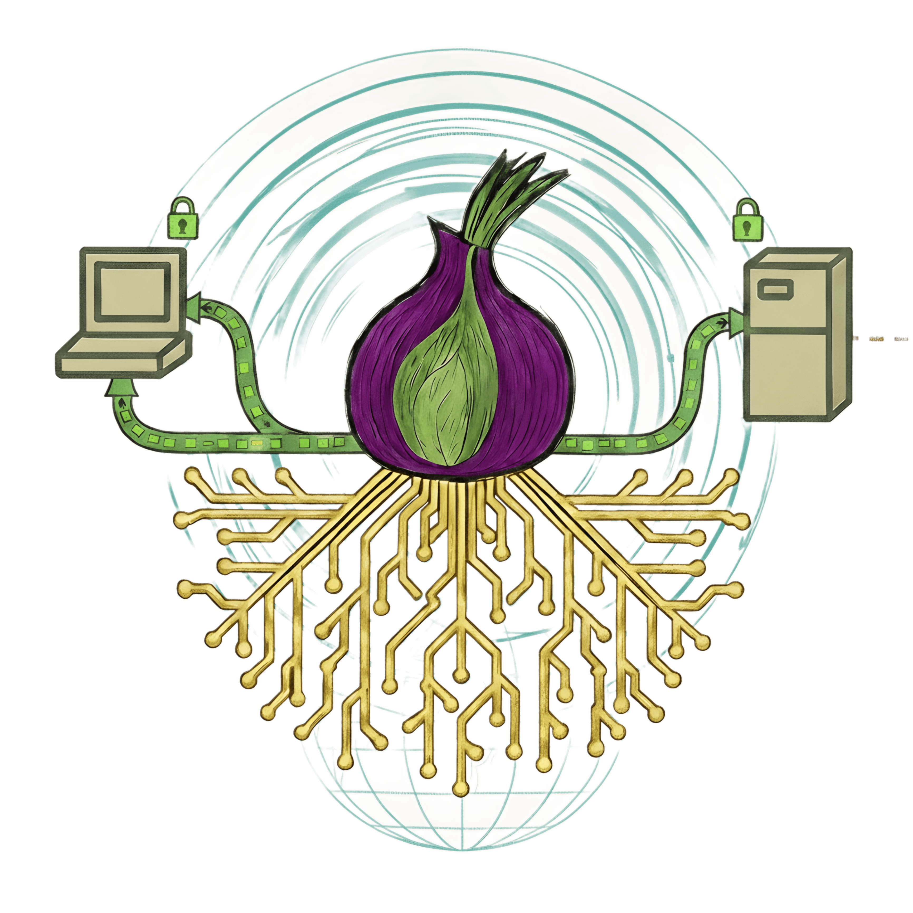
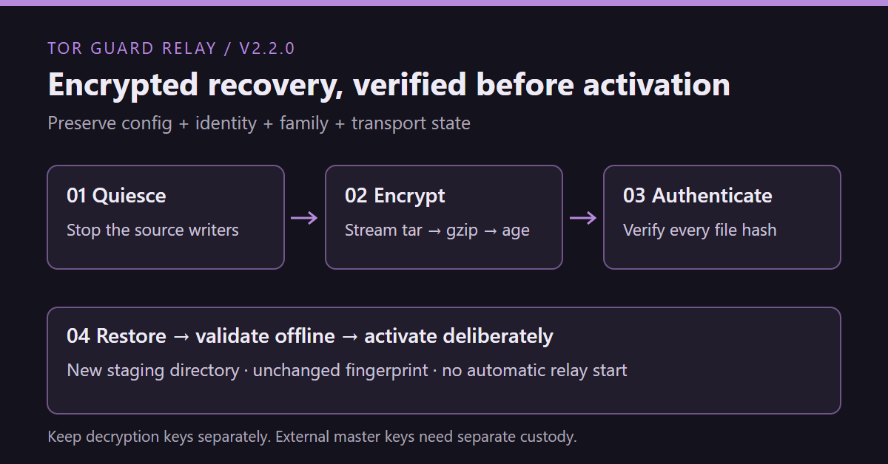
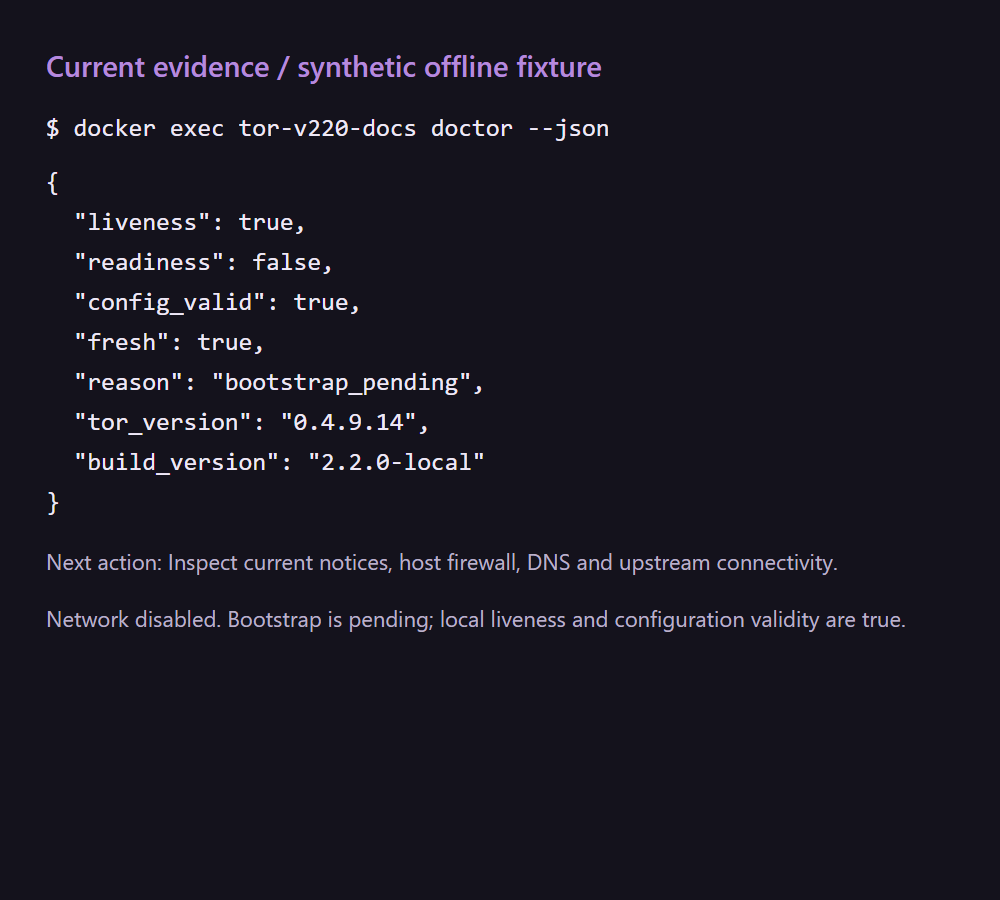
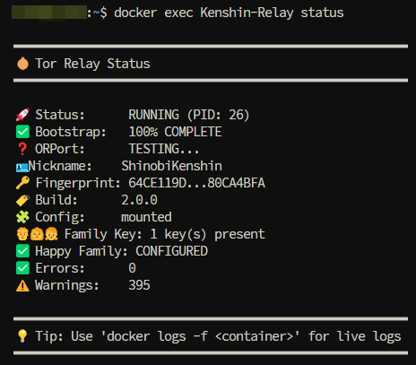
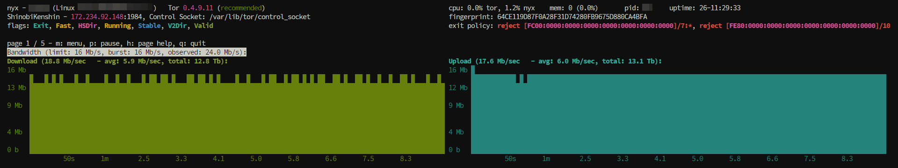

<a id="readme-top"></a>
<div align="center">

# 🧅 Tor Guard Relay

[](https://github.com/r3bo0tbx1/tor-guard-relay/actions/workflows/validate.yml)
[](https://github.com/r3bo0tbx1/tor-guard-relay/releases/latest)
[](#choose-a-mode-and-variant)
[](https://hub.docker.com/r/r3bo0tbx1/onion-relay)
[](LICENSE.txt)
[](https://brokenbotnet.com/donate/)



**🛡️ A small Tor container with clear diagnostics and encrypted recovery.**

[⚡ Quick start](#quick-start) · [🛠️ Tools](docs/TOOLS.md) · [📚 Documentation](docs/README.md) · [✨ Release notes](docs/releases/v2.2.0.md) · [🌐 Live network](https://relays.brokenbotnet.com/) · [🖼️ Gallery](#in-operation)

</div>

---

## ✨ What's new in v2.2.0

<!-- RELAY_VERSION -->v2.2.0<!-- /RELAY_VERSION --> is being prepared in this checkout. Public badges and registry tags reflect the published release; examples use a local candidate until publication.

| Improvement | What it means for operators |
| --- | --- |
| 🛡️ Security floors | Builds refuse Tor older than 0.4.9.14; Lyrebird uses a reviewed revision and locked dependencies |
| 🩺 Clearer health | Process, configuration, readiness and current-run observations are separate |
| 🔧 Controlled config | Mounted torrc remains authoritative; generated config is validated and replaced atomically |
| 🔐 Encrypted recovery | Preserve torrc/includes, keys, family and transport state; authenticate, verify and restore offline |
| 📊 Host observability | Fleet inventory and Prometheus text output without a public metrics port |

> 🚨 **Security update:** Tor 0.4.9.14 fixes high-severity issues affecting relays and other components. Update as soon as possible. [Tor Project announcement](https://forum.torproject.org/t/security-release-0-4-9-14/22241).

---

<a id="quick-start"></a>

## ⚡ Quick start

You need Docker, persistent storage, public ORPort connectivity and suitable host/provider policies. Start with a guard/middle relay if you are new to operating Tor.

### 🏗️ Build this candidate

```bash
docker build --build-arg BUILD_VERSION=2.2.0-local \
  -t tor-relay:2.2.0-local .
```

After publication, versioned stable images will be `r3bo0tbx1/onion-relay:2.2.0` and `ghcr.io/r3bo0tbx1/onion-relay:2.2.0`. The `latest` and `edge` aliases follow published builds.

### 🚀 Deploy and inspect

Replace the nickname/contact details. This example targets Linux; see [deployment](docs/DEPLOYMENT.md) for WSL/Desktop networking.

```bash
docker run -d --name tor-relay \
  --restart unless-stopped --network host --stop-timeout 45 \
  --security-opt no-new-privileges:true \
  -e TOR_RELAY_MODE=guard -e TOR_NICKNAME=MyGuardRelay \
  -e TOR_CONTACT_INFO="email:operator[]example.com" \
  -v tor-data:/var/lib/tor -v tor-logs:/var/log/tor \
  tor-relay:2.2.0-local

docker exec tor-relay status
docker exec tor-relay health
docker exec tor-relay doctor --json
```

> 🔑 **Preserve your identity:** The image runs as UID **100**, GID **101**, under Tini. Keep its data volume: that holds the relay identity.

`status: up` means exactly one Tor process exists. Readiness also requires valid config and a current-run 100% bootstrap observation. Tor's ORPort self-test is separate from independent reachability or consensus evidence.

For interactive setup, inspect [scripts/utilities/quick-start.sh](scripts/utilities/quick-start.sh). Templates live in [Docker Compose](templates/docker-compose) and [Cosmos Compose](templates/cosmos-compose).

---

<a id="choose-a-mode-and-variant"></a>

## 🎯 Choose a mode and variant

| Mode | Setting | Public listeners | Guide |
| --- | --- | --- | --- |
| 🛡️ Guard / middle | `guard` or `middle` | ORPort, default 9001 | [Deployment](docs/DEPLOYMENT.md) |
| 🚪 Exit | `exit` | ORPort; deliberate exit policy | [Modes](docs/MULTI-MODE.md) |
| 🌉 obfs4 bridge | `bridge` | ORPort + obfs4, default 9002 | [Bridge operations](docs/MULTI-MODE.md) |

Select the mode with `TOR_RELAY_MODE`. Both variants target AMD64 and ARM64.

| Variant | Base | Use |
| --- | --- | --- |
| Stable | Alpine 3.24.2 | Production after validation |
| Edge | Alpine edge | Testing; must pass the same Tor security floor |

The runtime remains Alpine, Tor, Tini, Lyrebird and BusyBox. Python, age and Docker belong to host tools; Go belongs to the build stage. DirPort is disabled by default. No diagnostic HTTP port is exposed.

---

## 🛠️ Operator workflows

### 🔄 Validate and reload

```bash
docker exec tor-relay config validate
docker exec tor-relay refresh
docker exec tor-relay fingerprint
```

Refresh validates the active torrc, waits for Tor's SIGHUP handler and verifies that PID/start time survive the signal. Some Tor options still require a restart.

For a candidate copied into the container:

```bash
docker exec tor-relay config diff /tmp/candidate.torrc
docker exec tor-relay config apply /tmp/candidate.torrc --reload
```

Diff redacts every value; value-only changes are hidden. Apply is allowed only for generated config. Edit mounted files at their host source. [Configuration ownership](docs/DEPLOYMENT.md#configuration-ownership).

### 🔐 Encrypt and verify a backup

Run **on the host**, from the checkout, with Python 3.10+, age and Docker:

```bash
sh scripts/utilities/relay-backup.sh create \
  --container tor-relay --recipients /secure/recipients.txt \
  --output-dir /backups/tor --dry-run

sh scripts/utilities/relay-backup.sh create \
  --container tor-relay --recipients /secure/recipients.txt \
  --output-dir /backups/tor --stop

sh scripts/utilities/relay-backup.sh verify /backups/tor/ARCHIVE.tar.gz.age \
  --identity /secure/recovery-key.txt
```

Keep the private recovery identity elsewhere. Restore requires a new destination, authenticates/checks contents and verifies torrc offline; it never activates the relay. [Backup and recovery](docs/BACKUP.md).

### 🌉 Inspect a fleet and export bridge output

```bash
# Host commands
sh scripts/utilities/relay-inventory.sh --json tor-relay
sh scripts/utilities/relay-inventory.sh --prometheus tor-relay

# Container command: supply the public address and external port
docker exec tor-relay bridge-line --plain \
  --address PUBLIC_ADDRESS --port PUBLIC_OBFS4_PORT
```

Collection enables no schedule or public endpoint. Share bridge lines privately. [Monitoring](docs/MONITORING.md) · [Tools](docs/TOOLS.md).

---

## 📚 Documentation

| Start | Operate | Recover | Develop |
| --- | --- | --- | --- |
| [Deployment](docs/DEPLOYMENT.md) | [Tools](docs/TOOLS.md) | [Backups](docs/BACKUP.md) | [Architecture](docs/ARCHITECTURE.md) |
| [Modes](docs/MULTI-MODE.md) | [Monitoring](docs/MONITORING.md) | [Migration](docs/MIGRATION.md) | [Testing](docs/LOCAL-TESTING.md) |
| [Templates](templates/README.md) | [Control Port](docs/CONTROL-PORT.md) | [FAQ](docs/FAQ.md) | [Contributing](CONTRIBUTING.md) |

[Documentation index](docs/README.md) · [Changelog](CHANGELOG.md).

---

<a id="in-operation"></a>

## 🖼️ In operation

[Shinobi Relays](https://relays.brokenbotnet.com/) shows the operator's network. Public observations are separate from container health.



The recovery command authenticates the archive before staging plaintext and validating configuration offline.

<details>
<summary>🩺 Current candidate diagnostic capture</summary>



Captured from the local candidate with networking disabled: liveness and config validity are true, readiness is false. The [text tool reference](docs/TOOLS.md) explains each field.

</details>

<details>
<summary>📸 Earlier operator screenshots</summary>

These illustrate earlier releases; see the current tool reference for v2.2.0 output.





</details>

---

## 🛡️ Security and support

Only the latest **published** release receives maintenance. Preparing this checkout does not change the current supported release.

Patch the host, protect persistent storage, keep recovery keys separate and rehearse recovery. Read [SECURITY.md](SECURITY.md), [legal considerations](docs/LEGAL.md), [CONTRIBUTING.md](CONTRIBUTING.md) and the [code of conduct](CODE_OF_CONDUCT.md).

[Docker Hub](https://hub.docker.com/r/r3bo0tbx1/onion-relay) · [GHCR](https://github.com/r3bo0tbx1/tor-guard-relay/pkgs/container/onion-relay) · [Support](https://brokenbotnet.com/donate/).

MIT licensed. Maintained by [rE-Bo0t.bx1](https://brokenbotnet.com/) for a freer Internet.

[Back to top](#readme-top)
