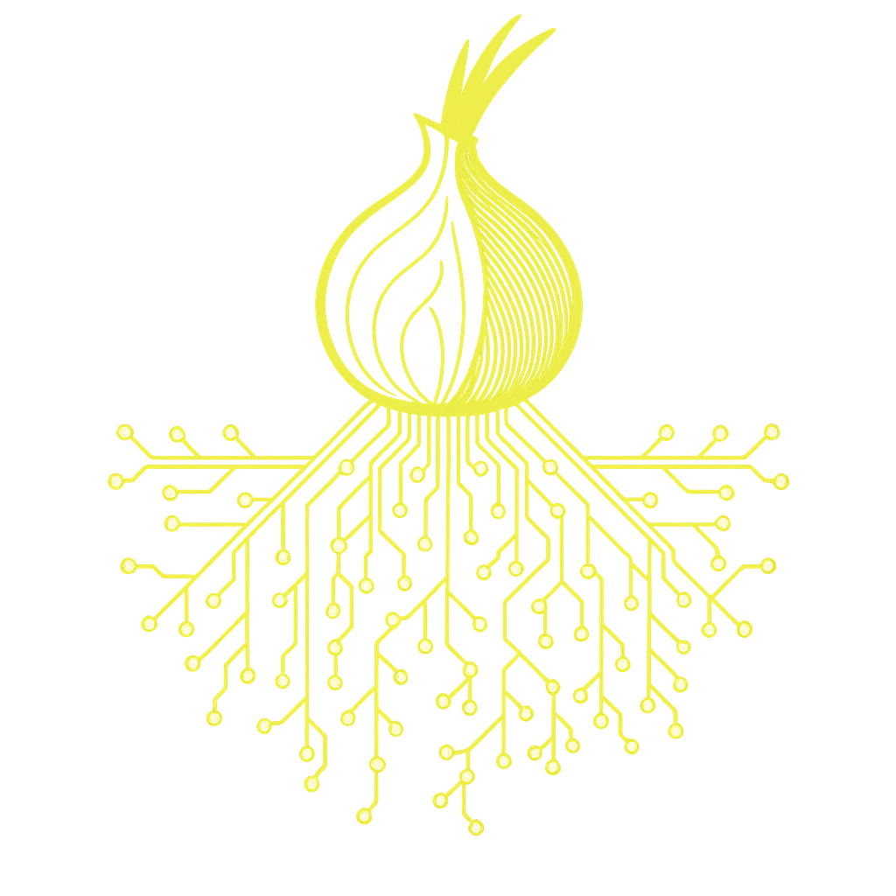

<a id="readme-top"></a>
<div align="center">

# 🧅 Tor Guard Relay

[](https://github.com/r3bo0tbx1/tor-guard-relay/actions/workflows/build.yml)
[](https://github.com/r3bo0tbx1/tor-guard-relay/releases/latest)


[](LICENSE.txt)



**A hardened, self-healing Tor relay container with built-in diagnostics**

[Quick Start](#-quick-installation) • [Usage Guide](#%EF%B8%8F-usage-guide) • [Diagnostics](#-diagnostic-tools) • [Monitoring](#%EF%B8%8F-monitoring--verification) • [Contributing](#-community--contribution)

</div>

---

## 📖 Table of Contents

- [Project Overview](#-project-overview)
- [Quick Installation](#-quick-installation)
- [Usage Guide](#%EF%B8%8F-usage-guide)
- [Key Features](#-key-features)
- [Monitoring & Verification](#%EF%B8%8F-monitoring--verification)
- [Troubleshooting](#-troubleshooting)
- [Development](#-development-workflow)
- [Security Best Practices](#-security-best-practices)
- [Contributing](#-community--contribution)

---

## 🚀 Project Overview

**Tor Guard Relay** is a **production-ready, hardened Tor relay container** designed for privacy-focused operators who want to contribute to the Tor network securely and efficiently.

> **🌉 Want to run a Tor Bridge instead?**  
> This project focuses on guard/middle relays. For bridge setup, please visit:  
> **[Official Tor Bridge Setup Guide](https://community.torproject.org/relay/setup/bridge/docker/)**

### Why This Project?

- 🛡️ **Security-First Design**: Built with hardened Alpine Linux and non-root operations
- 🎯 **Simplicity**: One command to deploy, minimal configuration required
- 🔄 **Automated Updates**: GitHub Actions keep your relay current
- 📊 **Production-Ready**: Battle-tested design with comprehensive diagnostics

Built from the ground up with security, reliability, and ease of use in mind. 🕵️‍♀️🔐

---

## 📦 Quick Installation

### System Requirements

| Component | Minimum | Recommended | Notes |
|-----------|---------|-------------|-------|
| 🖥️ CPU | 1 core | 2+ cores | ARM64 and AMD64 supported |
| 💾 RAM | 512 MB | 1 GB+ | More for high-traffic relays |
| 💿 Disk | 10 GB | 20 GB+ | SSD recommended |
| 🌐 Bandwidth | 10 Mbps | 100+ Mbps | Symmetric preferred |
| 🔌 Uptime | 95%+ | 99%+ | Stability builds trust |
| 🏗️ Architecture | amd64 or arm64 | Any | Auto-detected |
| 🐳 Docker | 20.10+ | Latest | Buildx support recommended |

### Deployment Options

Choose your preferred deployment method:

| Method | Best For | Documentation |
|--------|----------|---------------|
| 🐳 **Docker CLI** | Quick testing, simple setups | [Guide](docs/DEPLOYMENT.md#method-1-docker-cli) |
| 📦 **Docker Compose** | Production, version control | [Guide](docs/DEPLOYMENT.md#method-2-docker-compose) · [Template](templates/docker-compose.yml) |
| ☁️ **Cosmos Cloud** | Beautiful UI, auto-updates | [Guide](docs/DEPLOYMENT.md#method-3-cosmos-cloud) · [Template](templates/cosmos-compose.json) |
| 🎛️ **Portainer** | GUI management | [Guide](docs/DEPLOYMENT.md#method-4-portainer) |

**New to Docker management?** Check out [Cosmos Cloud](https://cosmos-cloud.io/) by [azukaar](https://github.com/azukaar) - a modern, self-hosted platform that makes Docker container management beautiful and simple.

> 📖 **Complete setup instructions**: See our detailed [Deployment Guide](docs/DEPLOYMENT.md) for step-by-step instructions for all methods.

---

## 🌍 Multi-Architecture Support

This image supports multiple CPU architectures automatically:

### Supported Platforms

| Architecture | Platforms | Use Cases |
|--------------|-----------|-----------|
| 🖥️ **linux/amd64** | x86_64 servers | VPS, dedicated servers, cloud instances |
| 🔧 **linux/arm64** | ARM64v8 | Raspberry Pi 4/5, Oracle ARM, AWS Graviton |

### How It Works

Docker automatically pulls the correct architecture for your system:

```bash
# On x86 server - pulls amd64 image
docker pull ghcr.io/r3bo0tbx1/onion-relay:latest

# On Raspberry Pi - pulls arm64 image  
docker pull ghcr.io/r3bo0tbx1/onion-relay:latest

# Same command, different architectures!
```

### Verify Your Architecture

After pulling, check what you got:

```bash
docker inspect ghcr.io/r3bo0tbx1/onion-relay:latest | grep Architecture
```

Or from inside the container:

```bash
docker exec guard-relay cat /build-info.txt | grep Architecture
```

**Output:**
```
Architecture: arm64  # or amd64
```

---

## ⚙️ Usage Guide

### 🌟 Basic Deployment

Run your relay with an external configuration:

```bash
docker run -d \
  --name guard-relay \
  --network host \
  -v /path/to/relay.conf:/etc/tor/torrc:ro \
  -v tor-guard-data:/var/lib/tor \
  -v tor-guard-logs:/var/log/tor \
  --restart unless-stopped \
  ghcr.io/r3bo0tbx1/onion-relay:latest
```

**Important Notes:**

* 🌐 Use `--network host` to support both IPv4 and IPv6 bindings
* 🔥 Ensure your firewall allows the ORPort (typically `9001` for relays)
* 📁 Store your `relay.conf` in a secure location with proper permissions (`chmod 600`)

### 🌐 Why Host Network Mode?

This project uses `--network host` instead of bridge networking for important reasons:

| Benefit | Explanation |
|---------|-------------|
| **IPv6 Support** | Direct access to host's IPv6 stack - critical for modern Tor relays |
| **No Port Mapping** | Tor can bind directly to ports without complex NAT traversal |
| **Better Performance** | Eliminates network translation overhead |
| **Tor Recommended** | Follows Tor Project best practices for relay operation |

**Security Note**: Host networking means the container shares the host's network stack. This is safe for Tor relays as they're designed to be internet-facing services. The container still runs as a non-root user with restricted permissions.

---

## 🔍 Diagnostic Tools

Built-in diagnostic commands provide instant insights into your relay's health.

### Quick Status Check

Get a comprehensive overview in seconds:

```bash
docker exec guard-relay relay-status
```

**Output Example:**
```
🧅 Tor Relay Status Report
━━━━━━━━━━━━━━━━━━━━━━━━━━━━━━━━━━━━━━━━━━━━━━━━━━━━━━━━━

📦 Build Information:
   Version: 1.0
   Build Date: 2025-11-01T12:00:00Z
   Architecture: amd64

🚀 Bootstrap Progress:
   [notice] Bootstrapped 100% (done): Done
   ✅ Relay is fully bootstrapped!

🌍 Reachability Status:
   [notice] Self-testing indicates your ORPort is reachable from the outside.
   ✅ ORPort is reachable!

🔑 Relay Fingerprint:
   MyPrivacyRelay 4A3F2E1D8C9B7A6F5E4D3C2B1A0F9E8D7C6B5A4F

⚠️  Recent Errors/Warnings:
   ✅ No recent errors or warnings.
```

---

### Individual Diagnostic Commands

| Command | Purpose | Example Output |
|---------|---------|----------------|
| `relay-status` | Full health report | Bootstrap, reachability, errors |
| `fingerprint` | Show relay fingerprint | `MyRelay 4A3F2E1D...` + Metrics links |
| `view-logs` | Stream live logs | Tail -f notices.log |

#### Show Fingerprint

```bash
docker exec guard-relay fingerprint
```

**Output:**
```
🔑 Tor Relay Fingerprint
━━━━━━━━━━━━━━━━━━━━━━━━━━━━━━━━━━━━━━━
MyPrivacyRelay 4A3F2E1D8C9B7A6F5E4D3C2B1A0F9E8D7C6B5A4F

🌐 Search on Tor Metrics:
   https://metrics.torproject.org/rs.html

🧅 Search on Onion Metrics (Tor Browser):
   http://hctxrvjzfpvmzh2jllqhgvvkoepxb4kfzdjm6h7egcwlumggtktiftid.onion/rs.html
```

#### Stream Logs

```bash
docker exec guard-relay view-logs
```

Displays the last 50 lines and follows new entries in real-time.

---

### Build Information

Check what version you're running:

```bash
docker exec guard-relay cat /build-info.txt
```

**Output:**
```
Version: 1.0
Build Date: 2025-11-01T12:00:00Z
Architecture: amd64
```

---

### 📝 Example Configuration Files

#### Guard Relay Configuration

```text
# relay.conf - Guard Relay Example
Nickname MyPrivacyRelay
ContactInfo privacy@example.com <0xYOUR_PGP_KEY>
ORPort 9001
ORPort [::]:9001
DirPort 9030

# Relay type
ExitRelay 0
SocksPort 0
ExitPolicy reject *:*

# Paths
DataDirectory /var/lib/tor
Log notice file /var/log/tor/notices.log

# Bandwidth (optional)
RelayBandwidthRate 1 MBytes
RelayBandwidthBurst 2 MBytes

# Performance tuning
NumCPUs 2
```

See [examples/relay.conf](examples/relay.conf) for a complete, well-documented configuration template.

---

## 🧰 Key Features

<table>
<tr>
<td>

### 🔐 Security
- Non-root operation
- Hardened permissions
- Auto-permission healing
- Minimal attack surface
- Regular security updates
- Configuration validation

</td>
<td>

### ⚡ Performance
- Lightweight Alpine base (~35 MB)
- Optimized resource usage
- Dual-stack IPv4/IPv6
- Health check monitoring
- Efficient multi-arch builds
- GitHub Actions caching

</td>
</tr>
<tr>
<td>

### 🔧 Operations
- External configuration
- Persistent data volumes
- Auto-restart support
- Cosmos-compatible
- Built-in diagnostics
- Self-healing startup

</td>
<td>

### 🤖 Automation
- Weekly auto-builds
- Multi-arch support (amd64/arm64)
- GHCR publishing
- CI/CD integration
- Version tagging
- SHA-based rollback

</td>
</tr>
<tr>
<td>

### 🔍 Observability
- `relay-status` command
- `fingerprint` command
- `view-logs` command
- Build metadata tracking
- Structured logging
- Health endpoints

</td>
<td>

### 🛡️ Reliability
- Tini init system
- Graceful shutdowns
- Zombie process reaping
- Config validation on boot
- Automatic error recovery
- Zero-downtime restarts

</td>
</tr>
</table>

---

## 🛰️ Monitoring & Verification

After deployment, Tor requires time to bootstrap and publish its descriptor. This section helps you verify it's running correctly and visible on the network.

### 🕒 Bootstrap Timeline

| Relay Type | Initial Bootstrap | Full Integration | More Info |
|------------|------------------|------------------|-----------|
| 🛡️ Guard Relay | 10–30 minutes | 2–4 hours | See below |
| 🌉 Bridge | 30–90 minutes | 4–8 hours | [Official Bridge Guide](https://community.torproject.org/relay/setup/bridge/docker/) |

**Success Indicator:** Look for `"Bootstrapped 100% (done): Done"` in logs.

---

### 📜 Checking Logs

#### Docker CLI Method

```bash
# Follow logs in real-time
docker logs -f guard-relay

# View last 50 lines
docker logs --tail 50 guard-relay

# Search for specific events
docker logs guard-relay 2>&1 | grep "Bootstrapped"
```

#### Using the Diagnostic Commands

```bash
# Quick status overview
docker exec guard-relay relay-status

# Stream logs
docker exec guard-relay view-logs
```

#### Using the Status Script

Download and use our automated status checker:

```bash
# Download the script
wget https://raw.githubusercontent.com/r3bo0tbx1/tor-guard-relay/main/relay-status.sh

# Make it executable
chmod +x relay-status.sh

# Run status check
./relay-status.sh
```

---

### 🌐 Verify on Tor Metrics (Clearnet)

Once bootstrapped, verify your relay is publicly visible:

**🔗 [Tor Metrics Relay Search](https://metrics.torproject.org/rs.html)**

#### Expected Timeline

- ⏰ **First appearance:** 1 to 2 hours after bootstrap
- 📊 **Full statistics:** 24 to 48 hours
- 🛡️ **Guard flag:** 8+ days of stable operation

---

### 📈 Healthy Relay Indicators (24–48 Hours)

On Tor Metrics, you should see:

| Status | Expected Value | Meaning |
|--------|---------------|---------|
| 🟢 Running | `True` | Currently online |
| ✅ Valid | `True` | Accepted by directory authorities |
| 🛡️ Guard | `True` (eventually) | Trusted for entry connections |
| 🚫 Exit | `False` | Non-exit relay (safer) |
| 📊 Bandwidth | Increasing | Network trust growing |
| ⏰ Uptime | High % | Stability demonstrated |

---

## 🔧 Troubleshooting

### Common Issues & Solutions

<details>
<summary><b>🔴 Container won't start</b></summary>

**Symptoms:** Container exits immediately or restarts repeatedly

**Solutions:**
```bash
# Check logs for errors
docker logs guard-relay

# Verify configuration syntax
docker run --rm -v /path/to/relay.conf:/etc/tor/torrc:ro \
  ghcr.io/r3bo0tbx1/onion-relay:latest tor --verify-config -f /etc/tor/torrc

# Check file permissions
ls -la /path/to/relay.conf
# Should be readable (644 or 600)
```
</details>

<details>
<summary><b>🟡 ORPort not reachable</b></summary>

**Symptoms:** Logs show "ORPort reachability test failed"

**Solutions:**
```bash
# Check firewall rules
sudo ufw status
sudo ufw allow 9001/tcp

# Test port from outside
# (from another machine)
nc -zv YOUR_IP 9001

# Verify Docker network mode
docker inspect guard-relay | grep NetworkMode
# Should show "host"
```
</details>

<details>
<summary><b>🟠 Relay not appearing on metrics</b></summary>

**Symptoms:** Can't find relay after several hours

**Solutions:**
1. Wait 24 hours (initial propagation takes time)
2. Verify bootstrap completed:
   ```bash
   docker logs guard-relay 2>&1 | grep "Bootstrapped 100"
   ```
3. Check fingerprint is correct:
   ```bash
   docker exec guard-relay fingerprint
   ```
4. Ensure ContactInfo is set in torrc
</details>

<details>
<summary><b>⚪ Low bandwidth or no traffic</b></summary>

**Symptoms:** Relay shows minimal traffic after days

**Possible causes:**
- New relays need time to build reputation (2–8 weeks)
- Bandwidth limits too restrictive
- Network connectivity issues
- Competition from established relays

**Monitor:**
```bash
# Check bandwidth allocation
docker exec guard-relay grep Relay /etc/tor/torrc

# Watch traffic patterns
docker stats guard-relay
```
</details>

<details>
<summary><b>🟤 Wrong architecture pulled</b></summary>

**Symptoms:** Container fails with "exec format error"

**Solutions:**

This means Docker pulled the wrong architecture variant:

```bash
# Check your system architecture
uname -m
# aarch64 = ARM64
# x86_64 = AMD64

# Force pull correct architecture
docker pull --platform linux/amd64 ghcr.io/r3bo0tbx1/onion-relay:latest
# or
docker pull --platform linux/arm64 ghcr.io/r3bo0tbx1/onion-relay:latest

# Verify architecture
docker inspect ghcr.io/r3bo0tbx1/onion-relay:latest | grep Architecture
```
</details>

For more troubleshooting help, see the [Deployment Guide](docs/DEPLOYMENT.md#troubleshooting-deployments).

---

## 🚧 Development Workflow

### 🛠️ Local Build

```bash
# Clone the repository
git clone https://github.com/r3bo0tbx1/tor-guard-relay.git
cd tor-guard-relay

# Build the Docker image
docker build \
  --build-arg BUILD_DATE="$(date -u +'%Y-%m-%dT%H:%M:%SZ')" \
  --build-arg BUILD_VERSION="1.0" \
  -t onion-relay:latest \
  -f Dockerfile .

# Test locally
docker run --rm onion-relay:latest cat /build-info.txt
```

### 🧪 Testing

```bash
# Run with test configuration
docker run --rm -v ./examples/relay.conf:/etc/tor/torrc:ro \
  onion-relay:latest tor --verify-config -f /etc/tor/torrc

# Interactive debugging
docker run -it --rm onion-relay:latest /bin/sh
```

---

## 🤖 Automated Workflows

GitHub Actions handle continuous integration and delivery:

| Workflow | Trigger | Purpose |
|----------|---------|---------|
| 🔁 Weekly Build | Monday 03:00 UTC | Keep Tor updated |
| 📦 Auto-publish | On successful build | Update GHCR |
| 📊 Build Summary | Every build | Generate reports |

View `.github/workflows/build.yml` for complete automation setup.

---

## 🔒 Security Best Practices

### Configuration Security

- ✅ Store `relay.conf` with restricted permissions (`600`)
- ✅ Never commit sensitive configs to version control
- ✅ Use PGP key in ContactInfo for verification
- ✅ Regularly update Docker image
- ✅ Monitor logs for suspicious activity

### Operational Security

```bash
# Create secure config directory
sudo mkdir -p /opt/tor-relay
sudo chmod 700 /opt/tor-relay

# Set proper ownership
sudo chown root:root /opt/tor-relay

# Use read-only mounts when possible
-v /opt/tor-relay/relay.conf:/etc/tor/torrc:ro
```

### Network Security

- 🔥 Configure firewall properly
- 🌐 Use IPv6 if available
- 📊 Monitor bandwidth usage
- 🚨 Set up alerts for downtime
- 🔍 Regular log audits

See [SECURITY.md](SECURITY.md) for complete security policy and reporting procedures.

---

## 🌈 Community & Contribution

**Tor Guard Relay** is maintained by **r3bo0tbx1** and built for the privacy-loving Tor community.

### Ways to Contribute

- 🐛 Report bugs via [GitHub Issues](https://github.com/r3bo0tbx1/tor-guard-relay/issues)
- 💡 Suggest features or improvements
- 📖 Improve documentation
- 🔧 Submit pull requests
- ⭐ Star the repository
- 🧅 Run your own relay!

### Resources

- 📚 [Tor Project Documentation](https://community.torproject.org/relay/)
- 💬 [Tor Relay Operators Forum](https://forum.torproject.net/)
- 📧 [Tor Relay Mailing List](https://lists.torproject.org/cgi-bin/mailman/listinfo/tor-relays)
- 🛡️ [Good/Bad Relays List](https://metrics.torproject.org/rs.html)

---

## 📊 Project Stats

<div align="center">


</div>

---

## 🔗 Quick Links

| Resource | Link |
|----------|------|
| 📦 **Docker Image** | [GHCR Package](https://github.com/r3bo0tbx1/tor-guard-relay/pkgs/container/onion-relay) |
| 🚀 **Deployment Guide** | [docs/DEPLOYMENT.md](docs/DEPLOYMENT.md) |
| 📖 **Contributing** | [CONTRIBUTING.md](CONTRIBUTING.md) |
| 🔒 **Security** | [SECURITY.md](SECURITY.md) |
| 📜 **Changelog** | [CHANGELOG.md](CHANGELOG.md) |
| 💬 **Discussions** | [GitHub Discussions](https://github.com/r3bo0tbx1/tor-guard-relay/discussions) |
| 🐛 **Report Bug** | [New Issue](https://github.com/r3bo0tbx1/tor-guard-relay/issues/new/choose) |
| 💡 **Feature Request** | [New Issue](https://github.com/r3bo0tbx1/tor-guard-relay/issues/new/choose) |

---

## 🌟 Star History

<div align="center">

[](https://star-history.com/#r3bo0tbx1/tor-guard-relay&Date)

</div>

---

## 📄 License

This project is licensed under the [MIT License](LICENSE.txt).

---

## 🙏 Acknowledgments

- **[The Tor Project](https://www.torproject.org/)** - For building the foundation of online privacy
- **[Alpine Linux](https://alpinelinux.org/)** - For the minimal, secure base image
- **[azukaar](https://github.com/azukaar)** - For [Cosmos Cloud](https://cosmos-cloud.io/), making Docker management beautiful
- **All relay operators** - For strengthening the Tor network

---

## 💖 Support the Project

If you find this project useful:

- ⭐ **Star the repository** to show your support
- 🧅 **Run a relay** and contribute to the Tor network
- 📢 **Share** with others who might benefit
- 🐛 **Report issues** to help improve the project
- 💡 **Suggest features** for future versions
- 🤝 **Contribute** code, documentation, or ideas

---

<div align="center">

**Made with 💜 for a freer, uncensored internet**

*Protecting privacy, one relay at a time* 🧅✨

🌍 [Support Internet Freedom](https://donate.torproject.org/) • ⬆ [Back to top](#readme-top)

</div>