# 🏗️ Architecture Documentation

**Tor Guard Relay Container** - Technical Architecture & Design

> [!IMPORTANT]
> 🧅 **v2.2.0 release candidate:** Tor must be **0.4.9.14 or newer**. Current-run health, validated configuration and encrypted recovery are described in the [release notes](releases/v2.2.0.md). Recreate from the validated image to update Tor; changing torrc alone does not upgrade the binary.

## 📋 Table of Contents

1. [Overview](#overview)
2. [Container Lifecycle](#container-lifecycle)
3. [Initialization Flow](#initialization-flow)
4. [Configuration System](#configuration-system)
5. [ENV Compatibility Layer](#env-compatibility-layer)
6. [Diagnostic Tools](#diagnostic-tools)
7. [Directory Structure](#directory-structure)
8. [Security Model](#security-model)
9. [Signal Handling](#signal-handling)
10. [Build Process](#build-process)
11. [Health Check](#health-check)
12. [Encrypted Recovery](#-encrypted-recovery-boundary)
13. [Independent Security Updates](#independent-security-updates)
14. [References](#references)

---

## 🧅 Overview

This container implements a production-ready Tor relay with three operational modes:
- **Guard/Middle**: Relay for traffic routing; DirPort is disabled by default
- **Exit**: High-trust relay with customizable exit policies
- **Bridge**: Censorship-resistant relay with obfs4 transport

**Design Principles:**
- POSIX sh compatibility (busybox ash, no bash)
- Minimal runtime dependencies; image size varies by variant and architecture
- Security-first (non-root, minimal capabilities, strict validation)
- Multi-architecture (AMD64, ARM64)
- Production-ready (graceful shutdown, health checks, observability)

---

## 🔄 Container Lifecycle

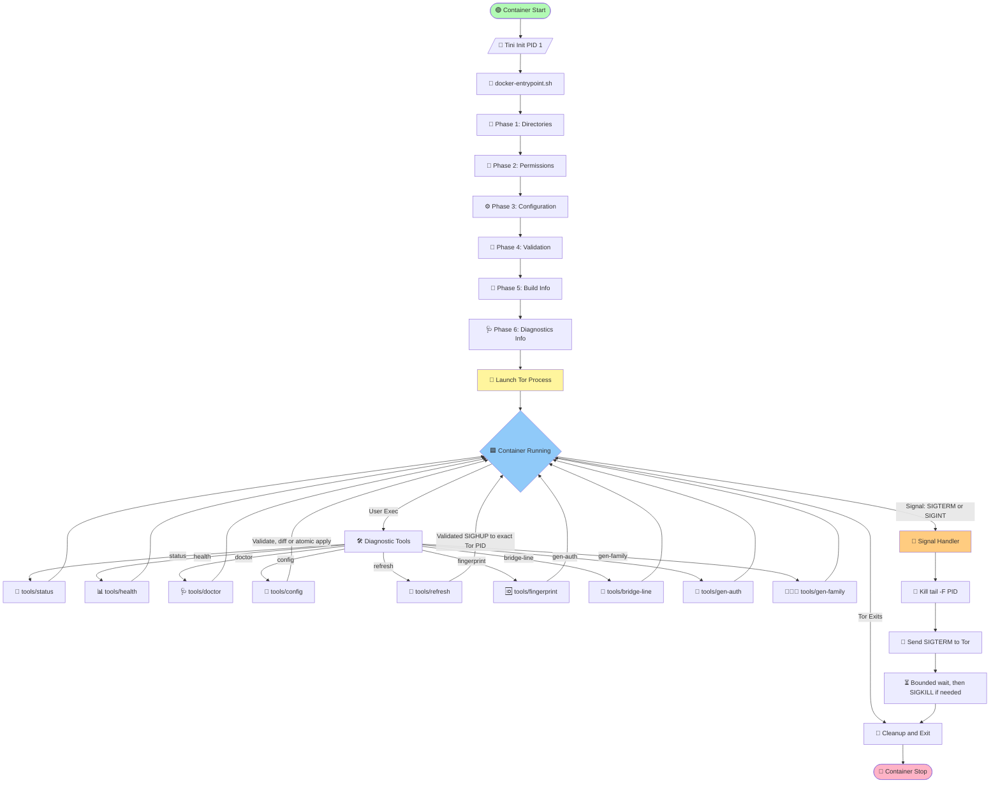
```mermaid
flowchart TD
    Start([🟢 Container Start]) --> Tini[/🔧 Tini Init PID 1/]
    Tini --> Entrypoint[🚀 docker-entrypoint.sh]

    Entrypoint --> Phase1[📁 Phase 1: Directories]
    Phase1 --> Phase2[🔐 Phase 2: Permissions]
    Phase2 --> Phase3[⚙️ Phase 3: Configuration]
    Phase3 --> Phase4[🧪 Phase 4: Validation]
    Phase4 --> Phase5[📄 Phase 5: Build Info]
    Phase5 --> Phase6[🩺 Phase 6: Diagnostics Info]
    Phase6 --> TorStart[🚀 Launch Tor Process]

    TorStart --> Running{🟦 Container Running}

    Running -->|Signal: SIGTERM or SIGINT| Trap[🧹 Signal Handler]
    Running -->|Tor Exits| Cleanup
    Running -->|User Exec| DiagTools[🛠️ Diagnostic Tools]

    DiagTools -->|status| StatusTool[📝 tools/status]
    DiagTools -->|health| HealthTool[📊 tools/health]
    DiagTools -->|doctor| DoctorTool[🩺 tools/doctor]
    DiagTools -->|config| ConfigTool[🧩 tools/config]
    DiagTools -->|refresh| RefreshTool[🔄 tools/refresh]
    DiagTools -->|fingerprint| FingerprintTool[🆔 tools/fingerprint]
    DiagTools -->|bridge-line| BridgeTool[🌉 tools/bridge-line]
    DiagTools -->|gen-auth| GenAuthTool[🔑 tools/gen-auth]
    DiagTools -->|gen-family| GenFamilyTool[👨‍👩‍👧 tools/gen-family]

    StatusTool --> Running
    HealthTool --> Running
    DoctorTool --> Running
    ConfigTool -->|Validate, diff or atomic apply| Running
    RefreshTool -->|Validated SIGHUP to exact Tor PID| Running
    FingerprintTool --> Running
    BridgeTool --> Running
    GenAuthTool --> Running
    GenFamilyTool --> Running

    Trap --> StopTail[🧽 Kill tail -F PID]
    StopTail --> StopTor[📨 Send SIGTERM to Tor]
    StopTor --> Wait[⏳ Bounded wait, then SIGKILL if needed]
    Wait --> Cleanup[🧹 Cleanup and Exit]
    Cleanup --> End([🔴 Container Stop])

    style Start fill:#b2fab4
    style End fill:#ffb3c6
    style Running fill:#90caf9
    style TorStart fill:#fff59d
    style Trap fill:#ffcc80
```

---

## 🚀 Initialization Flow

The entrypoint script (`docker-entrypoint.sh`) executes **6 distinct phases** in sequence:

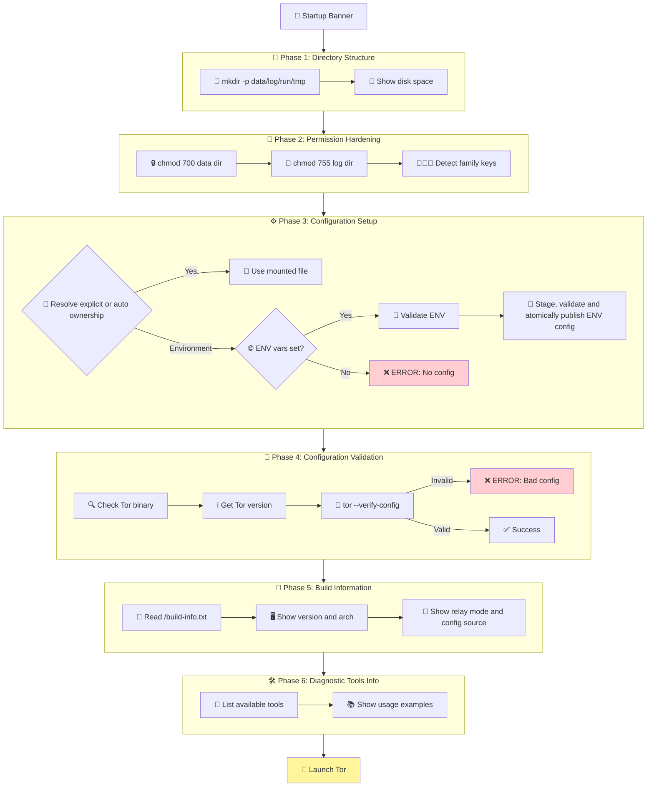
```mermaid
flowchart TD
    Banner[🎉 Startup Banner] --> P1

    subgraph P1["📁 Phase 1: Directory Structure"]
        P1_1[📂 mkdir -p data/log/run/tmp] --> P1_2[💽 Show disk space]
    end

    subgraph P2["🔐 Phase 2: Permission Hardening"]
        P2_1[🔒 chmod 700 data dir] --> P2_2[📁 chmod 755 log dir]
        P2_2 --> P2_3[👨‍👩‍👧 Detect family keys]
    end

    subgraph P3["⚙️ Phase 3: Configuration Setup"]
        P3_1{🧩 Resolve explicit or auto ownership} -->|Yes| P3_2[📄 Use mounted file]
        P3_1 -->|Environment| P3_3{🌐 ENV vars set?}
        P3_3 -->|Yes| P3_4[🧪 Validate ENV] --> P3_5[📝 Stage, validate and atomically publish ENV config]
        P3_3 -->|No| P3_6[❌ ERROR: No config]
    end

    subgraph P4["🧪 Phase 4: Configuration Validation"]
        P4_1[🔍 Check Tor binary] --> P4_2[ℹ️ Get Tor version]
        P4_2 --> P4_3[🧯 tor --verify-config]
        P4_3 -->|Invalid| P4_4[❌ ERROR: Bad config]
        P4_3 -->|Valid| P4_5[✅ Success]
    end

    subgraph P5["📄 Phase 5: Build Information"]
        P5_1[📘 Read /build-info.txt] --> P5_2[🖥️ Show version and arch]
        P5_2 --> P5_3[📡 Show relay mode and config source]
    end

    subgraph P6["🛠️ Phase 6: Diagnostic Tools Info"]
        P6_1[🔧 List available tools] --> P6_2[📚 Show usage examples]
    end

    P1 --> P2
    P2 --> P3
    P3 --> P4
    P4 --> P5
    P5 --> P6
    P6 --> Launch[🚀 Launch Tor]

    style P3_6 fill:#ffcdd2
    style P4_4 fill:#ffcdd2
    style Launch fill:#fff59d
```

### Phase Details

| Phase | Purpose | Key Operations | Error Handling |
|-------|---------|----------------|----------------|
| **1** | Directory Setup | `mkdir -p` data/log/run, show disk space | Fail if mkdir fails |
| **2** | Permissions | `chmod 700` data, `chmod 755` log, detect family keys | Warn on failure (read-only mount) |
| **3** | Configuration | Explicit source override; auto detects mounts/generated ownership; validate before publication | Die if no config source |
| **4** | Validation | `tor --verify-config` syntax check | Die if invalid config |
| **5** | Build Info | Show version/arch/mode/source | Warn if missing |
| **6** | Diagnostics | List available tools | Informational only |

---

## ⚙️ Configuration System

### Configuration Priority

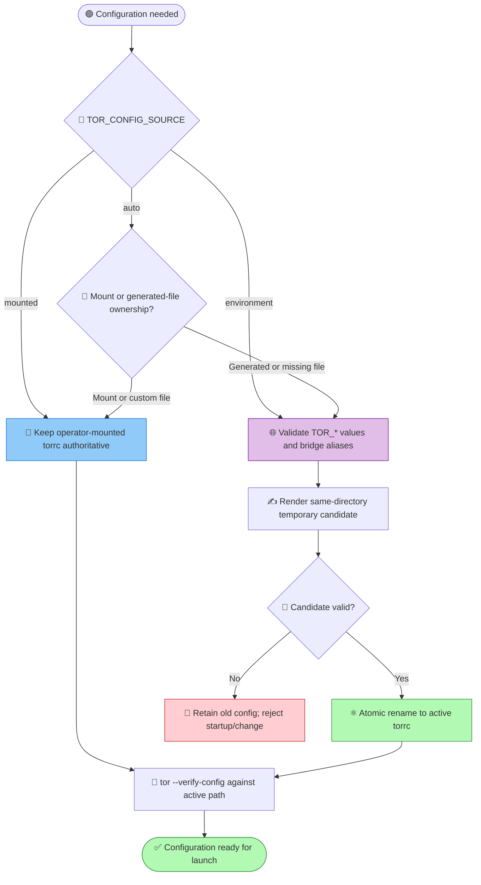
```mermaid
flowchart TD
    Start(["🟢 Configuration needed"]) --> Source{"🧩 TOR_CONFIG_SOURCE"}
    Source -->|mounted| Mounted["📄 Keep operator-mounted torrc authoritative"]
    Source -->|environment| Env["🌐 Validate TOR_* values and bridge aliases"]
    Source -->|auto| Detect{"📁 Mount or generated-file ownership?"}
    Detect -->|Mount or custom file| Mounted
    Detect -->|Generated or missing file| Env
    Mounted --> Check["🧪 tor --verify-config against active path"]
    Env --> Stage["✍️ Render same-directory temporary candidate"]
    Stage --> Valid{"🧪 Candidate valid?"}
    Valid -->|Yes| Rename["⚛️ Atomic rename to active torrc"]
    Valid -->|No| Keep["🛑 Retain old config; reject startup/change"]
    Rename --> Check
    Check --> Ready(["✅ Configuration ready for launch"])
    style Mounted fill:#90caf9,stroke:#1976d2
    style Env fill:#e1bee7,stroke:#7b1fa2
    style Rename fill:#b2fab4,stroke:#388e3c
    style Keep fill:#ffcdd2,stroke:#c62828
    style Ready fill:#b2fab4,stroke:#388e3c
```

`auto` respects actual mounted files and recognizes the generated-file marker. Explicit `mounted` and `environment` modes make operator intent clear. ENV-generated torrc is regenerated on restart; keep persistent changes in deployment ENV or use a mounted torrc. A custom `TOR_CONFIG` path is used consistently for launch, validation and tools.

**Code Reference:** `docker-entrypoint.sh` — configuration ownership, compatibility aliases and process lifecycle.

### ENV Variable Validation

All ENV variables are validated before config generation:

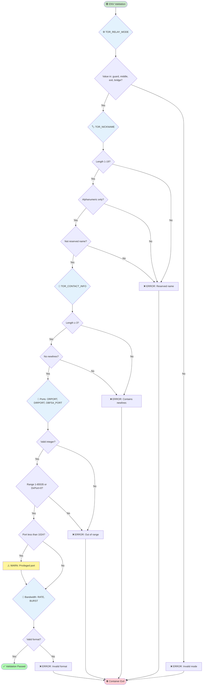
```mermaid
flowchart TD
    Start([🟢 ENV Validation]) --> V1{⚙️ TOR_RELAY_MODE}
    V1 --> V1_Check{Value in: guard, middle, exit, bridge?}
    V1_Check -->|Yes| V2
    V1_Check -->|No| V1_Fail[❌ ERROR: Invalid mode]

    V2{🏷️ TOR_NICKNAME} --> V2_1{Length 1-19?}
    V2_1 -->|Yes| V2_2{Alphanumeric only?}
    V2_2 -->|Yes| V2_3{Not reserved name?}
    V2_3 -->|Yes| V3
    V2_3 -->|No| V2_Fail[❌ ERROR: Reserved name]
    V2_2 -->|No| V2_Fail
    V2_1 -->|No| V2_Fail

    V3{📨 TOR_CONTACT_INFO} --> V3_1{Length ≥ 3?}
    V3_1 -->|Yes| V3_2{No newlines?}
    V3_2 -->|Yes| V4
    V3_2 -->|No| V3_Fail[❌ ERROR: Contains newlines]
    V3_1 -->|No| V3_Fail

    V4{🔌 Ports: ORPORT, DIRPORT, OBFS4_PORT} --> V4_1{Valid integer?}
    V4_1 -->|Yes| V4_2{Range 1-65535 or DirPort=0?}
    V4_2 -->|Yes| V4_3{Port less than 1024?}
    V4_3 -->|Yes| V4_Warn[⚠️ WARN: Privileged port]
    V4_3 -->|No| V5
    V4_Warn --> V5
    V4_2 -->|No| V4_Fail[❌ ERROR: Out of range]
    V4_1 -->|No| V4_Fail

    V5{📶 Bandwidth: RATE, BURST} --> V5_1{Valid format?}
    V5_1 -->|Yes| Success([✅ Validation Passed])
    V5_1 -->|No| V5_Fail[❌ ERROR: Invalid format]

    V1_Fail --> Failure([⛔ Container Exit])
    V2_Fail --> Failure
    V3_Fail --> Failure
    V4_Fail --> Failure
    V5_Fail --> Failure

    style Success fill:#b2fab4
    style Failure fill:#ffcdd2
    style V4_Warn fill:#fff59d
    style Start fill:#c8e6c9
    style V1 fill:#e3f2fd
    style V2 fill:#e3f2fd
    style V3 fill:#e3f2fd
    style V4 fill:#e3f2fd
    style V5 fill:#e3f2fd
```

**Code Reference:** `lib/config.sh` — ENV validation, rendering and OBFS4V whitelist.

---

## 🔗 ENV Compatibility Layer

The container supports **two naming conventions** for maximum compatibility:

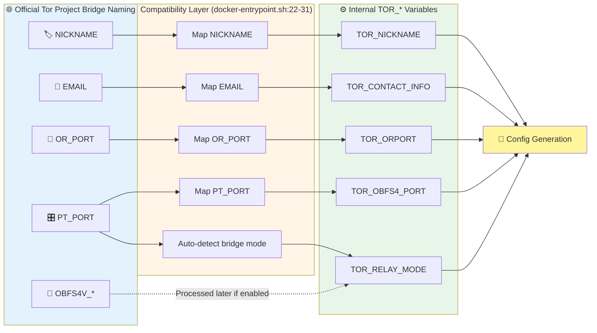
```mermaid
flowchart LR
    subgraph Official["🌐 Official Tor Project Bridge Naming"]
        NICKNAME["🏷️ NICKNAME"]
        EMAIL["📨 EMAIL"]
        OR_PORT["🔌 OR_PORT"]
        PT_PORT["🎛️ PT_PORT"]
        OBFS4V["🔐 OBFS4V_*"]
    end

    subgraph Compat["🔀 Compatibility Layer (docker-entrypoint.sh:22-31)"]
        Map1["Map NICKNAME"]
        Map2["Map EMAIL"]
        Map3["Map OR_PORT"]
        Map4["Map PT_PORT"]
        Auto["Auto-detect bridge mode"]
    end

    subgraph Internal["⚙️ Internal TOR_* Variables"]
        TOR_NICKNAME["TOR_NICKNAME"]
        TOR_CONTACT["TOR_CONTACT_INFO"]
        TOR_ORPORT["TOR_ORPORT"]
        TOR_OBFS4["TOR_OBFS4_PORT"]
        TOR_MODE["TOR_RELAY_MODE"]
    end

    NICKNAME --> Map1 --> TOR_NICKNAME
    EMAIL --> Map2 --> TOR_CONTACT
    OR_PORT --> Map3 --> TOR_ORPORT
    PT_PORT --> Map4 --> TOR_OBFS4
    PT_PORT --> Auto --> TOR_MODE
    OBFS4V -.->|Processed later if enabled| TOR_MODE

    TOR_NICKNAME --> Config[📝 Config Generation]
    TOR_CONTACT --> Config
    TOR_ORPORT --> Config
    TOR_OBFS4 --> Config
    TOR_MODE --> Config

    style Official fill:#e3f2fd
    style Compat fill:#fff4e6
    style Internal fill:#e8f5e9
    style Config fill:#fff59d
```

**Mapping Details:**
- **Map NICKNAME**: `[ -n "${NICKNAME:-}" ] && TOR_NICKNAME="$NICKNAME"`
- **Map EMAIL**: `[ -n "${EMAIL:-}" ] && TOR_CONTACT_INFO="$EMAIL"`
- **Map OR_PORT**: `[ -n "${OR_PORT:-}" ] && TOR_ORPORT="$OR_PORT"`
- **Map PT_PORT**: `[ -n "${PT_PORT:-}" ] && TOR_OBFS4_PORT="$PT_PORT"`
- **Auto-detect bridge mode**: If `PT_PORT` is set and mode is guard, automatically switch to bridge

### Priority Rules

1. **Official names OVERRIDE Dockerfile defaults**
   - Example: `OR_PORT=443` overrides `ENV TOR_ORPORT=9001`
2. **PT_PORT auto-detects bridge mode**
   - Setting `PT_PORT` automatically sets `TOR_RELAY_MODE=bridge`
3. **OBFS4V_\* variables** require `OBFS4_ENABLE_ADDITIONAL_VARIABLES=1`
   - Whitelist-validated for security

**Code Reference:** `docker-entrypoint.sh` — configuration ownership, compatibility aliases and process lifecycle.

---

## 📝 Configuration Generation

### Mode-Specific Config Generation

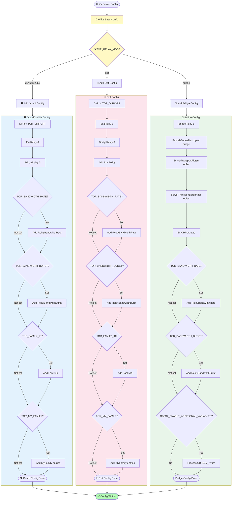
```mermaid
flowchart TD
    Start([🟢 Generate Config]) --> Base[📝 Write Base Config]

    Base --> Mode{⚙️ TOR_RELAY_MODE}

    Mode -->|guard/middle| Guard[🛡️ Add Guard Config]
    Mode -->|exit| Exit[🚪 Add Exit Config]
    Mode -->|bridge| Bridge[🌉 Add Bridge Config]

    subgraph GuardConfig["🛡️ Guard/Middle Config"]
        G1[DirPort TOR_DIRPORT] --> G2[ExitRelay 0]
        G2 --> G3[BridgeRelay 0]
        G3 --> G4{TOR_BANDWIDTH_RATE?}
        G4 -->|Set| G5[Add RelayBandwidthRate]
        G4 -->|Not set| G6
        G5 --> G6{TOR_BANDWIDTH_BURST?}
        G6 -->|Set| G7[Add RelayBandwidthBurst]
        G6 -->|Not set| G8
        G7 --> G8{TOR_FAMILY_ID?}
        G8 -->|Set| G9[Add FamilyId]
        G8 -->|Not set| G10
        G9 --> G10{TOR_MY_FAMILY?}
        G10 -->|Set| G11[Add MyFamily entries]
        G10 -->|Not set| GuardDone
        G11 --> GuardDone([🛡️ Guard Config Done])
    end

    subgraph ExitConfig["🚪 Exit Config"]
        E1[DirPort TOR_DIRPORT] --> E2[ExitRelay 1]
        E2 --> E3[BridgeRelay 0]
        E3 --> E4[Add Exit Policy]
        E4 --> E5{TOR_BANDWIDTH_RATE?}
        E5 -->|Set| E6[Add RelayBandwidthRate]
        E5 -->|Not set| E7
        E6 --> E7{TOR_BANDWIDTH_BURST?}
        E7 -->|Set| E8[Add RelayBandwidthBurst]
        E7 -->|Not set| E9
        E8 --> E9{TOR_FAMILY_ID?}
        E9 -->|Set| E10[Add FamilyId]
        E9 -->|Not set| E11
        E10 --> E11{TOR_MY_FAMILY?}
        E11 -->|Set| E12[Add MyFamily entries]
        E11 -->|Not set| ExitDone
        E12 --> ExitDone([🚪 Exit Config Done])
    end

    subgraph BridgeConfig["🌉 Bridge Config"]
        B1[BridgeRelay 1] --> B2[PublishServerDescriptor bridge]
        B2 --> B3[ServerTransportPlugin obfs4]
        B3 --> B4[ServerTransportListenAddr obfs4]
        B4 --> B5[ExtORPort auto]
        B5 --> B6{TOR_BANDWIDTH_RATE?}
        B6 -->|Set| B7[Add RelayBandwidthRate]
        B6 -->|Not set| B8
        B7 --> B8{TOR_BANDWIDTH_BURST?}
        B8 -->|Set| B9[Add RelayBandwidthBurst]
        B8 -->|Not set| B10
        B9 --> B10{OBFS4_ENABLE_ADDITIONAL_VARIABLES?}
        B10 -->|Yes| OBFS4[Process OBFS4V_* vars]
        B10 -->|No| BridgeDone
        OBFS4 --> BridgeDone([Bridge Config Done])
    end

    Guard --> GuardConfig
    Exit --> ExitConfig
    Bridge --> BridgeConfig

    GuardDone --> Complete([✅ Config Written])
    ExitDone --> Complete
    BridgeDone --> Complete

    style Complete fill:#b2fab4
    style GuardConfig fill:#e3f2fd
    style ExitConfig fill:#fce4ec
    style BridgeConfig fill:#e8f5e9
    style Mode fill:#fff9c4
    style Base fill:#fff9c4
```

**Base Config Includes:** Nickname, ContactInfo, ORPort, SocksPort 0, DataDirectory, Logging
**Family Config (guard/exit):** Optional FamilyId (Tor 0.4.9.2-alpha or later) and MyFamily (legacy, comma-separated fingerprints via TOR_MY_FAMILY)

**Code Reference:** `lib/config.sh` — ENV validation, rendering and OBFS4V whitelist.

### OBFS4V_* Variable Processing (Bridge Mode)

Security-critical whitelisting to prevent injection attacks:

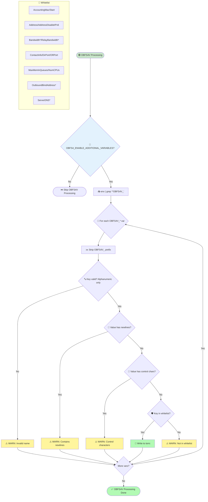
```mermaid
flowchart TD
    Start([🟢 OBFS4V Processing]) --> Enable{🔐 OBFS4_ENABLE_ADDITIONAL_VARIABLES?}
    Enable -->|No| Skip([⏭️ Skip OBFS4V Processing])
    Enable -->|Yes| GetVars["📥 env | grep '^OBFS4V_'"]

    GetVars --> Loop{🔁 For each OBFS4V_* var}

    Loop --> Strip[✂️ Strip OBFS4V_ prefix]
    Strip --> V1{🔤 Key valid? Alphanumeric only}
    V1 -->|No| Warn1[⚠️ WARN: Invalid name] --> Next
    V1 -->|Yes| V2{📄 Value has newlines?}

    V2 -->|Yes| Warn2[⚠️ WARN: Contains newlines] --> Next
    V2 -->|No| V3{🧪 Value has control chars?}

    V3 -->|Yes| Warn3[⚠️ WARN: Control characters] --> Next
    V3 -->|No| Whitelist{🛡️ Key in whitelist?}

    subgraph WhitelistCheck["🧾 Whitelist"]
        WL1[AccountingMax/Start]
        WL2[Address/AddressDisableIPv6]
        WL3[Bandwidth*/RelayBandwidth*]
        WL4[ContactInfo/DirPort/ORPort]
        WL5[MaxMemInQueues/NumCPUs]
        WL6[OutboundBindAddress*]
        WL7[ServerDNS*]
    end

    Whitelist -->|Yes| Write[📝 Write to torrc]
    Whitelist -->|No| Warn4[⚠️ WARN: Not in whitelist]

    Write --> Next{More vars?}
    Warn4 --> Next
    Next -->|Yes| Loop
    Next -->|No| Done([✅ OBFS4V Processing Done])

    style Write fill:#b2fab4
    style Done fill:#b2fab4
    style Warn1 fill:#fff59d
    style Warn2 fill:#fff59d
    style Warn3 fill:#fff59d
    style Warn4 fill:#fff59d
    style Start fill:#c8e6c9
    style Enable fill:#e3f2fd
```

**Security Features (fixed in v1.1.1, improved through v1.1.7):**
- **Newline detection:** `wc -l` instead of busybox-incompatible `grep -qE '[\x00\n\r]'`
- **Control char detection:** `tr -d '[ -~]'` removes printable chars, leaves control chars
- **Whitelist enforcement:** Only known-safe torrc options allowed
- **No code execution:** Values written with `printf`, not `eval`

**Code Reference:** `lib/config.sh` — ENV validation, rendering and OBFS4V whitelist.

---

## 🛠️ Diagnostic Tools

Nine POSIX shell tools provide observability and safe in-container operations:

```mermaid
flowchart TD
    User([👤 User: docker exec]) --> Choice{🛠️ Which tool?}

    Choice -->|status| StatusFlow
    Choice -->|health| HealthFlow
    Choice -->|refresh| RefreshFlow
    Choice -->|doctor| Doctor["🩺 Reason codes and next steps"]
    Choice -->|config| Config["⚙️ Validate, redacted diff, atomic apply"]
    Choice -->|fingerprint| FingerprintFlow
    Choice -->|bridge-line| BridgeFlow
    Choice -->|gen-family| FamilyFlow

    subgraph StatusFlow["📊 tools/status - Full Health Report"]
        S1[🔍 Check Tor process running] --> S2[📈 Read current-run bootstrap %]
        S2 --> S3[🌐 Read reachability status]
        S3 --> S4[🆔 Show fingerprint]
        S4 --> S5[🧩 Show config validity and readiness]
        S5 --> S6[⏱️ Show process uptime and reason]
        S6 --> S7[😁 Output with emoji formatting]
    end

    subgraph HealthFlow["📡 tools/health - JSON API"]
        H1[🔍 Check Tor process] --> H2[📈 Parse only fresh launch-boundary evidence]
        H2 --> H3[⚠️ Parse log for errors]
        H3 --> H4[🆔 Get fingerprint if exists]
        H4 --> H5[📤 Output JSON]
    end

    subgraph RefreshFlow["🔄 tools/refresh - PID-Preserving Reload"]
        R1[🔍 Find the single Tor PID] --> R2[📄 Detect active -f torrc]
        R2 --> R3[✅ tor --verify-config]
        R3 -->|Valid| R7[🧠 Confirm Tor catches SIGHUP]
        R3 -->|Invalid| R5[🛑 Exit without signalling Tor]
        R7 --> R4[📨 Send SIGHUP to exact PID]
        R4 --> R6[🔎 Confirm PID and process start time]
    end

    subgraph FingerprintFlow["🆔 tools/fingerprint - Show Identity"]
        F1[📄 Read /var/lib/tor/fingerprint] --> F2{File exists?}
        F2 -->|Yes| F3[🔎 Parse fingerprint]
        F3 --> F4[📤 Output fingerprint]
        F4 --> F5[🔗 Output Tor Metrics URL]
        F2 -->|No| F6[⚠️ Warn: Not ready yet]
    end

    subgraph BridgeFlow["🌉 tools/bridge-line - Bridge Sharing"]
        B1{Bridge mode?} -->|No| B2[❌ Error: Not a bridge]
        B1 -->|Yes| B3[📄 Read pt_state/obfs4_bridgeline.txt]
        B3 --> B4{File exists?}
        B4 -->|Yes| B5[🔐 Keep transport-generated cert and iat-mode]
        B5 --> B6[🌍 Require explicit public address]
        B6 --> B7[📤 Output bridge line]
        B4 -->|No| B8[⚠️ Warn: Not ready yet]
    end

    StatusFlow --> Output1([🟢 Human-readable output])
    HealthFlow --> Output2([🟢 JSON output])
    RefreshFlow --> Output5([🟢 Reload confirmation or safe rejection])
    FingerprintFlow --> Output3([🟢 Fingerprint + URL])
    BridgeFlow --> Output4([🟢 Bridge line or error])

    subgraph FamilyFlow["👨‍👩‍👧 tools/gen-family - Happy Family Management"]
        FM1{Which action?}
        FM1 -->|gen-family Name| FM2[🔑 Check Tor version]
        FM2 --> FM3{Key already exists?}
        FM3 -->|Yes| FM4[⚠️ Warn: key exists]
        FM3 -->|No| FM5[🔐 tor --keygen-family Name]
        FM5 --> FM6[📤 Output FamilyId + instructions]
        FM1 -->|gen-family --show| FM7[🔍 Scan keys dir for .secret_family_key]
        FM7 --> FM8[📝 Show FamilyId from torrc]
        FM8 --> FM9[ℹ️ Show MyFamily status]
    end

    FamilyFlow --> Output5([🟢 Key + FamilyId or status])

    style Output1 fill:#b2fab4
    style Output2 fill:#b2fab4
    style Output3 fill:#b2fab4
    style Output4 fill:#b2fab4
    style Output5 fill:#b2fab4
```

**JSON Output Fields:** Existing status, pid, uptime, bootstrap, reachable, errors, fingerprint and nickname remain available. Boolean `liveness`, `readiness`, `config_valid` and `fresh`, plus `reason`, distinguish process/configuration/readiness evidence. `reachable` remains a string; it is Tor self-test evidence, not an independent network probe.

### Tool Characteristics

| Tool | Purpose | Output Format | Dependencies |
|------|---------|---------------|--------------|
| **status** | Liveness, readiness and active config | Emoji-rich text / JSON | Shared runtime inspection |
| **health** | Current-run monitoring observation | JSON | Shared runtime inspection |
| **doctor** | Diagnose reason and next step | Emoji-rich text / JSON | Shared runtime inspection |
| **config** | Validate, diff, atomic apply | Text | Shared config/runtime libraries and Tor |
| **refresh** | Validated config reload | Text | busybox: pgrep, awk, ps, kill, tor --verify-config |
| **fingerprint** | Relay identity | Text + URL | busybox: cat, awk |
| **bridge-line** | Bridge sharing | obfs4 bridge line | busybox: grep, sed, awk, wget |
| **gen-auth** | Credential generation | Text (Pass + Hash) | busybox: head, tr, tor |
| **gen-family** | Happy Family key mgmt | Text (Key + FamilyId) | busybox: tor --keygen-family, grep, basename |

**All tools:**
- Use `#!/bin/sh` (POSIX sh, not bash)
- No Python or scanner dependency in runtime; host-only backup/inventory use Python and backup additionally uses age
- Numeric sanitization to prevent "bad number" errors
- Installed at `/usr/local/bin/` (no `.sh` extensions)

**Code Location:** `tools/` directory, copied to `/usr/local/bin/` in Dockerfile

---

## 🗂️ Directory Structure

```mermaid
graph TD
    %% Main directory structure
    Root["📦 Container Root"] --> Etc["📁 /etc"]
    Root --> Var["📁 /var"]
    Root --> Run["📁 /run"]
    Root --> Usr["📁 /usr"]
    Root --> Sbin["📁 /sbin"]
    Root --> BuildInfo["📄 /build-info.txt"]

    %% =============== /etc/tor ===============
    subgraph etc_group["⚙️ Configuration Layer"]
        direction TB
        TorEtc["📁 /etc/tor"]
        TorRC["⚙️ torrc"]
        TorRCSample["🗑️ torrc.sample"]

        TorEtc --> TorRC
        TorEtc -.->|Deleted at build| TorRCSample
    end
    Etc --> TorEtc

    %% =============== /var/lib ===============
    subgraph var_lib_group["💾 Persistent Data Volume"]
        direction TB
        Lib["📁 /var/lib"]
        TorData["📦 /var/lib/tor VOLUME"]
        Keys["🔑 keys/"]
        FamilyKey["👨‍👩‍👧 *.secret_family_key"]
        FingerprintFile["🆔 fingerprint"]
        PTState["🌀 pt_state/"]

        Lib --> TorData
        TorData --> Keys
        Keys --> FamilyKey
        TorData --> FingerprintFile
        TorData --> PTState
    end
    Var --> Lib

    %% =============== /var/log ===============
    subgraph var_log_group["📜 Log Volume"]
        direction TB
        Log["📁 /var/log"]
        TorLog["📦 /var/log/tor VOLUME"]
        Notices["📄 notices.log"]

        Log --> TorLog
        TorLog --> Notices
    end
    Var --> Log

    %% =============== /run/tor ===============
    subgraph run_group["⚡ Runtime State"]
        direction TB
        TorRun["📁 /run/tor"]
        TorPID["🧩 relay.state: PID, start time, inode and offset"]

        TorRun --> TorPID
    end
    Run --> TorRun

    %% =============== /usr/local/bin ===============
    subgraph usr_local_group["🚀 Custom Scripts"]
        direction TB
        UsrLocal["📁 /usr/local"]
        Bin["📁 /usr/local/bin"]
        Entrypoint["🚀 docker-entrypoint.sh"]
        Healthcheck["❤️ healthcheck.sh"]
        Status["📡 status"]
        Health["💚 health"]
        Refresh["🔄 refresh"]
        Fingerprint["🧬 fingerprint"]
        BridgeLine["🌉 bridge-line"]
        GenAuth["🔑 gen-auth"]
        GenFamily["👨‍👩‍👧 gen-family"]

        UsrLocal --> Bin
        Bin --> Entrypoint
        Bin --> Healthcheck
        Bin --> Status
        Bin --> Health
        Bin --> Refresh
        Bin --> Fingerprint
        Bin --> BridgeLine
        Bin --> GenAuth
        Bin --> GenFamily
        Bin --> Doctor["🩺 doctor"]
        Bin --> ConfigTool["⚙️ config"]
        UsrLocal --> SharedLib["📚 /usr/local/lib/relay: runtime.sh and config.sh"]
    end
    Usr --> UsrLocal

    %% =============== /usr/bin ===============
    subgraph usr_bin_group["🎯 Binaries"]
        direction TB
        UsrBin["📁 /usr/bin"]
        TorBin["🧅 tor"]
        Lyrebird["🎶 lyrebird"]

        UsrBin --> TorBin
        UsrBin --> Lyrebird
    end
    Usr --> UsrBin

    %% =============== /sbin ===============
    subgraph sbin_group["🟢 Init System"]
        direction TB
        Tini["🟩 /sbin/tini"]
    end
    Sbin --> Tini

    %% =============== Styling ===============
    classDef volumeStyle fill:#ff9e9e,stroke:#d32f2f,stroke-width:2px,color:#000
    classDef configStyle fill:#90caf9,stroke:#1976d2,stroke-width:2px,color:#000
    classDef scriptStyle fill:#fff176,stroke:#f57f17,stroke-width:2px,color:#000
    classDef binaryStyle fill:#a5d6a7,stroke:#388e3c,stroke-width:2px,color:#000
    classDef runtimeStyle fill:#ffcc80,stroke:#f57c00,stroke-width:2px,color:#000
    classDef deletedStyle fill:#e0e0e0,stroke:#9e9e9e,stroke-width:1px,color:#757575,stroke-dasharray: 5 5
    classDef infoStyle fill:#e1bee7,stroke:#7b1fa2,stroke-width:1px,color:#000

    class TorData,TorLog volumeStyle
    class TorRC configStyle
    class Entrypoint,Healthcheck,Status,Health,Fingerprint,BridgeLine,GenAuth,GenFamily scriptStyle
    class TorBin,Lyrebird,Tini binaryStyle
    class TorPID runtimeStyle
    class TorRCSample deletedStyle
    class BuildInfo infoStyle
```

### Ownership & Permissions

| Path | Owner | Permissions | Set By |
|------|-------|-------------|--------|
| `/var/lib/tor` | tor:tor (100:101) | `700` | Dockerfile + entrypoint |
| `/var/log/tor` | tor:tor (100:101) | `755` | Dockerfile + entrypoint |
| `/run/tor` | tor:tor (100:101) | `755` | Dockerfile |
| `/etc/tor` | tor:tor (100:101) | `755` | Dockerfile |
| `/etc/tor/torrc` | tor:tor (100:101) | `600` for atomically generated files | Generated at runtime; mounted permissions remain operator-owned |

**Migration Note:** Official `thetorproject/obfs4-bridge` uses Debian `debian-tor` user (UID 101), while this image uses Alpine `tor` user (UID 100). Volume ownership must be fixed when migrating.

---

## 🛡️ Security Model

### Attack Surface Minimization

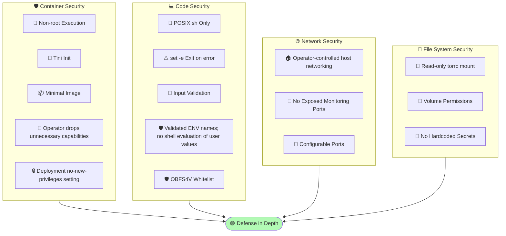
```mermaid
flowchart TD
    subgraph Container["🛡️ Container Security"]
        NonRoot[👤 Non-root Execution]
        Tini[🔧 Tini Init]
        Minimal[📦 Minimal Image]
        NoCaps["🚫 Operator drops unnecessary capabilities"]
        NoPriv["🔒 Deployment no-new-privileges setting"]
    end

    subgraph CodeSec["💻 Code Security"]
        POSIX[📜 POSIX sh Only]
        SetE[⚠️ set -e Exit on error]
        Validation[🧪 Input Validation]
        NoEval["🛡️ Validated ENV names; no shell evaluation of user values"]
        Whitelist[🛡️ OBFS4V Whitelist]
    end

    subgraph NetworkSec["🌐 Network Security"]
        HostNet["🏠 Operator-controlled host networking"]
        NoPorts[🔕 No Exposed Monitoring Ports]
        Configurable[🧭 Configurable Ports]
    end

    subgraph FileSec["📁 File System Security"]
        ReadOnly[📄 Read-only torrc mount]
        VolPerms[🔐 Volume Permissions]
        NoSecrets[🙅 No Hardcoded Secrets]
    end

    Container --> Secure([🟢 Defense in Depth])
    CodeSec --> Secure
    NetworkSec --> Secure
    FileSec --> Secure

    style Secure fill:#b2fab4
```

### Validation Points

1. **Relay Mode** - Must be: guard, middle, exit, or bridge
2. **Nickname** - 1-19 alphanumeric, not reserved (unnamed/tor/relay/etc)
3. **Contact Info** - Minimum 3 chars, no newlines (verified with `wc -l`)
4. **Ports** - Valid integers 1-65535 (or 0 for DirPort), warn on <1024
5. **Bandwidth** - Valid format: `N MB`, `N GB`, `N KBytes`, etc.
6. **OBFS4V_\* Keys** - Alphanumeric with underscores only
7. **OBFS4V_\* Values** - No newlines (`wc -l`), no control chars (`tr -d '[ -~]'`)
8. **OBFS4V_\* Whitelist** - Only known-safe torrc options

**Code Reference:** `lib/config.sh` — ENV validation, rendering and OBFS4V whitelist.

---

## 📨 Signal Handling

Graceful shutdown stops the notice stream, forwards SIGTERM to the recorded Tor process and waits within the configured limit. Natural Tor exits preserve their original exit status.

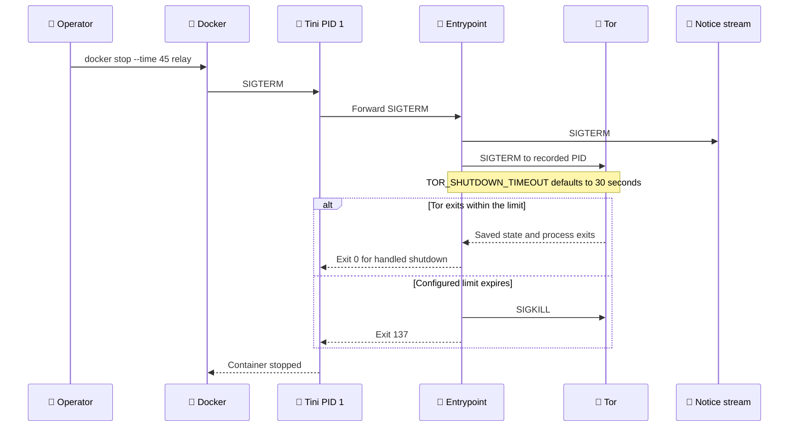
```mermaid
sequenceDiagram
    participant Operator as 👤 Operator
    participant Docker as 🐳 Docker
    participant Tini as 🔧 Tini PID 1
    participant Entry as 🚀 Entrypoint
    participant Tor as 🧅 Tor
    participant Tail as 📜 Notice stream
    Operator->>Docker: docker stop --time 45 relay
    Docker->>Tini: SIGTERM
    Tini->>Entry: Forward SIGTERM
    Entry->>Tail: SIGTERM
    Entry->>Tor: SIGTERM to recorded PID
    Note over Entry,Tor: TOR_SHUTDOWN_TIMEOUT defaults to 30 seconds
    alt Tor exits within the limit
        Tor-->>Entry: Saved state and process exits
        Entry-->>Tini: Exit 0 for handled shutdown
    else Configured limit expires
        Entry->>Tor: SIGKILL
        Entry-->>Tini: Exit 137
    end
    Tini-->>Docker: Container stopped
```

| Boundary | Responsibility |
| --- | --- |
| 🔧 Tini | PID 1 signal forwarding and child reaping |
| 🚀 Entrypoint | Exact Tor PID, notice stream and bounded wait |
| 🐳 Docker / Compose | Stop grace period longer than the entrypoint timeout |
| 🔎 Operator | Verify stopped state before snapshot or activation of a restored identity |

Use a Docker/Compose stop grace period longer than `TOR_SHUTDOWN_TIMEOUT`. Docker's default stop timeout can cut the graceful wait short. Backup uses an explicit 45-second default Docker stop timeout.

**Code Reference:** `docker-entrypoint.sh` — configuration ownership, compatibility aliases and process lifecycle.

---

## 🏗️ Build Process

The native Go builder cross-compiles Lyrebird using a pinned source revision and independent module lock. No build tools or vulnerability scanner are copied into the runtime.

```mermaid
flowchart LR
    subgraph Source["📁 Reviewed inputs"]
        Pin["🧅 Lyrebird source SHA"]
        Lock["🔒 Independent go.mod / go.sum"]
        Go["🐹 Go 1.27.2 builder digest"]
        Files["📜 POSIX libraries and tools"]
    end
    subgraph Build["🏗️ Candidate build"]
        Native["🔨 Native builder / target cross-compile"]
        Stable["🐧 Stable Alpine 3.24.2 digest"]
        Edge["🧪 Alpine edge"]
        Matrix["🌍 Stable / edge × AMD64 / ARM64"]
    end
    subgraph Gates["🛡️ Current reviewed policy"]
        Behavior["🧪 Offline behavior and component floors"]
        GoScan["🔎 Matching transport bytes and Go reachability"]
        ImageScan["🔐 Full vulnerability / secret scan"]
        Evidence["📦 Image archive, ID, checksum and SBOM"]
    end
    subgraph Promotion["🚀 Publication after all gates"]
        Load["📥 Verify archives and import OCI layout"]
        Push["🐳 Push candidate digests to both registries"]
        Manifest["🏷️ Assemble version and alias manifests"]
        Notes["📝 Curated notes and full evidence"]
    end
    Pin --> Native
    Lock --> Native
    Go --> Native
    Native --> Matrix
    Stable --> Matrix
    Edge --> Matrix
    Files --> Matrix
    Matrix --> Behavior --> GoScan --> ImageScan --> Evidence
    Evidence --> Load --> Push --> Manifest --> Notes
    style Evidence fill:#e1bee7,stroke:#7b1fa2
    style Manifest fill:#b2fab4,stroke:#388e3c
    style Behavior fill:#90caf9,stroke:#1976d2
    style ImageScan fill:#fff59d,stroke:#f57f17
```

### 📆 Rebuild and source policy

- Tags select their exact reviewed source commit; schedules select their captured main commit under the latest released version.
- Manual dispatch on main with an empty `source_tag` selects the immutable dispatch commit and rebuilds both variants and architectures. Image tags use the latest release version, which must match main's version marker; Git tags and release notes remain unchanged.
- Security policy and scanner come from current reviewed main, separately from selected source/lock/toolchain.
- Every candidate must pass before any promotion. Promotion imports those same archives into a temporary OCI layout, verifies config IDs/checksums and publishes by digest; it never rebuilds or creates public staging tags.
- A merged source or Go-lock change can ship through a validated manual main rebuild; subsequent schedules retain that merged fix. A version bump requires a new release tag.
- Release jobs check out trusted main, validate both full commit SHAs against reviewed main ancestry, then materialize separate immutable source and policy worktrees. Publication credentials exist only in promotion; checkout credentials are not retained.
- Registry inventory defaults to read-only retention review. Explicit v2.2.0 tag cleanup verifies and preserves released/rollback manifest graphs; referenced untagged architecture versions remain.

**Code Location:** `.github/workflows/release.yml`, `build/lyrebird/`, `scripts/testing/`.

---

## 🩺 Health Check

Docker health checks liveness and active configuration. Current-run bootstrap readiness and external reachability remain separate observations.

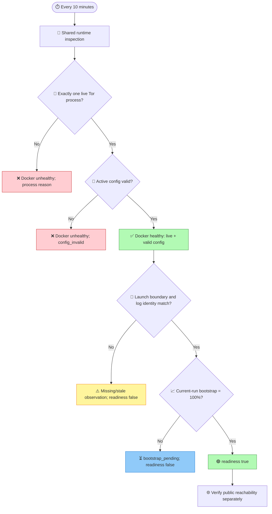
```mermaid
flowchart TD
    Timer(["⏱️ Every 10 minutes"]) --> Inspect["🔎 Shared runtime inspection"]
    Inspect --> Process{"🧅 Exactly one live Tor process?"}
    Process -->|No| Down["❌ Docker unhealthy; process reason"]
    Process -->|Yes| Config{"📄 Active config valid?"}
    Config -->|No| Invalid["❌ Docker unhealthy; config_invalid"]
    Config -->|Yes| Healthy["✅ Docker healthy: live + valid config"]
    Healthy --> Fresh{"📜 Launch boundary and log identity match?"}
    Fresh -->|No| Missing["⚠️ Missing/stale observation; readiness false"]
    Fresh -->|Yes| Bootstrap{"📈 Current-run bootstrap = 100%?"}
    Bootstrap -->|No| Pending["⏳ bootstrap_pending; readiness false"]
    Bootstrap -->|Yes| Ready["🟢 readiness true"]
    Ready --> External["🌐 Verify public reachability separately"]
    style Healthy fill:#b2fab4,stroke:#388e3c
    style Ready fill:#b2fab4,stroke:#388e3c
    style Down fill:#ffcdd2,stroke:#c62828
    style Invalid fill:#ffcdd2,stroke:#c62828
    style Missing fill:#fff59d,stroke:#f57f17
    style Pending fill:#90caf9,stroke:#1976d2
```

| Docker setting | Value |
| --- | --- |
| ⏱️ Interval | 10 minutes |
| ⌛ Timeout | 15 seconds |
| 🌱 Start period | 30 seconds |
| 🔁 Retries | 3 |

`health` exposes `liveness`, `config_valid`, `readiness`, `fresh` and `reason`. The entrypoint records PID, process start time, log inode and byte offset in `/run/tor/relay.state`. Old log lines cannot mark a restarted relay ready; rotation invalidates the recorded observation boundary. A custom mounted configuration must keep notice logging at the expected path for readiness evidence.

**Code Location:** `healthcheck.sh`, `lib/runtime.sh`, `tools/health`, `tools/doctor`.

---

## 🔐 Encrypted recovery boundary

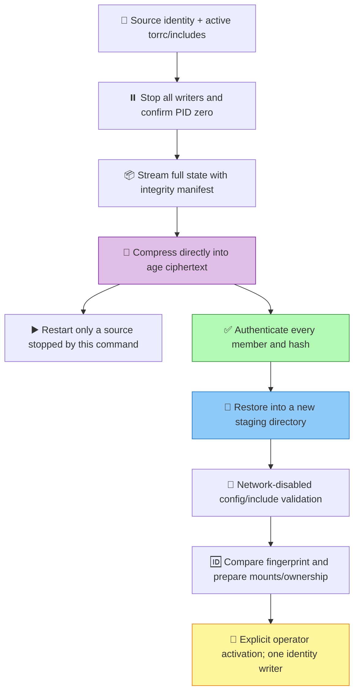
```mermaid
flowchart TD
    Source["🧅 Source identity + active torrc/includes"] --> Stop["⏸️ Stop all writers and confirm PID zero"]
    Stop --> Stream["📦 Stream full state with integrity manifest"]
    Stream --> Encrypt["🔐 Compress directly into age ciphertext"]
    Encrypt --> Restart["▶️ Restart only a source stopped by this command"]
    Encrypt --> Verify["✅ Authenticate every member and hash"]
    Verify --> Stage["📁 Restore into a new staging directory"]
    Stage --> Offline["🧪 Network-disabled config/include validation"]
    Offline --> Compare["🆔 Compare fingerprint and prepare mounts/ownership"]
    Compare --> Activate["👤 Explicit operator activation; one identity writer"]
    style Encrypt fill:#e1bee7,stroke:#7b1fa2
    style Verify fill:#b2fab4,stroke:#388e3c
    style Stage fill:#90caf9,stroke:#1976d2
    style Activate fill:#fff59d,stroke:#f57f17
```

Backup and inventory run on the host. Python 3.10+ and age are not runtime dependencies. The backup command never writes a plaintext archive, rejects unsupported includes/links and shared running-container writers, and verifies before staged extraction. External master keys and host writers require operator handling. See [encrypted recovery](BACKUP.md).

## 🛡️ Independent security updates

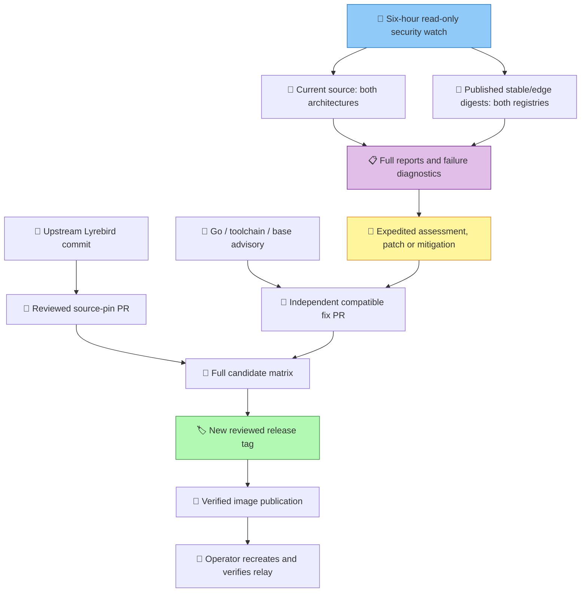
```mermaid
flowchart TD
    Upstream["🧅 Upstream Lyrebird commit"] --> PinPR["🔀 Reviewed source-pin PR"]
    Advisory["🚨 Go / toolchain / base advisory"] --> FixPR["🔀 Independent compatible fix PR"]
    PinPR --> Checks["🧪 Full candidate matrix"]
    FixPR --> Checks
    Checks --> Tag["🏷️ New reviewed release tag"]
    Tag --> Promote["🚀 Verified image publication"]
    Promote --> Recreate["👤 Operator recreates and verifies relay"]
    Watch["🔎 Six-hour read-only security watch"] --> SourceScan["🐹 Current source: both architectures"]
    Watch --> Published["🐳 Published stable/edge digests: both registries"]
    SourceScan --> Findings["📋 Full reports and failure diagnostics"]
    Published --> Findings
    Findings --> Triage["👤 Expedited assessment, patch or mitigation"]
    Triage --> FixPR
    style Watch fill:#90caf9,stroke:#1976d2
    style Findings fill:#e1bee7,stroke:#7b1fa2
    style Tag fill:#b2fab4,stroke:#388e3c
    style Triage fill:#fff59d,stroke:#f57f17
```

Renovate tracks all four source/metadata pins and direct/indirect module updates. Source and Go changes require review. OSV automatic alerts cover direct dependencies only; scans and maintainer triage cover other findings. HIGH/CRITICAL image vulnerabilities, secrets and known reachable Go findings block release even without a fix. Static reachability and advisory ingestion have limits, and hosted schedules can be delayed. Monitoring never patches a running relay.

## 📚 References

### Key Files

| File | Purpose | Location |
|------|---------|---------------|
| `Dockerfile` | Container build | Source functions; no fragile line-count reference |
| `docker-entrypoint.sh` | Initialization & startup | Source functions; no fragile line-count reference |
| `healthcheck.sh` | Docker health check | Source functions; no fragile line-count reference |
| `tools/status` | Human-readable status | Source functions; no fragile line-count reference |
| `tools/health` | JSON health API | Source functions; no fragile line-count reference |
| `tools/fingerprint` | Show relay identity | Source functions; no fragile line-count reference |
| `tools/bridge-line` | Generate bridge line | Source functions; no fragile line-count reference |
| `tools/gen-auth` | Generate Control Port auth | Source functions; no fragile line-count reference |
| `tools/gen-family` | Happy Family key management | Source functions; no fragile line-count reference |

### External Documentation

- [Tor Project Manual](https://2019.www.torproject.org/docs/tor-manual.html.en) - Complete torrc reference
- [Alpine Linux](https://alpinelinux.org/) - Base image documentation
- [Lyrebird](https://gitlab.torproject.org/tpo/anti-censorship/pluggable-transports/lyrebird) - obfs4 pluggable transport
- [Tini](https://github.com/krallin/tini) - Init system for containers

---

**Document Version:** 2.2.0 • **Last Updated:** 2026-10-09 • **Container Version:** v2.2.0

