# Architecture Documentation

**Tor Guard Relay Container** - Technical Architecture & Design

## Table of Contents

1. [Overview](#overview)
2. [Container Lifecycle](#container-lifecycle)
3. [Initialization Flow](#initialization-flow)
4. [Configuration System](#configuration-system)
5. [ENV Compatibility Layer](#env-compatibility-layer)
6. [Diagnostic Tools](#diagnostic-tools)
7. [Directory Structure](#directory-structure)
8. [Security Model](#security-model)
9. [Signal Handling](#signal-handling)

---

## Overview

This container implements a production-ready Tor relay with three operational modes:
- **Guard/Middle**: Directory-enabled relay for traffic routing
- **Exit**: High-trust relay with customizable exit policies
- **Bridge**: Censorship-resistant relay with obfs4 transport

**Design Principles:**
- POSIX sh compatibility (busybox ash, no bash)
- Minimal dependencies (~16.8 MB total image)
- Security-first (non-root, minimal capabilities, strict validation)
- Multi-architecture (AMD64, ARM64)
- Production-ready (graceful shutdown, health checks, observability)

---

## Container Lifecycle

```mermaid
flowchart TD
    Start([🟢 Container Start]) --> Tini[/🔧 Tini Init PID 1/]
    Tini --> Entrypoint[🚀 docker-entrypoint.sh]

    Entrypoint --> Phase1[📁 Phase 1: Directories]
    Phase1 --> Phase2[🔐 Phase 2: Permissions]
    Phase2 --> Phase3[⚙️ Phase 3: Configuration]
    Phase3 --> Phase4[🧪 Phase 4: Validation]
    Phase4 --> Phase5[📄 Phase 5: Build Info]
    Phase5 --> Phase6[🩺 Phase 6: Diagnostics Info]
    Phase6 --> TorStart[🚀 Launch Tor Process]

    TorStart --> Running{🟦 Container Running}

    Running -->|Signal: SIGTERM or SIGINT| Trap[🧹 Signal Handler]
    Running -->|Tor Exits| Cleanup
    Running -->|User Exec| DiagTools[🛠️ Diagnostic Tools]

    DiagTools -->|status| StatusTool[📝 tools/status]
    DiagTools -->|health| HealthTool[📊 tools/health]
    DiagTools -->|fingerprint| FingerprintTool[🆔 tools/fingerprint]
    DiagTools -->|bridge-line| BridgeTool[🌉 tools/bridge-line]
    DiagTools -->|gen-auth| GenAuthTool[🔑 tools/gen-auth]

    StatusTool --> Running
    HealthTool --> Running
    FingerprintTool --> Running
    BridgeTool --> Running
    GenAuthTool --> Running

    Trap --> StopTail[🧽 Kill tail -F PID]
    StopTail --> StopTor[📨 Send SIGTERM to Tor]
    StopTor --> Wait[⏳ Wait for Tor Exit]
    Wait --> Cleanup[🧹 Cleanup and Exit]
    Cleanup --> End([🔴 Container Stop])

    style Start fill:#b2fab4
    style End fill:#ffb3c6
    style Running fill:#90caf9
    style TorStart fill:#fff59d
    style Trap fill:#ffcc80
```

---

## Initialization Flow

The entrypoint script (`docker-entrypoint.sh`) executes **6 distinct phases** in sequence:

```mermaid
flowchart TD
    Banner[🎉 Startup Banner] --> P1

    subgraph P1["📁 Phase 1: Directory Structure"]
        P1_1[📂 mkdir -p data/log/run/tmp] --> P1_2[💽 Show disk space]
    end

    subgraph P2["🔐 Phase 2: Permission Hardening"]
        P2_1[🔒 chmod 700 data dir] --> P2_2[📁 chmod 755 log dir]
    end

    subgraph P3["⚙️ Phase 3: Configuration Setup"]
        P3_1{🧩 Mounted config exists?} -->|Yes| P3_2[📄 Use mounted file]
        P3_1 -->|No| P3_3{🌐 ENV vars set?}
        P3_3 -->|Yes| P3_4[🧪 Validate ENV] --> P3_5[📝 Generate config]
        P3_3 -->|No| P3_6[❌ ERROR: No config]
    end

    subgraph P4["🧪 Phase 4: Configuration Validation"]
        P4_1[🔍 Check Tor binary] --> P4_2[ℹ️ Get Tor version]
        P4_2 --> P4_3[🧯 tor --verify-config]
        P4_3 -->|Invalid| P4_4[❌ ERROR: Bad config]
        P4_3 -->|Valid| P4_5[✅ Success]
    end

    subgraph P5["📄 Phase 5: Build Information"]
        P5_1[📘 Read /build-info.txt] --> P5_2[🖥️ Show version and arch]
        P5_2 --> P5_3[📡 Show relay mode and config source]
    end

    subgraph P6["🛠️ Phase 6: Diagnostic Tools Info"]
        P6_1[🔧 List available tools] --> P6_2[📚 Show usage examples]
    end

    P1 --> P2
    P2 --> P3
    P3 --> P4
    P4 --> P5
    P5 --> P6
    P6 --> Launch[🚀 Launch Tor]

    style P3_6 fill:#ffcdd2
    style P4_4 fill:#ffcdd2
    style Launch fill:#fff59d
```

### Phase Details

| Phase | Purpose | Key Operations | Error Handling |
|-------|---------|----------------|----------------|
| **1** | Directory Setup | `mkdir -p` data/log/run, show disk space | Fail if mkdir fails |
| **2** | Permissions | `chmod 700` data, `chmod 755` log | Warn on failure (read-only mount) |
| **3** | Configuration | Priority: mounted > ENV > error | Die if no config source |
| **4** | Validation | `tor --verify-config` syntax check | Die if invalid config |
| **5** | Build Info | Show version/arch/mode/source | Warn if missing |
| **6** | Diagnostics | List available tools | Informational only |

---

## Configuration System

### Configuration Priority

```mermaid
flowchart TD
    Start([🟢 Configuration Needed]) --> Check1{📄 File exists at /etc/tor/torrc?}

    Check1 -->|Yes| Check2{📏 File not empty?}
    Check2 -->|Yes| UseMounted[📁 Use Mounted Config]
    Check2 -->|No| Check3

    Check1 -->|No| Check3{🌐 ENV vars set? TOR_NICKNAME and TOR_CONTACT_INFO}

    Check3 -->|Yes| Validate[🧪 Validate ENV Values]
    Validate -->|Valid| Generate[✍️ Generate torrc from ENV]
    Validate -->|Invalid| Error1[❌ ERROR: Invalid ENV]

    Generate --> ModeCheck{⚙️ TOR_RELAY_MODE?}
    ModeCheck -->|guard/middle| GenGuard[🛡️ Generate Guard Config]
    ModeCheck -->|exit| GenExit[🚪 Generate Exit Config]
    ModeCheck -->|bridge| GenBridge[🌉 Generate Bridge Config]

    GenBridge --> OBFS4Check{🔐 OBFS4_ENABLE_ADDITIONAL_VARIABLES?}
    OBFS4Check -->|Yes| ProcessOBFS4V[🧩 Process OBFS4V_* vars]
    OBFS4Check -->|No| UseEnv
    ProcessOBFS4V --> UseEnv[🧾 Use Generated Config]

    GenGuard --> UseEnv
    GenExit --> UseEnv

    Check3 -->|No| Error2[❌ ERROR: No Config Found]

    UseMounted --> Success([✅ Config Ready])
    UseEnv --> Success
    Error1 --> Failure([⛔ Container Exit])
    Error2 --> Failure

    style Start fill:#c8e6c9
    style UseMounted fill:#b2fab4
    style UseEnv fill:#b2fab4
    style Success fill:#b2fab4
    style Error1 fill:#ffcdd2
    style Error2 fill:#ffcdd2
    style Failure fill:#ffcdd2
    style Validate fill:#fff9c4
    style Generate fill:#fff9c4
    style ModeCheck fill:#e1f5fe
    style GenGuard fill:#e3f2fd
    style GenExit fill:#fce4ec
    style GenBridge fill:#e8f5e9
    style OBFS4Check fill:#f3e5f5
    style ProcessOBFS4V fill:#ede7f6
```

**Code Reference:** `docker-entrypoint.sh` lines 201-220 (phase_3_configuration)

### ENV Variable Validation

All ENV variables are validated before config generation:

**Code Reference:** `docker-entrypoint.sh` lines 115-198 (validate_relay_config)

---

## ENV Compatibility Layer

The container supports **two naming conventions** for maximum compatibility:

```mermaid
flowchart LR
    subgraph Official["🌐 Official Tor Project Bridge Naming"]
        NICKNAME["🏷️ NICKNAME"]
        EMAIL["📨 EMAIL"]
        OR_PORT["🔌 OR_PORT"]
        PT_PORT["🎛️ PT_PORT"]
        OBFS4V["🔐 OBFS4V_*"]
    end

    subgraph Compat["🔀 Compatibility Layer (docker-entrypoint.sh:22-31)"]
        Map1["Map NICKNAME"]
        Map2["Map EMAIL"]
        Map3["Map OR_PORT"]
        Map4["Map PT_PORT"]
        Auto["Auto-detect bridge mode"]
    end

    subgraph Internal["⚙️ Internal TOR_* Variables"]
        TOR_NICKNAME["TOR_NICKNAME"]
        TOR_CONTACT["TOR_CONTACT_INFO"]
        TOR_ORPORT["TOR_ORPORT"]
        TOR_OBFS4["TOR_OBFS4_PORT"]
        TOR_MODE["TOR_RELAY_MODE"]
    end

    NICKNAME --> Map1 --> TOR_NICKNAME
    EMAIL --> Map2 --> TOR_CONTACT
    OR_PORT --> Map3 --> TOR_ORPORT
    PT_PORT --> Map4 --> TOR_OBFS4
    PT_PORT --> Auto --> TOR_MODE
    OBFS4V -.->|Processed later if enabled| TOR_MODE

    TOR_NICKNAME --> Config[📝 Config Generation]
    TOR_CONTACT --> Config
    TOR_ORPORT --> Config
    TOR_OBFS4 --> Config
    TOR_MODE --> Config

    style Official fill:#e3f2fd
    style Compat fill:#fff4e6
    style Internal fill:#e8f5e9
    style Config fill:#fff59d
```

**Mapping Details:**
- **Map NICKNAME**: `[ -n "${NICKNAME:-}" ] && TOR_NICKNAME="$NICKNAME"`
- **Map EMAIL**: `[ -n "${EMAIL:-}" ] && TOR_CONTACT_INFO="$EMAIL"`
- **Map OR_PORT**: `[ -n "${OR_PORT:-}" ] && TOR_ORPORT="$OR_PORT"`
- **Map PT_PORT**: `[ -n "${PT_PORT:-}" ] && TOR_OBFS4_PORT="$PT_PORT"`
- **Auto-detect bridge mode**: If `PT_PORT` is set and mode is guard, automatically switch to bridge

### Priority Rules

1. **Official names OVERRIDE Dockerfile defaults** (lines 23-26)
   - Example: `OR_PORT=443` overrides `ENV TOR_ORPORT=9001`
2. **PT_PORT auto-detects bridge mode** (lines 29-31)
   - Setting `PT_PORT` automatically sets `TOR_RELAY_MODE=bridge`
3. **OBFS4V_\* variables** require `OBFS4_ENABLE_ADDITIONAL_VARIABLES=1`
   - Whitelist-validated for security (lines 292-343)

**Code Reference:** `docker-entrypoint.sh` lines 8-31 (ENV Compatibility Layer)

---

## Configuration Generation

### Mode-Specific Config Generation

```mermaid
flowchart TD
    Start([🟢 Generate Config]) --> Base[📝 Write Base Config]

    Base --> Mode{⚙️ TOR_RELAY_MODE}

    Mode -->|guard/middle| Guard[🛡️ Add Guard Config]
    Mode -->|exit| Exit[🚪 Add Exit Config]
    Mode -->|bridge| Bridge[🌉 Add Bridge Config]

    subgraph GuardConfig["🛡️ Guard/Middle Config (lines 247-257)"]
        G1[DirPort TOR_DIRPORT] --> G2[ExitRelay 0]
        G2 --> G3[BridgeRelay 0]
        G3 --> G4{TOR_BANDWIDTH_RATE?}
        G4 -->|Set| G5[Add RelayBandwidthRate]
        G4 -->|Not set| G6
        G5 --> G6{TOR_BANDWIDTH_BURST?}
        G6 -->|Set| G7[Add RelayBandwidthBurst]
        G6 -->|Not set| GuardDone
        G7 --> GuardDone([Guard Config Done])
    end

    subgraph ExitConfig["🚪 Exit Config (lines 260-273)"]
        E1[DirPort TOR_DIRPORT] --> E2[ExitRelay 1]
        E2 --> E3[BridgeRelay 0]
        E3 --> E4[Add Exit Policy]
        E4 --> E5{TOR_BANDWIDTH_RATE?}
        E5 -->|Set| E6[Add RelayBandwidthRate]
        E5 -->|Not set| E7
        E6 --> E7{TOR_BANDWIDTH_BURST?}
        E7 -->|Set| E8[Add RelayBandwidthBurst]
        E7 -->|Not set| ExitDone
        E8 --> ExitDone([Exit Config Done])
    end

    subgraph BridgeConfig["🌉 Bridge Config (lines 276-343)"]
        B1[BridgeRelay 1] --> B2[PublishServerDescriptor bridge]
        B2 --> B3[ServerTransportPlugin obfs4]
        B3 --> B4[ServerTransportListenAddr obfs4]
        B4 --> B5[ExtORPort auto]
        B5 --> B6{TOR_BANDWIDTH_RATE?}
        B6 -->|Set| B7[Add RelayBandwidthRate]
        B6 -->|Not set| B8
        B7 --> B8{TOR_BANDWIDTH_BURST?}
        B8 -->|Set| B9[Add RelayBandwidthBurst]
        B8 -->|Not set| B10
        B9 --> B10{OBFS4_ENABLE_ADDITIONAL_VARIABLES?}
        B10 -->|Yes| OBFS4[Process OBFS4V_* vars]
        B10 -->|No| BridgeDone
        OBFS4 --> BridgeDone([Bridge Config Done])
    end

    Guard --> GuardConfig
    Exit --> ExitConfig
    Bridge --> BridgeConfig

    GuardDone --> Complete([✅ Config Written])
    ExitDone --> Complete
    BridgeDone --> Complete

    style Complete fill:#b2fab4
    style GuardConfig fill:#e3f2fd
    style ExitConfig fill:#fce4ec
    style BridgeConfig fill:#e8f5e9
    style Mode fill:#fff9c4
    style Base fill:#fff9c4
```

**Base Config Includes:** Nickname, ContactInfo, ORPort, SocksPort 0, DataDirectory, Logging

**Code Reference:** `docker-entrypoint.sh` lines 222-350 (generate_config_from_env)

### OBFS4V_* Variable Processing (Bridge Mode)

Security-critical whitelisting to prevent injection attacks:

```mermaid
flowchart TD
    Start([🟢 OBFS4V Processing]) --> Enable{🔐 OBFS4_ENABLE_ADDITIONAL_VARIABLES?}
    Enable -->|No| Skip([⏭️ Skip OBFS4V Processing])
    Enable -->|Yes| GetVars["📥 env | grep '^OBFS4V_'"]

    GetVars --> Loop{🔁 For each OBFS4V_* var}

    Loop --> Strip[✂️ Strip OBFS4V_ prefix]
    Strip --> V1{🔤 Key valid? Alphanumeric only}
    V1 -->|No| Warn1[⚠️ WARN: Invalid name] --> Next
    V1 -->|Yes| V2{📄 Value has newlines?}

    V2 -->|Yes| Warn2[⚠️ WARN: Contains newlines] --> Next
    V2 -->|No| V3{🧪 Value has control chars?}

    V3 -->|Yes| Warn3[⚠️ WARN: Control characters] --> Next
    V3 -->|No| Whitelist{🛡️ Key in whitelist?}

    subgraph WhitelistCheck["🧾 Whitelist (lines 325-331)"]
        WL1[AccountingMax/Start]
        WL2[Address/AddressDisableIPv6]
        WL3[Bandwidth*/RelayBandwidth*]
        WL4[ContactInfo/DirPort/ORPort]
        WL5[MaxMemInQueues/NumCPUs]
        WL6[OutboundBindAddress*]
        WL7[ServerDNS*]
    end

    Whitelist -->|Yes| Write[📝 Write to torrc]
    Whitelist -->|No| Warn4[⚠️ WARN: Not in whitelist]

    Write --> Next{More vars?}
    Warn4 --> Next
    Next -->|Yes| Loop
    Next -->|No| Done([✅ OBFS4V Processing Done])

    style Write fill:#b2fab4
    style Done fill:#b2fab4
    style Warn1 fill:#fff59d
    style Warn2 fill:#fff59d
    style Warn3 fill:#fff59d
    style Warn4 fill:#fff59d
    style Start fill:#c8e6c9
    style Enable fill:#e3f2fd
```

**Security Features (v1.1.1 Fix):**
- **Newline detection:** `wc -l` instead of busybox-incompatible `grep -qE '[\x00\n\r]'`
- **Control char detection:** `tr -d '[ -~]'` removes printable chars, leaves control chars
- **Whitelist enforcement:** Only known-safe torrc options allowed
- **No code execution:** Values written with `printf`, not `eval`

**Code Reference:** `docker-entrypoint.sh` lines 292-343 (OBFS4V processing)

---

## Diagnostic Tools

Four busybox-only diagnostic tools provide observability:

```mermaid
flowchart TD
    User([👤 User: docker exec]) --> Choice{🛠️ Which tool?}

    Choice -->|status| StatusFlow
    Choice -->|health| HealthFlow
    Choice -->|fingerprint| FingerprintFlow
    Choice -->|bridge-line| BridgeFlow

    subgraph StatusFlow["📊 tools/status - Full Health Report"]
        S1[🔍 Check Tor process running] --> S2[📈 Read bootstrap %]
        S2 --> S3[🌐 Read reachability status]
        S3 --> S4[🆔 Show fingerprint]
        S4 --> S5[📝 Show recent logs]
        S5 --> S6[💽 Show resource usage]
        S6 --> S7[😁 Output with emoji formatting]
    end

    subgraph HealthFlow["📡 tools/health - JSON API"]
        H1[🔍 Check Tor process] --> H2[📈 Parse log for bootstrap]
        H2 --> H3[⚠️ Parse log for errors]
        H3 --> H4[🆔 Get fingerprint if exists]
        H4 --> H5[📤 Output JSON]
    end

    subgraph FingerprintFlow["🆔 tools/fingerprint - Show Identity"]
        F1[📄 Read /var/lib/tor/fingerprint] --> F2{File exists?}
        F2 -->|Yes| F3[🔎 Parse fingerprint]
        F3 --> F4[📤 Output fingerprint]
        F4 --> F5[🔗 Output Tor Metrics URL]
        F2 -->|No| F6[⚠️ Warn: Not ready yet]
    end

    subgraph BridgeFlow["🌉 tools/bridge-line - Bridge Sharing"]
        B1{Bridge mode?} -->|No| B2[❌ Error: Not a bridge]
        B1 -->|Yes| B3[📄 Read pt_state/obfs4_state.json]
        B3 --> B4{File exists?}
        B4 -->|Yes| B5[🔐 Parse cert and iat-mode]
        B5 --> B6[🌍 Get public IP]
        B6 --> B7[📤 Output bridge line]
        B4 -->|No| B8[⚠️ Warn: Not ready yet]
    end

    StatusFlow --> Output1([🟢 Human-readable output])
    HealthFlow --> Output2([🟢 JSON output])
    FingerprintFlow --> Output3([🟢 Fingerprint + URL])
    BridgeFlow --> Output4([🟢 Bridge line or error])

    style Output1 fill:#b2fab4
    style Output2 fill:#b2fab4
    style Output3 fill:#b2fab4
    style Output4 fill:#b2fab4
```

**JSON Output Fields:** status, bootstrap_pct, reachable, errors, fingerprint, nickname, uptime_seconds

### Tool Characteristics

| Tool | Purpose | Output Format | Dependencies |
|------|---------|---------------|--------------|
| **status** | Full health check | Emoji-rich text | busybox: pgrep, grep, sed, awk, ps |
| **health** | Monitoring integration | JSON | busybox: pgrep, grep, awk |
| **fingerprint** | Relay identity | Text + URL | busybox: cat, awk |
| **bridge-line** | Bridge sharing | obfs4 bridge line | busybox: grep, sed, awk, wget |
| **gen-auth** | Credential generation | Text (Pass + Hash) | busybox: head, tr, tor |

**All tools:**
- Use `#!/bin/sh` (POSIX sh, not bash)
- No external dependencies (Python, jq, curl, etc.)
- Numeric sanitization to prevent "bad number" errors
- Installed at `/usr/local/bin/` (no `.sh` extensions)

**Code Location:** `tools/` directory, copied to `/usr/local/bin/` in Dockerfile

---

## Directory Structure

```mermaid
graph TD
    %% Main directory structure
    Root["📦 Container Root"] --> Etc["📁 /etc"]
    Root --> Var["📁 /var"]
    Root --> Run["📁 /run"]
    Root --> Usr["📁 /usr"]
    Root --> Sbin["📁 /sbin"]
    Root --> BuildInfo["📄 /build-info.txt"]

    %% =============== /etc/tor ===============
    subgraph etc_group["⚙️ Configuration Layer"]
        direction TB
        TorEtc["📁 /etc/tor"]
        TorRC["⚙️ torrc"]
        TorRCSample["🗑️ torrc.sample"]
        
        TorEtc --> TorRC
        TorEtc -.->|Deleted at build| TorRCSample
    end
    Etc --> TorEtc

    %% =============== /var/lib ===============
    subgraph var_lib_group["💾 Persistent Data Volume"]
        direction TB
        Lib["📁 /var/lib"]
        TorData["📦 /var/lib/tor VOLUME"]
        Keys["🔑 keys/"]
        FingerprintFile["🆔 fingerprint"]
        PTState["🌀 pt_state/"]
        
        Lib --> TorData
        TorData --> Keys
        TorData --> FingerprintFile
        TorData --> PTState
    end
    Var --> Lib

    %% =============== /var/log ===============
    subgraph var_log_group["📜 Log Volume"]
        direction TB
        Log["📁 /var/log"]
        TorLog["📦 /var/log/tor VOLUME"]
        Notices["📄 notices.log"]
        
        Log --> TorLog
        TorLog --> Notices
    end
    Var --> Log

    %% =============== /run/tor ===============
    subgraph run_group["⚡ Runtime State"]
        direction TB
        TorRun["📁 /run/tor"]
        TorPID["🧩 tor.pid"]
        
        TorRun --> TorPID
    end
    Run --> TorRun

    %% =============== /usr/local/bin ===============
    subgraph usr_local_group["🚀 Custom Scripts"]
        direction TB
        UsrLocal["📁 /usr/local"]
        Bin["📁 /usr/local/bin"]
        Entrypoint["🚀 docker-entrypoint.sh"]
        Healthcheck["❤️ healthcheck.sh"]
        Status["📡 status"]
        Health["💚 health"]
        Fingerprint["🧬 fingerprint"]
        BridgeLine["🌉 bridge-line"]
        GenAuth["🔑 gen-auth"]
        
        UsrLocal --> Bin
        Bin --> Entrypoint
        Bin --> Healthcheck
        Bin --> Status
        Bin --> Health
        Bin --> Fingerprint
        Bin --> BridgeLine
    end
    Usr --> UsrLocal

    %% =============== /usr/bin ===============
    subgraph usr_bin_group["🎯 Binaries"]
        direction TB
        UsrBin["📁 /usr/bin"]
        TorBin["🧅 tor"]
        Lyrebird["🎶 lyrebird"]
        
        UsrBin --> TorBin
        UsrBin --> Lyrebird
    end
    Usr --> UsrBin

    %% =============== /sbin ===============
    subgraph sbin_group["🟢 Init System"]
        direction TB
        Tini["🟩 /sbin/tini"]
    end
    Sbin --> Tini

    %% =============== Styling ===============
    classDef volumeStyle fill:#ff9e9e,stroke:#d32f2f,stroke-width:2px,color:#000
    classDef configStyle fill:#90caf9,stroke:#1976d2,stroke-width:2px,color:#000
    classDef scriptStyle fill:#fff176,stroke:#f57f17,stroke-width:2px,color:#000
    classDef binaryStyle fill:#a5d6a7,stroke:#388e3c,stroke-width:2px,color:#000
    classDef runtimeStyle fill:#ffcc80,stroke:#f57c00,stroke-width:2px,color:#000
    classDef deletedStyle fill:#e0e0e0,stroke:#9e9e9e,stroke-width:1px,color:#757575,stroke-dasharray: 5 5
    classDef infoStyle fill:#e1bee7,stroke:#7b1fa2,stroke-width:1px,color:#000

    class TorData,TorLog volumeStyle
    class TorRC configStyle
    class Entrypoint,Healthcheck,Status,Health,Fingerprint,BridgeLine scriptStyle
    class TorBin,Lyrebird,Tini binaryStyle
    class TorPID runtimeStyle
    class TorRCSample deletedStyle
    class BuildInfo infoStyle
```

### Ownership & Permissions

| Path | Owner | Permissions | Set By |
|------|-------|-------------|--------|
| `/var/lib/tor` | tor:tor (100:101) | `700` | Dockerfile + entrypoint |
| `/var/log/tor` | tor:tor (100:101) | `755` | Dockerfile + entrypoint |
| `/run/tor` | tor:tor (100:101) | `755` | Dockerfile |
| `/etc/tor` | tor:tor (100:101) | `755` | Dockerfile |
| `/etc/tor/torrc` | tor:tor (100:101) | `644` (default) | Generated at runtime |

**Migration Note:** Official `thetorproject/obfs4-bridge` uses Debian `debian-tor` user (UID 101), while this image uses Alpine `tor` user (UID 100). Volume ownership must be fixed when migrating.

---

## Security Model

### Attack Surface Minimization

```mermaid
flowchart TD
    subgraph Container["🛡️ Container Security"]
        NonRoot[👤 Non-root Execution]
        Tini[🔧 Tini Init]
        Minimal[📦 Minimal Image]
        NoCaps[🚫 Minimal Capabilities]
        NoPriv[🔒 no-new-privileges]
    end

    subgraph CodeSec["💻 Code Security"]
        POSIX[📜 POSIX sh Only]
        SetE[⚠️ set -e Exit on error]
        Validation[🧪 Input Validation]
        NoEval[🚫 No eval or exec]
        Whitelist[🛡️ OBFS4V Whitelist]
    end

    subgraph NetworkSec["🌐 Network Security"]
        HostNet[🏠 --network host]
        NoPorts[🔕 No Exposed Monitoring Ports]
        Configurable[🧭 Configurable Ports]
    end

    subgraph FileSec["📁 File System Security"]
        ReadOnly[📄 Read-only torrc mount]
        VolPerms[🔐 Volume Permissions]
        NoSecrets[🙅 No Hardcoded Secrets]
    end

    Container --> Secure([🟢 Defense in Depth])
    CodeSec --> Secure
    NetworkSec --> Secure
    FileSec --> Secure

    style Secure fill:#b2fab4
```

### Validation Points

1. **Relay Mode** - Must be: guard, middle, exit, or bridge
2. **Nickname** - 1-19 alphanumeric, not reserved (unnamed/tor/relay/etc)
3. **Contact Info** - Minimum 3 chars, no newlines (verified with `wc -l`)
4. **Ports** - Valid integers 1-65535 (or 0 for DirPort), warn on <1024
5. **Bandwidth** - Valid format: `N MB`, `N GB`, `N KBytes`, etc.
6. **OBFS4V_\* Keys** - Alphanumeric with underscores only
7. **OBFS4V_\* Values** - No newlines (`wc -l`), no control chars (`tr -d '[ -~]'`)
8. **OBFS4V_\* Whitelist** - Only known-safe torrc options

**Code Reference:** `docker-entrypoint.sh` lines 115-198 (validation), 309-321 (OBFS4V security)

---

## Signal Handling

Graceful shutdown ensures relay reputation is maintained:

```mermaid
sequenceDiagram
    participant User as 👤 User
    participant Docker as 🐳 Docker
    participant Tini as 🔧 Tini PID1
    participant Entrypoint as 🚀 docker-entrypoint.sh
    participant Tor as 🌀 Tor Process
    participant Tail as 📄 tail -F Process

    User->>Docker: docker stop <container>
    Docker->>Tini: SIGTERM
    Tini->>Entrypoint: SIGTERM (forwarded)

    Note over Entrypoint: trap 'cleanup_and_exit' SIGTERM

    Entrypoint->>Entrypoint: cleanup_and_exit()
    Entrypoint->>Tail: kill -TERM $TAIL_PID
    Tail-->>Entrypoint: Process exits

    Entrypoint->>Tor: kill -TERM $TOR_PID
    Note over Tor: 🔄 Graceful shutdown, close circuits, notify directory, save state

    Tor-->>Entrypoint: Process exits (wait)
    Entrypoint->>Entrypoint: ✅ Success, relay stopped cleanly
    Entrypoint-->>Tini: exit 0
    Tini-->>Docker: Container stopped
    Docker-->>User: Stopped

    Note over User,Tail: ⏱️ Total 5–10 seconds, Tor gets 10s before SIGKILL
```

**Signal Flow:**
1. Docker sends `SIGTERM` to Tini (PID 1)
2. Tini forwards signal to entrypoint script
3. Entrypoint trap triggers `cleanup_and_exit()` function
4. Stop log tail process first (non-blocking)
5. Send `SIGTERM` to Tor process
6. Wait for Tor to exit cleanly
7. Log success message and exit

**Timeout:** Docker waits 10 seconds (default) before sending `SIGKILL`.

**Code Reference:** `docker-entrypoint.sh` lines 51-74 (signal handler)

---

## Build Process

```mermaid
flowchart LR
    subgraph Source["📁 Source Files"]
        Dockerfile[📄 Dockerfile]
        Scripts[🧾 Scripts]
        Tools[🛠️ Diagnostic Tools]
    end

    subgraph Build["🏗️ Docker Build"]
        Alpine[🐧 Alpine 3.23.0]
        Install[📦 apk add packages]
        Copy[📥 Copy scripts and tools]
        Perms[🔒 Set permissions]
        User[👤 Switch to USER tor]
    end

    subgraph CI["⚙️ CI/CD (GitHub Actions)"]
        Trigger{🚀 Trigger Type?}
        Trigger -->|Weekly| Weekly[📆 Rebuild latest tag]
        Trigger -->|Git Tag| Release[🏷️ New release build]
        Trigger -->|Manual| Manual[🖐 workflow_dispatch]

        Weekly --> MultiArch[🌍 Multi-arch build]
        Release --> MultiArch
        Manual --> MultiArch

        MultiArch --> Push[📤 Push to registries]
        Release --> GHRelease[📦 Create GitHub Release]
    end

    Source --> Build
    Build --> Image[🧱 Container Image]
    Image --> CI

    style Image fill:#fff59d
    style Push fill:#b2fab4
    style GHRelease fill:#b2fab4
```

**Weekly Rebuild Strategy:**
- Rebuilds use the **same version tag** as the last release (e.g., `1.1.1`)
- Overwrites existing image with fresh Alpine packages (security updates)
- No `-weekly` suffix needed - just updated packages
- `:latest` always points to most recent release version

**Code Location:** `.github/workflows/release.yml`

---

## Health Check

Docker `HEALTHCHECK` runs every 10 minutes:

```mermaid
flowchart TD
    Start([⏱️ Health Check Timer]) -->|Every 10 min| Script["usr/local/bin/healthcheck.sh"]

    Script --> Check1{🌀 Tor process running?}
    Check1 -->|No| Unhealthy1[❌ Exit 1: UNHEALTHY]
    Check1 -->|Yes| Check2{📄 Config file exists?}

    Check2 -->|No| Unhealthy2[❌ Exit 1: No config]
    Check2 -->|Yes| Check3{🔍 Config readable?}

    Check3 -->|No| Unhealthy3[❌ Exit 1: Unreadable config]
    Check3 -->|Yes| Check4{📈 Bootstrap ≥ 75%?}

    Check4 -->|Unknown| Healthy2[⚪ Exit 0: Can't determine]
    Check4 -->|No| Unhealthy4[⚠️ Exit 1: Bootstrap stuck]
    Check4 -->|Yes| Healthy1[✅ Exit 0: HEALTHY]

    Healthy1 --> Status([🟢 Container: healthy])
    Healthy2 --> Status
    Unhealthy1 --> Status2([🔴 Container: unhealthy])
    Unhealthy2 --> Status2
    Unhealthy3 --> Status2
    Unhealthy4 --> Status2

    style Healthy1 fill:#b2fab4
    style Healthy2 fill:#b2fab4

    style Unhealthy1 fill:#ffcdd2
    style Unhealthy2 fill:#ffcdd2
    style Unhealthy3 fill:#ffcdd2
    style Unhealthy4 fill:#ffcdd2
```

**Health Check Configuration:**
- **Interval:** 10 minutes
- **Timeout:** 15 seconds
- **Start Period:** 30 seconds (grace period for bootstrap)
- **Retries:** 3 consecutive failures = unhealthy

**Code Location:** `healthcheck.sh`, called by Dockerfile `HEALTHCHECK` directive

---

## References

### Key Files

| File | Purpose | Lines of Code |
|------|---------|---------------|
| `Dockerfile` | Container build | 117 |
| `docker-entrypoint.sh` | Initialization & startup | 478 |
| `healthcheck.sh` | Docker health check | ~50 |
| `tools/status` | Human-readable status | ~150 |
| `tools/health` | JSON health API | ~100 |
| `tools/fingerprint` | Show relay identity | ~50 |
| `tools/bridge-line` | Generate bridge line | ~80 |
| `tools/gen-auth` | Generate Control Port auth | ~30 |

### External Documentation

- [Tor Project Manual](https://2019.www.torproject.org/docs/tor-manual.html.en) - Complete torrc reference
- [Alpine Linux](https://alpinelinux.org/) - Base image documentation
- [Lyrebird](https://gitlab.com/yawning/lyrebird) - obfs4 pluggable transport
- [Tini](https://github.com/krallin/tini) - Init system for containers

---

**Document Version:** 1.0.4 • **Last Updated:** 2025-12-05 • **Container Version:** v1.1.3

