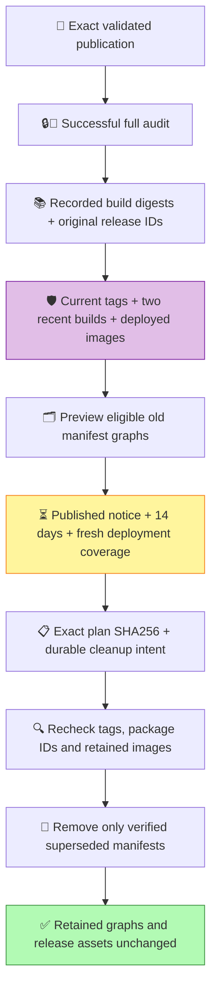

# 🛡️ Registry storage without losing required images

Docker Hub's repository size includes more than its visible tag list. Replacing `latest`, `edge` or a version tag can leave older image indexes and architecture manifests behind. Deleting a tag does not establish that every old manifest has been removed.

**An untagged image is not automatically disposable.** Current multi-platform images use untagged AMD64/ARM64 children. Remote deployments can also need an old digest even when no public tag points to it.

## 🧭 Preview first

The **🗑️🧹** workflow keeps its weekly inventory and preview. Automatic deletion is enabled in `build/registry-retention.json`, with a separate daily eligibility check. It can run cleanup **at most once every 14 days**, and the first cleanup waits for **14 full days after the public notice**. Merging does not start the clock. Applying also requires complete deployment protection and a review timestamp within the last seven days. A missing, incomplete or expired review blocks deletion.



| Always preserve | Eligible for preview |
| --- | --- |
| Every current public tag and its complete image graph | Superseded builds with recorded publication evidence |
| At least two distinct recent published/audited builds per variant | Builds outside the retained set and at least 14 days old |
| Original current-release image configs and their parent indexes | Only manifests not shared with a protected graph |
| Reviewed Docker image IDs and explicit digests | Only untagged GHCR package versions or unreferenced Hub manifests |
| Other tagged images and unknown GHCR images | Only exact reviewed legacy Hub graphs or recorded rebuilds |

Both registries are planned before any mutation. Publication and maintenance share the registry mutation lock. Apply requires the SHA256 from an unchanged preview, a complete deployment review within seven days, live package metadata and unchanged tag/manifest/config identities. New tags or package versions abort removal. Retained layers must exist before and after cleanup. Docker Hub reference/access errors stop the operation; the helper never forces deletion or deletes blobs directly. Evidence records each request before sending it, then marks completed removals. A timed-out request can still complete asynchronously; reconcile its exact digest before another apply.

## ⏳ Enable the published notice clock

1. After merging, copy [the notice](REGISTRY-RETIREMENT-NOTICE.md) into a **public issue in this repository**, published by a maintainer. Keep its `registry-retirement-policy-sha256` line intact and the issue open. The marker binds the notice to the reviewed retention rules and exact [legacy digest list](../build/retired-image-builds.json).
2. In **Settings → Secrets and variables → Actions → Variables**, set `REGISTRY_RETIREMENT_NOTICE_URL` to that issue's URL. This is a public URL, not a secret or a credential.
3. Refresh the complete fleet inventory and `deployment_reviewed_at` near the deadline. The seven-day review requirement still applies: a 14-day-old approval cannot authorize deletion. Without fresh evidence the daily check reports a wait and skips deletion successfully.
4. The daily check uses GitHub's issue creation/update timestamps in UTC. Notice edits restart the full window. A closed, foreign, bot-authored, untrusted or mismatched notice cannot authorize removal.
5. At the first eligible daily check, the workflow rechecks eligibility under the publication lock, builds both live plans, saves the exact intent and applies only an unchanged plan. A successful run starts the next 14-day interval. `automatic-run` checks the same rules on demand and never bypasses the deadline.

The notice announces the rolling policy as well as the exact initial legacy list. Later recorded superseded rebuilds must satisfy the same 14-day image age and protection rules. Changing the legacy list or retention contract invalidates the notice marker; regenerate the notice with `scripts/release/automatic-retention.py --notice-draft` and publish the updated contract before continuing. Adding protected digests or refreshing an honest fleet review does not expand deletion authority or reset the notice contract.

Each apply creates a dedicated `registry-retention` deployment record **before the first registry deletion** and marks success only after retained graphs and release assets are verified. This is cleanup history, not a relay-server deployment; it contains only plan/revision/run identities. Records survive the 90-day artifact retention period. Failed, statusless or interrupted records block future automatic attempts, including workflow reruns. Reconcile every attempted digest using the retained result and live registry first; only then add the reviewed deployment ID to `automatic.acknowledged_failed_deployments`. Acknowledged attempts still observe the 14-day interval.

Builds, PR validation and security monitoring retain their schedules. Only registry mutation shares the existing publication lock. The weekly preview continues while waiting for the notice window, and a missing notice/expired review is a successful waiting result rather than a failed CI check. API, validation, security and preservation errors remain failures.

## 🔎 Discover deployed image identities safely

Run this on **each actual relay host**, including engines with stopped relay containers:

```sh
python3 scripts/utilities/relay-image-protection.py > relay-image-protection.json
```

From WSL, Docker Desktop's CLI can be selected explicitly:

```sh
python3 scripts/utilities/relay-image-protection.py --docker docker.exe
```

An existing remote Docker context can be selected with `--context CONTEXT`. The command only reads container image IDs and narrow image identity fields. It does not read relay ENV, torrc, keys, mounts or logs, and never starts/stops a container.

Docker image IDs can represent a config digest or a manifest/index digest, depending on the engine's image store. The planner resolves either form and protects its parent indexes and architecture children. An unresolved deployment identity blocks the plan instead of being silently ignored.

Merge the resulting `protected_image_ids` and `protected_digests` into `build/registry-retention.json`. Only after every deployment host, dormant deployment and planned rollback is accounted for should the maintainer set `deployment_review_complete` to `true` and `deployment_reviewed_at` to the review's UTC timestamp. A local engine with zero relays cannot certify a remote fleet. External users' digest pins are not discoverable from the registry; publish the retention policy before retiring builds they may use.

The policy also explicitly protects the original release's stable and edge parent indexes, identified by comparing their architecture config IDs with the retained release archive. These digest entries are rollback protection, not a release-version setting. Keep them until their retirement is separately reviewed; replacing a public version tag does not retire these protected copies.

## 🍓 ARM64 and other operators

Protection is applied to complete multi-platform builds, not just the architectures found on the maintainer's servers. Every retained stable/edge index keeps both its AMD64 and ARM64 images. Raspberry Pi deployments using the supported ARM64 image remain covered even when the reviewed fleet uses AMD64.

A complete deployment review covers the maintainer's known fleet; it cannot discover third-party digest pins. Before retiring older digests, publish the proposed digests and retirement date so other operators can request protection or migrate. Pulling an explicitly retired digest will stop working regardless of architecture. Unknown Docker Hub manifests remain outside this helper's deletion targets.

## 🧹 Review and apply through GitHub

1. Open **Actions → 🗑️🧹 → Run workflow**, select `main`, choose `rebuild-plan` and run it.
2. Download the **rebuild-retention** artifact. Review `rebuild-retention.json`, the complete protection graphs, original-release IDs and eligible deletion targets.
3. Confirm deployment protection is complete and fresh. Any policy change requires another preview.
4. Select `rebuild-apply` and supply that preview's `plan_sha256`. Manual apply also respects the enabled notice/interval gates and records its cleanup intent; it cannot bypass the 14-day wait. A changed publication, policy, retained graph, package inventory or release record invalidates the confirmation.
5. Inspect the saved removal evidence and verify retained image pulls from both registries. Retired digests become unavailable to pull; running containers alone do not prove a future pull will work.

GitHub release notes, source tags and uploaded assets are preserved. They are not backups of container layer data.

## 📦 What this does and does not reclaim

The collector uses reviewed successful publications with a later successful full audit and retained `published-manifests.json` evidence. The original current-release `release-evidence.tar.gz` supplies the four protected config identities. New publication artifacts are retained for 90 days. Missing/expired/legacy text-only evidence never authorizes deletion.

Docker Hub does not expose an untagged manifest catalogue through the documented tag-list endpoint. This helper therefore targets **known recorded build digests** plus exact authenticated legacy graphs in `build/retired-image-builds.json`, not every object contributing to the repository size. The initial legacy list identifies 74 indexes and their 370 manifests from the reviewed inventory. Live graph, version and architecture identities must match that list; unknown objects remain outside the deletion scope. This preview cannot promise to reclaim the entire displayed repository size.

Docker Hub's **Image Management → Preview and delete** shows affected indexes/images and a reclaim estimate. Do not select all untagged rows: some belong to current indexes. Manifest deletion and storage accounting can complete asynchronously, so the displayed size may not change immediately. See [Docker Hub Image Management](https://docs.docker.com/docker-hub/repos/manage/hub-images/manage/) and [manifest deletion](https://docs.docker.com/reference/api/registry/latest/operations/DeleteImageManifest/).

The historical `prune-old-plan` remains read-only. Its former `prune-old-apply` workflow operation is removed so legacy deletion uses the same notice, protection and exact-plan gates as rebuild retention. Tag-only `tidy-v2.2.0` remains a separate maintenance operation.
